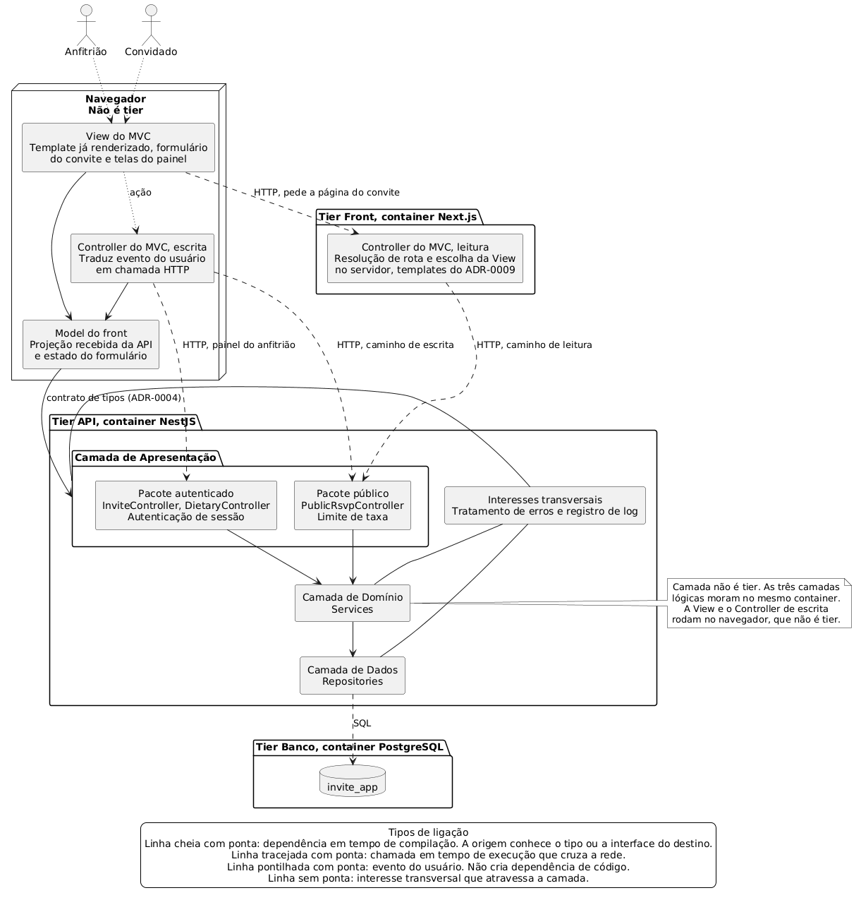

# Guia da Arquitetura

Este guia descreve como o invite-app está organizado por dentro e o que cada parte pode e não pode fazer. É o documento que se consulta antes de escrever código, quando a dúvida é "onde isso mora".

A divisão de trabalho entre os documentos do projeto é esta. Os [ADRs](../Sprints/Sprint-2/Decisões-Arquiteturais.md) registram decisões pontuais e o porquê de cada uma, em ordem cronológica e imutável. Este guia descreve o resultado combinado delas na forma de regras que valem para todo o código. Se os dois divergirem, o ADR é a fonte da decisão e o guia é que está desatualizado.

Onde nenhum ADR decidiu e o código precisa de uma regra assim mesmo, o guia decide e marca a decisão como nova na seção 11. Decisão nova deste guia não tem o mesmo peso de um ADR aceito e precisa de aval do time.

O guia segue o método de projeto de arquitetura em camadas apresentado na Aula 03 da disciplina, apoiado em [Fowler06]. São seis macro-passos e cada um tem lugar aqui.

| Macro-passo | Onde está neste guia |
|---|---|
| 1. Definir critérios para abstrair as camadas | Seção 1 |
| 2. Identificar o número de níveis de abstração | Seção 1 |
| 3. Nomear as camadas e atribuir suas responsabilidades | Seções 2 e 3 |
| 4. Especificar os serviços de cada camada (interfaces) | Seção 4 |
| 5. Definir os componentes que implementarão cada camada | Seção 8 |
| 6. Definir uma estratégia para tratamento de erros | Seção 9 |

As seções 5, 6, 7, 10 e 11 não estão nessa lista, e cada uma tem motivo próprio. A seção 5 existe porque a Aula 03 abre dizendo que a arquitetura "usa camadas coesas e com fraco acoplamento entre elas", e nenhum dos seis passos manda verificar se isso aconteceu. A seção 6 existe porque a regra de dependência é a única obrigação que o ADR-0001 impõe. A seção 7 existe porque há MVC no front. A seção 10 existe porque há três containers. A seção 11 existe porque o que não está escrito vira interpretação individual na hora de implementar.

## Vocabulário deste documento

Três palavras se repetem e precisam significar sempre a mesma coisa.

**Camada** é divisão lógica, com um nível de abstração próprio. São três, definidas no [ADR-0001](../Sprints/Sprint-2/Decisões-Arquiteturais/0001-Estilo-arquitetural.md): Apresentação, Domínio e Dados.

**Tier** é divisão física, ou seja, unidade de implantação. São três, definidas no [ADR-0002](../Sprints/Sprint-2/Decisões-Arquiteturais/0002-Empacotamento-em-tiers.md): Front, API e Banco. Camada e tier não são sinônimos e a seção 10 trata disso.

**Camada de Apresentação**, neste guia, é sempre a camada de controllers HTTP que roda no tier API. O código de interface que roda no navegador e no tier Front é chamado de **View** e **Controller do MVC**, nunca de camada de Apresentação. Os dois são código de apresentação no sentido amplo de [Fowler06], mas misturar os nomes torna a seção 10 ilegível.

Vale registrar desde já uma quarta peça que não é nem camada nem tier. **O navegador não é tier.** Ele não é unidade de implantação do sistema, não sobe no `docker compose` e não está no ADR-0002. Mesmo assim é onde a View roda e é de onde parte o POST do UC005. O diagrama da seção 2 o desenha fora dos três tiers por isso.

---

## 1. Estilo arquitetural adotado e por quê

O estilo está decidido no [ADR-0001](../Sprints/Sprint-2/Decisões-Arquiteturais/0001-Estilo-arquitetural.md): **MVC no front-end e arquitetura em três camadas no back-end**. Esta seção não reabre a decisão, ela registra o critério que sustenta o desenho e que o ADR não detalha.

### 1.1 Critério para abstrair as camadas

O critério adotado é **por motivo de mudança**. Uma camada existe quando reúne um conjunto de decisões que muda por um motivo próprio, diferente do motivo que faz as vizinhas mudarem, e que pode ser compreendido sem conhecer as outras.

Aplicado ao produto, os três motivos de mudança são estes.

- **Muda porque o jeito de conversar com quem está fora mudou.** Nome de rota, código de status, formato de saída, sessão, limite de tráfego. Nada disso altera o que é um convite. Esta é a camada de **Apresentação**.
- **Muda porque a regra do evento mudou.** Quem pode publicar, quantos acompanhantes cada resposta aceita, quando a observação alimentar exige descrição, quanto vale uma resposta em vagas. Esta é a camada de **Domínio**.
- **Muda porque a forma de guardar ou a garantia sobre a escrita mudou.** Consulta, junção, agregação, transação, bloqueio. Esta é a camada de **Dados**.

O critério tem um teste prático, e o teste é a pergunta que a Aula 03 usa para narrar o defeito histórico das aplicações em duas camadas: **alguma regra de negócio vazou para a tela ou para o banco?** Se a resposta for sim, a abstração falhou, independentemente de quantas pastas existam.

### 1.2 Número de níveis de abstração

**São três.** Não dois e não quatro.

Não são dois porque a alternativa de duas camadas é justamente o antipadrão descrito na Aula 03, em que a lógica de domínio mora dentro da tela e produz duplicação e código não modularizado. O produto tem duas interfaces sobre o mesmo modelo, então esse defeito não seria teórico aqui. A mesma regra de acompanhantes existiria escrita duas vezes.

Não são quatro porque não existe um quarto motivo de mudança com vida própria. O sistema não integra outro sistema, não troca mensagem com terceiro e não tem processo de aplicação separado das regras do evento. Acrescentar uma camada sem motivo próprio cobra o preço sem entregar a separação, e a própria Aula 03 registra que camadas extras prejudicam o desempenho e aumentam a propagação de alterações.

### 1.3 Princípio de projeto

O enunciado é o da Aula 03: **camadas coesas e com fraco acoplamento entre elas**.

As duas palavras têm definição operacional e medida neste guia, e a medida está na seção 5. Aqui fica só o enunciado, porque afirmar coesão e acoplamento sem contar nada é elogio, e elogio não reprova código em revisão.

### 1.4 Por que MVC no front

A Aula 03 lista quatro sintomas do acoplamento entre regras de negócio e interface: **alto grau de instabilidade, baixa coesão, reuso comprometido e dificuldade de alocar equipes**. Os quatro se aplicariam a este projeto sem MVC, e o quarto é o mais concreto.

O Team Charter descreve quatro integrantes com experiência desigual e duas sprints de implementação. Sem separação entre View, Controller e Model, não existe recorte de tarefa que duas pessoas possam pegar sem se atropelar. A separação dá nome ao que cada um leva, que é a mesma justificativa de divisão de tarefas que o ADR-0001 já registra.

O motivo principal, porém, é a forma do produto. O invite-app tem **duas Views sobre o mesmo Model**, o convite público aberto por link sem login e o painel do anfitrião autenticado. É o problema que o padrão foi criado para resolver, e a Aula 03 nomeia essa vantagem de forma direta, suporte a múltiplas interfaces de usuário sobre o mesmo model.

A camada de Apresentação, por consequência, tem **dois pacotes**, um por superfície. A Aula 03 registra que uma única aplicação pode ter múltiplos pacotes de cada uma das três camadas, e usa o exemplo de uma aplicação com linha de comando e interface gráfica. Aqui é a mesma estrutura com outras duas interfaces, uma anônima e uma autenticada. A divisão não é decorativa: ela aparece marcada rota por rota na tabela 4.1, desenhada no diagrama da seção 2, e vira regra de código na seção 5.3, que diz quais serviços de Domínio o pacote público pode chamar.

### 1.5 Os quatro critérios de qualidade

A Aula 03 avalia uma arquitetura em camadas por quatro critérios. A seguir, o que cada um significa neste projeto.

**Reusabilidade.** A camada de Domínio é reutilizada por duas superfícies diferentes sem uma linha duplicada. A validação da observação alimentar do UC006 é a mesma para o convidado anônimo e para qualquer tela futura do anfitrião, porque mora num serviço e não no formulário.

**Modularidade.** A separação é estrutural e não convencional. O [ADR-0004](../Sprints/Sprint-2/Decisões-Arquiteturais/0004-Stack-de-implementação.md) escolheu NestJS exatamente por isso, porque módulos e injeção de dependência tornam a fronteira visível em revisão de código, e não apenas em diagrama.

**Compreensibilidade.** Um integrante que abre um arquivo de repository sabe que ali só existe consulta e transação, sem precisar ler os outros dois.

**Extensibilidade.** Acrescentar a tela de alteração da resposta, que hoje é a pendência 3 dos [Diagramas de Sequência](../Sprints/Sprint-2/Diagramas-de-Sequência.md), é acrescentar rota e View. A regra de vaga e o teto já estão no lugar certo e não mudam.

### 1.6 Como saber se uma camada está bem desenhada

A Aula 03 deriva do modelo OSI cinco propriedades de uma boa camada. Elas funcionam como lista de verificação e são usadas aqui nesse papel. Cada linha cita a evidência que a sustenta, porque marcar o próprio trabalho como atendido sem apontar onde não verifica nada.

| Propriedade | Situação | Evidência |
|---|---|---|
| Dá para compreender a camada como um todo coerente sem conhecer as outras | Atendida | A camada de Dados recebe `seatsRequested` já calculado e compara com a coluna `capacity_limit`. Ela não precisa saber que uma resposta "talvez" vale zero vaga, que é a medida 1 do [ADR-0008](../Sprints/Sprint-2/Decisões-Arquiteturais/0008-Confiança-na-fronteira-pública.md). Ver o passo `saveRsvpWithinCapacity` no diagrama do UC005 |
| Dá para substituir a camada por outra implementação dos mesmos serviços | Parcial | A View, o Controller do MVC e a camada de Apresentação são substituíveis. A camada de Dados não é. A garantia transacional do teto é serviço dela, e uma substituta precisa oferecer a mesma garantia, não apenas a mesma assinatura |
| As dependências entre camadas são minimizadas | Atendida, com número | Sete serviços do Domínio oferecidos à Apresentação e dez operações de Dados oferecidas ao Domínio, contados um a um na seção 4 e medidos na seção 5 |
| Camadas são bons lugares para padronização | Atendida | O filtro de exceção único da seção 9.2 e o formato único de erro da seção 9.3, os dois na Apresentação. Nenhum controller escreve corpo de erro por conta própria |
| Uma vez projetada, a camada pode ser usada por vários serviços de nível mais alto | Atendida | `listDietaryCategories()`, em `DietaryCategoryRepository`, é consumida por `RsvpService` no UC005 e por `DietaryService` no UC008. `findById`, em `InviteRepository`, é consumida por `InviteService` no UC004 e por `DietaryService` no UC008 |

Sobre a segunda linha, vale dizer o que ela não significa. A camada de Dados não ser substituível não a torna incompreensível de forma isolada, que é a primeira linha. São propriedades diferentes. O que o teto de capacidade tira da camada de Dados é a liberdade de trocar de implementação sem reler a regra, não a possibilidade de entender o que ela faz lendo só ela.

### 1.7 Desvantagens assumidas

A Aula 03 fecha lembrando que usar um estilo exige entender benefícios e desvantagens. As deste desenho são quatro e estão aceitas.

**Propagação de alterações.** Acrescentar um campo ao convite toca as três camadas e o front. É o preço da separação e ele é cobrado toda vez.

**Custo de desempenho.** Cada requisição atravessa três camadas e um mapeamento em cada fronteira. Na escala deste projeto, algumas respostas por hora no pico do disparo do convite, o custo é irrelevante.

**Estrutura acima do necessário para o tamanho do CRUD.** O ADR-0001 já registra isso e nomeia o risco de excesso de projeto que o Team Charter atribui ao time. A mitigação é a mesma que ele adota: a regra de dependência da seção 6 é a única obrigatória, o resto se resolve caso a caso.

**A ida e a volta ao servidor.** A Aula 03 marca esse ponto como crítico de desempenho, e no caminho do convite público ele acontece duas vezes, não uma, por causa do [ADR-0002](../Sprints/Sprint-2/Decisões-Arquiteturais/0002-Empacotamento-em-tiers.md). A seção 10 trata do assunto e a seção 9.4 trata do que fazer quando um dos dois saltos falha.

---

## 2. Diagrama de camadas



### Como ler

**O diagrama usa quatro tipos de ligação, e eles não são a mesma coisa.** Linha cheia com ponta é dependência em tempo de compilação, ou seja, quem está na origem conhece o tipo ou a interface do destino e não compila sem ele. Linha tracejada com ponta é chamada em tempo de execução que cruza a rede. Linha pontilhada com ponta é evento do usuário, que não cria dependência de código nenhuma. Linha sem ponta liga um interesse transversal à camada que ele atravessa. Confundir os quatro num símbolo só torna a direção da dependência ilegível na figura, e a direção da dependência é o assunto do documento.

**A dependência só desce, e só a linha cheia responde por ela.** A Apresentação conhece o Domínio, o Domínio conhece os Dados, e o Model do front conhece os tipos que a API publica. Não existe linha cheia subindo. O que sobe é retorno, e retorno não é dependência.

**O navegador está fora dos três tiers.** Ele não é unidade de implantação do sistema. A View roda ali, e o Controller de escrita também, que é o que torna visível a assimetria da seção 10.2.

**São dois caminhos até a camada de Apresentação, não um.** O caminho de leitura sai do tier Front, que renderiza no servidor e chama a API. O caminho de escrita sai do navegador direto para a API, sem tocar o tier Front. Os dois são tracejados porque os dois cruzam a rede. Desenhar um só esconderia o POST do UC005, que é o fluxo mais importante do sistema.

**Não há atalho.** Não existe linha do navegador nem do tier Front para o Domínio ou para os Dados. A camada de Apresentação é a única porta de entrada do back-end, e é isso que torna verificável a frase do ADR-0001 de que trocar ou reescrever o front não afeta o Domínio.

**A camada de Apresentação aparece dividida em dois pacotes.** O público, com o `PublicRsvpController`, e o autenticado, com o `InviteController` e o `DietaryController`, conforme a seção 1.4. A autenticação de sessão pertence ao pacote autenticado e não aos interesses transversais, porque autenticação é responsabilidade da Apresentação e o Domínio nunca vê sessão. As seções 3.1 e 3.2 dizem o mesmo.

**Os interesses transversais são dois, não três.** Tratamento de erros e registro de log atravessam as três camadas e por isso aparecem ligados às três por linha sem ponta. Eles não são uma quarta camada. A Aula 03 traz um exemplo de diagrama em camadas com interesses transversais, e é essa a forma usada aqui.

**As caixas externas são os tiers.** Elas marcam fronteira de container, não fronteira de camada. As três camadas lógicas moram no mesmo container, que é o que a seção 10 detalha.

### Fonte do diagrama

Gerado a partir de [`diagrama-de-camadas.puml`](../.attachments/diagrama-de-camadas.puml), versionado junto com a imagem. Para regerar depois de editar o fonte, com Docker:

    docker run --rm -v "<caminho de docs/.attachments>:/data" plantuml/plantuml -tpng /data/diagrama-de-camadas.puml

---

## 3. Responsabilidades por camada

As responsabilidades abaixo foram derivadas dos três [Diagramas de Sequência](../Sprints/Sprint-2/Diagramas-de-Sequência.md) da Sprint 2, que cobrem o UC004, o UC005 com a extensão do UC006, e o UC008. Onde uma responsabilidade não tem passo de diagrama que a sustente, isso está dito.

### 3.1 Camada de Apresentação

Trata da interação com quem está fora do sistema. Exibe informação e traduz comando em ação sobre a camada de Domínio. No invite-app ela é a fronteira HTTP da API.

**O que faz**

- **Recebe a requisição e devolve a resposta.** É a única camada que conhece rota, método, cabeçalho e código de status. `POST /invites/{inviteId}/publish` no UC004, `POST /public/invites/{publicToken}/rsvp` no UC005, `GET /invites/{inviteId}/dietary-summary` no UC008.
- **Autentica a sessão do anfitrião.** `authenticateSession(session)` é a primeira chamada nos fluxos autenticados e traduz o cabeçalho de sessão em `hostId`. Para por aí. Não decide se aquele anfitrião pode agir sobre aquele convite.
- **Controla tráfego na fronteira pública.** São duas operações e não uma, `enforceReadLimit(publicToken)` na rota de leitura e `enforceWriteLimit(publicToken, clientIp)` na de escrita, conforme a medida 2 do [ADR-0008](../Sprints/Sprint-2/Decisões-Arquiteturais/0008-Confiança-na-fronteira-pública.md). A leitura não conta por endereço de origem porque ali o endereço visível para a API é o do container do tier Front, e a tabela 4.1 explica por quê. É controle de tráfego, não regra do caso de uso. A ordem em que cada uma roda está na seção 9.5, que separa o que pode ser decidido antes da resolução do token do que só pode ser decidido depois.
- **Desserializa e confere forma.** `parseRequest(dto)` verifica se o corpo é JSON legível e se cada campo chegou no tipo declarado pela rota, por exemplo `companionCount` como inteiro. Verifica forma, e só. **Se `status` chegou como texto mas com um valor fora de sim, não ou talvez, isso não é forma, é a RN1 do UC005 e quem recusa é o Domínio.** O conjunto de valores aceitos é o enum `RsvpStatus` do Domínio, não uma lista escrita dentro do controller.
- **Traduz o resultado do Domínio em protocolo.** `InvalidInviteForPublication` vira 422, `NotInviteOwner` vira 404, `CapacityExceededError` vira 409, e a ausência de valor vira 404. O Domínio não conhece nenhum desses números.
- **Decide o que o mundo lê quando não há recurso.** Token inexistente, convite em rascunho e convite despublicado chegam do Domínio como ausência de valor, e é aqui que os três viram o mesmo 404 com o mesmo corpo. A política está na seção 9.5 e a razão de ela ser da Apresentação está na 9.2.
- **Serializa a saída.** `renderCsv(rows)` no UC008, incluindo o `neutralizeFormulaPrefix(field)` que prefixa com aspa simples todo campo começado por `=`, `+`, `-` ou `@`, conforme a medida 5 do ADR-0008.

**O que não faz**

- **Não cria identificador.** `generatePublicToken()` e `generatePersonalToken()` são do Domínio. A Apresentação nunca gera identificador.
- **Não decide regra de negócio.** Ela tem o `companionCount` em mãos depois de `parseRequest` e não o julga. Quem julga é `checkCompanionLimit` no Domínio.
- **Não verifica o teto de capacidade.** Validar aqui deixaria duas respostas simultâneas ultrapassarem o limite. Ver a seção 3.4.
- **Não decide autorização.** Ela autentica e obtém `hostId`. Quem compara `hostId` com o dono do convite é `validateOwnership` no Domínio.
- **Não fala com o banco.** Nos três diagramas de sequência não existe uma única seta da Apresentação para o banco.

**De que depende e o que depende dela**

Depende do Domínio e da infraestrutura de sessão e de contagem de tráfego. Dependem dela o navegador, que faz os POST direto, e o tier Front, que faz a leitura do convite público. Dentro da API, nada depende dela.

### 3.2 Camada de Domínio

Também chamada de lógica de negócio. Possui as regras, as validações e os cálculos. Valida os dados que vêm da Apresentação. É a camada que sabe o que é um convite e o que é uma resposta.

**O que faz**

- **Conduz o caso de uso.** No UC008, `consolidateDietaryNotes` chama a camada de Dados três vezes em ordem, `countGuestsByCategory`, depois `listDietaryCategories`, depois `findDescriptionsByCategories`, e só então monta o resultado. Essa ordem é o caso de uso, não é consulta.
- **Decide autorização.** `validateForPublication(invite, hostId)` no UC004 e `validateOwnership(invite, hostId)` no UC004 e no UC008.
- **Aplica as regras que se decidem com o que já está em mãos.** `checkCompanionLimit(invite, companionCount)` para a RN2 do UC005, `validateDietaryNote(dietaryNote, categories)` para a RN2 do UC006 e para o limite de tamanho do texto livre da medida 3 do ADR-0008, a conferência de que o `status` recebido é um dos três valores da RN1 do UC005, e a checagem de nome, data, hora e local da RN1 do UC004.
- **Gera identificador.** `generatePublicToken()` produz os 128 bits em base32 Crockford do [ADR-0005](../Sprints/Sprint-2/Decisões-Arquiteturais/0005-Identificador-público-do-convite.md). `generatePersonalToken()` produz a credencial de edição da ED2 do UC005.
- **Decide quando não gerar.** No UC004 a geração do token está dentro de um `opt`, porque republicar um convite despublicado reaproveita o link que o anfitrião já colou no grupo. Isso é decisão de negócio e está no lugar certo.
- **Deriva valor que não é coluna.** `seatsRequested(status, companionCount)` transforma a resposta em número de vagas, porque uma confirmação ocupa e um talvez não ocupa, conforme a medida 1 do ADR-0008.
- **Nomeia os erros no vocabulário do negócio.** Inclusive traduzindo o que sobe dos Dados, como `CapacityExceeded` virando `CapacityExceededError`.
- **Devolve ausência quando não há recurso.** `getPublishedInvite(publicToken)` devolve o convite publicado ou vazio. O Domínio não lança um erro chamado "não encontrado" e não sabe que aquilo vira 404.

**O que não faz**

- **Não verifica o teto de capacidade.** Ele calcula `seatsRequested` e entrega como parâmetro. Quem compara com `capacityLimit` é a camada de Dados, dentro da transação.
- **Não agrega em memória.** `countGuestsByCategory` devolve a contagem já agrupada, porque o `GROUP BY` roda no banco. O Domínio não percorre convidados contando.
- **Não conhece SQL nem o banco.** Todo pedido que ele faz tem nome de negócio.
- **Não conhece HTTP nem formato de saída.** No UC008 ele devolve as linhas da exportação e sai. Quem monta o CSV, escolhe o separador e define o `Content-Type` é a Apresentação.
- **Não vê sessão.** Ele recebe `hostId` já resolvido e nunca um cabeçalho.
- **Não controla tráfego.** `enforceRateLimit` não toca a linha de vida do Domínio em passo nenhum.

**De que depende e o que depende dela**

Depende da camada de Dados, e só dela. Toda leitura e toda escrita passam por ali, inclusive o dado de referência. Depende dele somente a camada de Apresentação.

Vale registrar com honestidade: o Domínio depende da interface da camada de Dados, o que é dependência para baixo e é o que a arquitetura em três camadas prevê. **O projeto não adota inversão de dependência entre Domínio e Dados**, e o ADR-0001 não pede uma. A regra registrada é uma só, Domínio e Dados não dependem da Apresentação, e é essa que os diagramas provam.

### 3.3 Camada de Dados

Trata da persistência e da comunicação com o que executa tarefas no interesse da aplicação. Neste projeto isso é o PostgreSQL do [ADR-0004](../Sprints/Sprint-2/Decisões-Arquiteturais/0004-Stack-de-implementação.md) e nada mais.

**O que faz**

- **Traduz intenção de negócio em SQL e devolve objeto do modelo.** `findPublishedByPublicToken(publicToken)` vira um `SELECT` com junção e devolve `Invite` com `InviteCustomization`. Quem chamou não sabe que existe uma junção ali.
- **Garante, dentro de transação, a invariante que depende do estado do banco.** `saveRsvpWithinCapacity` executa `BEGIN`, `SELECT status, capacity_limit FROM invite WHERE id = ? FOR UPDATE`, a soma das vagas ocupadas, a comparação, o `INSERT` e o `COMMIT`. Nos ramos de recusa, `ROLLBACK`.
- **Torna atômica a transição de situação já decidida acima.** `publishIfPublishable` carrega a condição no `WHERE` do próprio `UPDATE`. Sem isso, dois cliques em compartilhar geram dois tokens e o segundo sobrescreve o primeiro. O predicado não decide se pode publicar, quem decidiu foi `validateForPublication` no Domínio. Ver a seção 3.5.
- **Agrega e junta no banco.** O `count(DISTINCT guest.id)` com `GROUP BY category_code` é o que faz a RN1 do UC008 sair certa, com um convidado de duas categorias contando nas duas. O `string_agg` com junção à esquerda é o que faz a exportação sair com uma linha por convidado mesmo sem nota.
- **Serve o dado de referência.** `listDietaryCategories()` devolve as categorias alimentares. A seção 5.2 explica por que essa operação não pertence ao repositório do convite.
- **Escreve junto o conjunto relacionado.** O convidado, a nota alimentar e as categorias marcadas entram todos entre o `BEGIN` e o `COMMIT`, porque a nota não existe sem o convidado.

**O que não faz**

- **Não decide quem pode o quê.** `findById(inviteId)` devolve o convite sem filtrar por anfitrião, e `countGuestsByCategory` nem recebe `hostId`.
- **Não checa o limite de acompanhantes.** `maxCompanionsPerGuest` não aparece em SQL nenhum. `saveRsvpWithinCapacity` recebe `seatsRequested` já calculado.
- **Não gera o token que persiste.** Ele chega por parâmetro.
- **Não formata saída.** Se o convidado digitou `=SOMA(A1:A9)` no texto livre, é isso que fica gravado. A aspa simples entra depois, na Apresentação, e a linha no banco continua íntegra.
- **Não conduz o caso de uso.** No UC008 as três consultas em sequência são três chamadas separadas vindas do Domínio, e não um método que já sabe a ordem.

**De que depende e o que depende dela**

Depende do tier Banco e das classes do [Diagrama de Classes](../Sprints/Sprint-2/Diagrama-de-Classes.md) que devolve. Não depende de nada acima dela. Depende dela somente o Domínio.

### 3.4 O critério de alocação

Quando surgir uma regra nova e o time não souber onde ela mora, é esta a pergunta a fazer.

> **Se a regra pode ser decidida com o que já está em memória, é Domínio. Se decidir exige o estado do banco no instante da escrita, e a resposta pode mudar entre ler e gravar, é Dados.**

O melhor exemplo do projeto está dentro de um único envio, o POST do passo 7 do UC005. Dois limites, os dois do mesmo formulário, os dois vindos da RN2 do UC002 e do ADR-0008, caindo em camadas diferentes.

`checkCompanionLimit(invite, companionCount)` é função de dois valores que já estão em mãos, o `maxCompanionsPerGuest` do convite já lido e o número que o convidado digitou. Duas requisições simultâneas não interferem uma na outra e rodar duas vezes dá o mesmo resultado. É Domínio.

O teto depende da soma das linhas de todos os outros convidados no instante da escrita, e a resposta muda entre a leitura e a gravação. Precisa do bloqueio e da escrita na mesma transação. É Dados. Sem isso, **duas respostas simultâneas num evento em 49 de 50 leem as duas 49, as duas passam, e a festa fecha em 51**.

Isso é o que tira a separação de camadas do terreno da afirmação de diagrama. Não é que as camadas existam separadas porque o desenho diz. É que juntá-las produz um número errado que dá para nomear.

Dois critérios auxiliares saem dos mesmos diagramas.

> **Se é forma de saída e não verdade do dado, é Apresentação.** O tratamento de fórmula no CSV prova. O mesmo texto vai para a tela do painel sem aspa simples e para o CSV com aspa simples. Muda a serialização, não o dado.

> **Autenticação é Apresentação, autorização é Domínio.** `authenticateSession` fica na Apresentação nos quatro pontos em que aparece, dois no diagrama do UC004 e dois no do UC008. O diagrama do UC005 não tem nenhum, porque é a fronteira pública. `validateOwnership` fica no Domínio nos três pontos em que aparece.

### 3.5 O limite do critério

O argumento do teto abre um precedente, e sem limite escrito ele vira porta para empurrar qualquer regra para baixo em nome de transação ou de desempenho. Então o limite fica escrito, e ele tem dois casos, não um.

> **Caso 1, invariante que exige transação.** A camada de Dados relata resultado de negócio porque só ela pode verificar, já que a resposta depende do estado do banco no instante da escrita e muda entre ler e gravar. É `saveRsvpWithinCapacity`, que devolve `CapacityExceeded` ou `InviteNotOpen`.
>
> **Caso 2, transição de situação protegida por predicado.** A decisão já foi tomada acima. `publishIfPublishable` só é chamado depois de `validateForPublication` aprovar no Domínio, e `unpublishIfPublished` depois de `validateOwnership`. O predicado no `WHERE` não decide nada novo, ele impede que duas requisições simultâneas escrevam uma por cima da outra. O desfecho "zero linhas" não é regra sendo aplicada em Dados, é o relato de que outra requisição chegou primeiro.
>
> **Em nenhum outro caso.**

O caso 2 é o que mais se parece com abuso, então ele tem teste próprio:

> **Tire o predicado do `WHERE` e rode de novo com uma requisição só.** Se o sistema continuar recusando o pedido errado, o predicado era defesa contra corrida e o caso 2 se aplica. Se o pedido errado passar, a regra estava morando na camada de Dados, e isso é violação da seção 6.

---

## 4. Os serviços de cada camada

Esta seção cumpre o macro-passo 4 da Aula 03, especificar os serviços que cada camada oferece à camada acima. Ela existe porque é a superfície que as seções 5 e 6 governam. Sem lista de serviços, "fraco acoplamento" é elogio e não medida.

As assinaturas abaixo são as dos três `.puml` da Sprint 2, copiadas sem simplificar, porque parâmetro omitido em tabela vira parâmetro ausente em código e o efeito disso aparece na tabela 4.3.

Três regras valem para todos eles.

1. **O nome do serviço usa o vocabulário de quem chama, não de quem implementa.** `findPublishedByPublicToken`, não `selectInviteJoinCustomization`.
2. **Nenhuma camada expõe tipo da camada de baixo, e nenhuma recebe tipo da camada de cima.** A Apresentação não devolve linha de banco e o Domínio não recebe objeto de requisição HTTP. É por isso que o parâmetro de `registerRsvp` se chama `rsvpCommand` e não `dto`. `dto` é palavra da Apresentação.
3. **Identificadores em inglês**, conforme o [Guia de Estilo](Guia-de-Estilo.md).

### 4.1 Serviços da camada de Apresentação, oferecidos ao front

| Rota | Caso de uso | Pacote | Autenticação e tráfego |
|---|---|---|---|
| `GET /public/invites/{publicToken}` | UC005 passos 1 e 2 | Público | Nenhuma, com limite de taxa |
| `POST /public/invites/{publicToken}/rsvp` | UC005 passo 7, com a extensão do UC006 | Público | Nenhuma, com limite de taxa |
| `POST /invites/{inviteId}/publish` | UC004 passo 1 | Autenticado | Sessão do anfitrião |
| `POST /invites/{inviteId}/unpublish` | UC004 A2 | Autenticado | Sessão do anfitrião |
| `GET /invites/{inviteId}/dietary-summary` | UC008 passo 1 | Autenticado | Sessão do anfitrião |
| `GET /invites/{inviteId}/dietary-notes.csv` | UC008 passo 4 | Autenticado | Sessão do anfitrião |
| `GET /invites/{inviteId}/attendance` | UC007, consulta periódica do [ADR-0007](../Sprints/Sprint-2/Decisões-Arquiteturais/0007-Atualização-da-lista-de-presença.md) | Autenticado | Sessão do anfitrião |

As seis primeiras saem dos diagramas de sequência. A última é derivada do ADR-0007 e do UC007, que não têm diagrama de sequência.

**Por que a leitura pública também entra no limite de taxa.** A medida 2 do ADR-0008 não restringe o limite à escrita. Ela diz "por token de convite e por endereço de origem" e justifica por repasse abusivo do link, que é comportamento de leitura: um link colado num grupo grande gera GET em massa, não POST em massa. Restringir o limite ao POST seria estreitar o ADR, e o guia não faz isso em silêncio.

Essa escolha traz uma consequência que nenhum artefato do projeto tinha notado. **No caminho de leitura, o endereço de origem que a API enxerga é o do container do tier Front, não o do convidado**, porque quem chama a API ali é a renderização no servidor. Contar por endereço de origem nesse caminho contaria todos os convidados como um só e derrubaria a página do convite para todo mundo ao mesmo tempo. Então, até o time decidir se o tier Front repassa o endereço original, **o limite da rota de leitura conta por token de convite apenas**. O da rota de escrita conta pelos dois, porque ali o POST chega direto do navegador. Está registrado na seção 11.

### 4.2 Serviços da camada de Domínio, oferecidos à Apresentação

| Serviço | Componente dono | O que faz | Caso de uso |
|---|---|---|---|
| `getPublishedInvite(publicToken)` | `RsvpService` | Devolve o convite publicado, ou vazio | UC005 |
| `registerRsvp(publicToken, rsvpCommand)` | `RsvpService` | Valida, deriva as vagas e registra a resposta | UC005 e UC006 |
| `publishInvite(inviteId, hostId)` | `InviteService` | Valida, gera o token se ainda não houver e publica | UC004 |
| `unpublishInvite(inviteId, hostId)` | `InviteService` | Desativa o link sem apagar nada | UC004 A2 |
| `consolidateDietaryNotes(inviteId, hostId)` | `DietaryService` | Monta a contagem por categoria e as descrições | UC008 |
| `exportDietaryNotes(inviteId, hostId)` | `DietaryService` | Devolve as linhas da exportação, sem formatá-las | UC008 |
| `listAttendance(inviteId, hostId)` | `AttendanceService` | Devolve a lista de presença por status e o total de pessoas | UC007 |

A coluna de dono vem do [Diagrama de Componentes](../Sprints/Sprint-2/Diagrama-de-Componentes.md). Seis dos sete donos saem das linhas de vida dos diagramas de sequência e não são decisão nova. `AttendanceService` é, e está na seção 11.

As seis primeiras saem dos diagramas de sequência. `listAttendance` é derivada do UC007 e do ADR-0007 e existe aqui porque a rota correspondente já estava na tabela 4.1 sem serviço por trás.

**Estes são serviços, não métodos da entidade.** O [Diagrama de Classes](../Sprints/Sprint-2/Diagrama-de-Classes.md) coloca `listAttendance()`, `consolidateDietaryNotes()` e `exportDietaryNotes()` como operações de `Invite`. Este guia adota a outra leitura, por três razões. A assinatura recebe `inviteId` e `hostId`, o que não é forma de método de instância de um `Invite` já carregado. As três conduzem o caso de uso chamando a camada de Dados mais de uma vez em ordem, e conduzir caso de uso não é trabalho da entidade, conforme a seção 3.3. E o diagrama do UC008 já as coloca em `DietaryService`. A divergência com o Diagrama de Classes está registrada na seção 11 com a correção exata.

Os serviços do UC001, do UC002 e do UC003 seguem a mesma forma e ainda não têm diagrama de sequência que os aloque passo a passo. Eles estão na seção 11.

### 4.3 Serviços da camada de Dados, oferecidos ao Domínio

| Serviço | Repositório | O que garante | Caso de uso |
|---|---|---|---|
| `findById(inviteId)` | `InviteRepository` | Leitura simples, sem filtro de dono | UC004 e UC008 |
| `findPublishedByPublicToken(publicToken)` | `InviteRepository` | Devolve só o que está publicado | UC005 |
| `publishIfPublishable(inviteId, publicToken)` | `InviteRepository` | Transição atômica pelo predicado do `WHERE` | UC004 |
| `unpublishIfPublished(inviteId)` | `InviteRepository` | Transição atômica pelo predicado do `WHERE` | UC004 A2 |
| `saveRsvpWithinCapacity(invite, guest, dietaryNote, seatsRequested)` | `InviteRepository` | Teto de capacidade dentro de transação, com `SELECT ... FOR UPDATE` | UC005 RN4 |
| `countGuestsByCategory(inviteId, statuses)` | `InviteRepository` | Agregação no banco, não em memória | UC008 RN1 |
| `findDescriptionsByCategories(inviteId, statuses, categoryCodes)` | `InviteRepository` | Textos livres das categorias que exigem descrição, só de quem conta | UC008 |
| `findGuestsForExport(inviteId, statuses)` | `InviteRepository` | Uma linha por convidado, mesmo sem nota | UC008 ED2 |
| `findAttendanceByStatus(inviteId, statuses)` | `InviteRepository` | Uma linha por convidado com nome, status e acompanhantes | UC007 ED1 |
| `listDietaryCategories()` | `DietaryCategoryRepository` | Dado de referência | UC005, UC006 e UC008 |

São dez operações em dois repositórios. A separação segue a regra da seção 5.2 e `findAttendanceByStatus` é a única das dez sem diagrama de sequência que a sustente, porque o UC007 não tem. As duas entradas estão na seção 11.

**O parâmetro `statuses` não é detalhe de assinatura.** A RN2 do UC008 manda exportar e consolidar apenas quem respondeu sim ou talvez. Se o filtro `[ACCEPTED, MAYBE]` não vier do Domínio como parâmetro, ele acaba escrito dentro do SQL do repositório, e aí uma regra de negócio passa a morar na camada de Dados sem nenhum dos dois casos da seção 3.5 a justificar. As três operações do painel recebem os status de fora por isso.

---

## 5. Coesão e acoplamento, com número

A Aula 03 abre dizendo que a arquitetura em camadas "usa camadas coesas e com fraco acoplamento entre elas", e o deck de MVC lista "baixa coesão" entre os quatro sintomas do acoplamento entre regra e interface. Nenhum dos seis macro-passos manda verificar se isso de fato aconteceu. Esta seção verifica.

### 5.1 O que se mede

**Coesão** se mede contando motivos de mudança dentro de um mesmo arquivo ou pacote. Um motivo, coeso. Dois motivos que não se falam, não coeso.

**Acoplamento entre camadas** se mede na superfície da seção 4. Duas perguntas: quantas operações a camada de cima precisa conhecer, e de quem são os tipos que atravessam a fronteira.

Pelos números, o desenho passa. A Apresentação precisa conhecer sete serviços de Domínio. O Domínio precisa conhecer dez operações de Dados, distribuídas em duas interfaces, `InviteStore` com nove e `DietaryCategoryStore` com uma. O número de interfaces é a terceira medida e ele registra o efeito da separação dos repositórios, que a contagem de operações sozinha não captura. O sete é provisório e sobe quando o UC001, o UC002 e o UC003 fecharem assinatura. Nenhum tipo da Apresentação desce e nenhum tipo de banco sobe. O que atravessa cada fronteira são classes do Diagrama de Classes e projeções nomeadas.

### 5.2 Onde a medida falha, o `InviteRepository`

A tabela 4.3 coloca nove operações num único `InviteRepository`. Os números são estes: **nove operações, quatro consumidores e quatro tipos de retorno que não são o agregado**.

Oito dessas operações saem dos três diagramas de sequência. A nona, `findAttendanceByStatus`, vem da ED1 do UC007 e não tem diagrama. Os quatro consumidores são `InviteService` no UC004, `RsvpService` no UC005, `DietaryService` no UC008 e `AttendanceService` no UC007. Três dos quatro tipos que não são `Invite` estão nomeados, `CategoryCount`, `AllergyDescription` e `ExportRow`, e o quarto é a projeção que `findAttendanceByStatus` devolve, que nenhum artefato nomeia e que está na seção 11.

Aplicando a definição de coesão da 5.1, há três motivos de mudança dentro do mesmo arquivo.

1. **O caminho de escrita do convite e suas invariantes.** `findById`, `findPublishedByPublicToken`, `publishIfPublishable`, `unpublishIfPublished` e `saveRsvpWithinCapacity`. Muda quando a regra de publicação ou a invariante do teto muda.
2. **As projeções de leitura do painel.** `countGuestsByCategory`, `findDescriptionsByCategories`, `findGuestsForExport` e `findAttendanceByStatus`. Muda quando uma coluna ou um filtro do painel muda. A pendência 2 dos Diagramas de Sequência, acrescentar a coluna de acompanhantes à exportação da ED2 do UC008, é exatamente esse tipo de mudança, e hoje ela tocaria o mesmo arquivo que guarda a transação do teto.
3. **O dado de referência.** `listDietaryCategories`. Muda quando o catálogo de categorias muda, que não tem nada a ver com os outros dois.

A regra que o projeto adota para resolver isso:

> **Uma operação pertence ao repositório da raiz de agregação quando o que ela devolve é o agregado ou uma projeção do agregado, filtrada pelo mesmo `inviteId`. Uma operação que não filtra por convite não pertence a ele.**

Pelo critério, os motivos 1 e 2 ficam juntos. As três projeções do painel filtram por `inviteId`, dependem da mesma fronteira de consistência do agregado, e separá-las num repositório de consulta próprio compraria um conceito novo para três consultas. O motivo 3 sai: `listDietaryCategories()` não recebe `inviteId`, `DietaryCategory` é dado de referência marcado como tal no Diagrama de Classes, e o lugar dela é um `DietaryCategoryRepository` próprio.

**Esta regra é decisão nova deste guia, não algo que outro artefato já tenha registrado.** O Diagrama de Classes registra que `Invite` é a raiz do modelo e que `DietaryCategory` é dado de referência, e não fala em repositório em ponto nenhum. A regra segue daquilo, mas não está escrita lá. Está na seção 11 junto com as outras decisões novas.

Os diagramas de sequência do UC005 e do UC008 mostravam `listDietaryCategories()` em `InviteRepository`, em três chamadas ao todo, duas no UC005 e uma no UC008. Os dois ganharam a linha de vida de `DietaryCategoryRepository` quando o Diagrama de Componentes separou os dois repositórios. O diagrama do UC004 não usa a operação e não mudou.

### 5.3 Os dois pacotes da Apresentação, e a regra que faltava

O acoplamento entre o pacote público e o pacote autenticado é zero, e assim deve continuar. Um não chama o outro, e nada é compartilhado entre eles além do filtro de exceção da seção 9.2.

A consequência que a seção 1.4 anunciou e que faltava escrever é esta:

> **O pacote público chama apenas `getPublishedInvite` e `registerRsvp`. Nenhum outro serviço de Domínio.** Os outros cinco serviços da tabela 4.2 são exclusivos do pacote autenticado.

Sem essa regra, a separação por superfície fica decorativa. Com ela, vira verificação de uma linha em revisão de código. O risco que ela cobre é concreto: o pacote público é a única escrita sem autenticação do sistema, e o dia em que alguém acrescentar ali uma rota que chame `consolidateDietaryNotes` para "mostrar as restrições na página do convite", a lista de restrições alimentares de todos os convidados fica pública. Nenhum erro seria levantado, nenhum teste falharia, e o texto exposto é informação de saúde de pessoa identificável.

---

## 6. Regras de dependência

### 6.1 A regra inegociável

O [ADR-0001](../Sprints/Sprint-2/Decisões-Arquiteturais/0001-Estilo-arquitetural.md) define uma regra e apenas uma como obrigatória:

> **O Domínio e a camada de Dados nunca dependem da Apresentação. As dependências apontam sempre para dentro.**

A Aula 03 enuncia a mesma ideia de mais duas formas, e as três importam porque cada uma pega um tipo diferente de violação.

**Forma 1, a da camada inferior.** A camada inferior ignora a existência da camada superior. Pega o caso do repository que importa um tipo de requisição HTTP para "facilitar".

**Forma 2, a do escondimento.** A camada de Domínio esconde a camada de Dados da camada de Apresentação. Pega o caso do controller que chama o repository direto para pular uma chamada.

**Forma 3, a da direção.** As camadas de Domínio e de Dados não devem depender da camada de Apresentação. Pega o caso do service que lança um erro já com código de status dentro.

O benefício declarado é o mesmo das três: **flexibiliza a arquitetura ao permitir a troca da camada de Apresentação sem provocar impacto nas camadas inferiores**. Neste projeto isso não é hipótese de futuro, é o que faz duas Views funcionarem sobre um Model só hoje.

### 6.2 Leitura adotada sobre o acesso da Apresentação aos Dados

O material da Aula 03 admite duas leituras em pontos diferentes. Em um deles, a Apresentação traduz comandos em ações sobre a camada de Domínio **e** a camada de Dados. Em outro, o Domínio esconde a camada de Dados da Apresentação.

**Este projeto adota a leitura estrita: a Apresentação nunca chama a camada de Dados.** É a leitura que o ADR-0001 já assumiu e é a que o teto de capacidade obriga. Se a Apresentação pudesse ler o convite por conta própria, alguém acabaria checando o teto ali, e a seção 3.4 explica o que acontece então.

### 6.3 O que violaria a regra na prática

Lista concreta, para revisão de código e não para discussão de princípio.

- Um `service` ou um `repository` importando tipo de requisição, de resposta, de cabeçalho ou de sessão HTTP.
- Um número de status HTTP escrito fora da pasta da Apresentação.
- SQL, nome de tabela ou nome de coluna fora da pasta de Dados.
- Um controller chamando um repository direto, sem passar pelo service.
- Um controller do pacote público chamando serviço de Domínio fora dos dois da seção 5.3.
- O tier Front abrindo conexão com o banco, ou o navegador chamando qualquer coisa que não seja a camada de Apresentação.
- Uma regra de negócio decidida no template, no formulário ou na rota do Next, sem ser revalidada no servidor.
- Um repository recebendo `hostId` para decidir permissão, em vez de devolver o dado e deixar o Domínio decidir.
- O Domínio montando CSV, escolhendo separador, definindo `Content-Type` ou escrevendo texto de tela.
- O Domínio percorrendo uma lista para contar o que um `GROUP BY` resolveria.
- Um repository checando `maxCompanionsPerGuest`, ou escrevendo `[ACCEPTED, MAYBE]` dentro do SQL em vez de receber os status por parâmetro.
- Uma chamada que repete requisição dentro de um `service` ou de um `repository`, conforme a seção 9.4.

### 6.4 Como a revisão de código verifica

São três buscas, e as três juntas levam menos de um minuto. O ADR-0001 registra que a regra exige disciplina de time, e disciplina que depende de boa vontade não sobrevive a uma sprint. Esta é a forma de checar sem depender disso.

**No tier API, procurar por `404`, `409`, `422` e `HttpException`.** Se algum resultado sair de fora da pasta da Apresentação, a regra foi quebrada.

**No tier API, procurar por `SELECT`, `INSERT` e `UPDATE`.** Se algum sair de fora da pasta de Dados, a regra foi quebrada.

**No tier Front, procurar por `use server`, pela pasta `app/api`, e por `capacityLimit` e `maxCompanionsPerGuest`.** Se algum aparecer, a regra foi quebrada. Esta terceira busca cobre a violação mais provável do projeto, que é a regra de negócio decidida no Next, e as duas primeiras não pegam nada dela. É o atalho que aparece quando a sprint aperta e o Next já está ali, e a seção 8 o proíbe em texto.

---

## 7. Mapeamento entre MVC e as três camadas

### 7.1 A equivalência, e onde ela não é exata

A Aula 03 define as três peças do MVC assim: **View** é a interface do usuário, **Controller** é o controle de fluxo da aplicação, e **Model** é a lógica de negócios **e o acesso a dados**. Essa última definição é o ponto que exige cuidado neste projeto.

A tabela abaixo usa a expressão "camada de apresentação no sentido amplo de [Fowler06]", e não "camada de Apresentação", que o Vocabulário reservou para os controllers HTTP do tier API. São coisas diferentes com nome parecido, e a coluna de tier existe para não deixar dúvida.

| Peça do MVC | Camada de [Fowler06] | Tier onde roda |
|---|---|---|
| View | Apresentação no sentido amplo | Navegador |
| Controller do MVC, caminho de leitura | Apresentação no sentido amplo | Front |
| Controller do MVC, caminho de escrita | Apresentação no sentido amplo | Navegador |
| Camada de Apresentação deste guia, os controllers HTTP | Apresentação | API |
| Model | Domínio e Dados | API |

A separação em três camadas do back-end é, portanto, **um refinamento do Model**, e não uma contradição com o padrão. O Model do padrão cobre duas responsabilidades que mudam por motivos diferentes, regra de negócio e persistência, e o critério da seção 1.1 manda separá-las.

### 7.2 O Model do front não é o Model do padrão

Esta é a confusão mais provável de todo o documento, e ela precisa ficar resolvida em voz alta.

O ADR-0001 diz "MVC no front-end" e o [ADR-0004](../Sprints/Sprint-2/Decisões-Arquiteturais/0004-Stack-de-implementação.md) diz que Next.js é front-end apenas. Se alguém chamar de "Model" alguma coisa dentro do tier Front sem qualificar, lê-se como regra de negócio dentro da tela, que é exatamente o antipadrão que a Aula 03 narra como defeito histórico.

> **O Model do MVC deste sistema mora no tier API, distribuído entre Domínio e Dados. O que existe no navegador é a projeção desse Model recebida na resposta HTTP, mais o estado do formulário que o usuário está preenchendo.**

A prova está no UC005. As categorias alimentares chegam junto com a página vinda da API, e o passo 1 do UC006 exibe as categorias recebidas com a página. O front não tem cópia própria da lista, e `DietaryCategory` é dado de referência que mora no banco. `Invite`, `InviteCustomization`, `Guest`, `DietaryNote` e os enums `RsvpStatus` e `InviteStatus` pertencem ao Domínio. O front reflete, não define. O contrato de tipos compartilhado do ADR-0004 torna isso um tipo e não uma convenção.

### 7.3 As três peças neste projeto

| Peça | Onde roda | O que é aqui | Com que camada do back conversa |
|---|---|---|---|
| Model | Não roda no front, chega nele | Projeção do modelo recebida na resposta, mais o estado do formulário | Nenhuma diretamente, chega pela resposta da Apresentação |
| View | Navegador, com o HTML do convite público montado no tier Front | Template do [ADR-0009](../Sprints/Sprint-2/Decisões-Arquiteturais/0009-Personalização-por-template.md), formulário do convite, telas do painel, montagem do link a partir do token | Nenhuma, só exibe |
| Controller | Tier Front no caminho de leitura, navegador no caminho de escrita | Resolução de rota e escolha da View no Next.js, tradução de evento do usuário em chamada HTTP, e a consulta periódica do ADR-0007 | Apresentação, e só ela |

**A View faz trabalho de exibição e nada além.** Ela monta o link a partir de um token que o Domínio gerou. Ela esconde e mostra campo, por exemplo ocultando acompanhantes e restrição alimentar quando a resposta é "não", ou cobrando o texto livre depois que uma categoria que exige descrição foi marcada. Ela esconde campo, não decide validade.

**O Controller do front não decide nada.** Todos os passos do UC005 entre o 3 e o 6 acontecem entre o convidado e o navegador, sem uma única seta de rede, e nada disso é confiado. Depois do POST, `checkCompanionLimit` e `validateDietaryNote` rodam de novo no Domínio. **A checagem do front é conforto, a do servidor é verdade.** O motivo está no ADR-0008: a fronteira pública é a única escrita sem autenticação, o POST sai direto do navegador, e qualquer um envia qualquer corpo.

### 7.4 O Controller está partido entre dois lugares

No caminho de leitura, a resolução de rota e a escolha da View acontecem no servidor, dentro do tier Front. Quando o token não resolve, é o servidor que redireciona para a rota de não encontrado. No caminho de escrita, o Controller vive inteiramente no navegador e o POST sai direto para a API, sem passar pelo tier Front.

Isso não é inconsistência. É o efeito combinado do ADR-0002, que separou os tiers, com o ADR-0004, que mantém o Next.js como front-end apenas. Fica escrito aqui porque é melhor estar declarado do que ser perguntado na apresentação.

### 7.5 O que do MVC não foi adotado, e por quê

O MVC original é baseado em notificação. O Model registra as views e os controllers interessados e notifica os registrados quando o estado muda, e o diagrama da Aula 03 separa na legenda a invocação de método do evento.

**Nada disso existe sobre HTTP sem estado.** O servidor não tem lista de views registradas e não tem como avisar ninguém. Então:

- **Adotado:** a separação de responsabilidades entre View, Controller e Model, e a ideia central de múltiplas Views sobre um Model só, que é a razão da escolha no ADR-0001.
- **Não adotado:** o registro de observadores e a notificação de mudança.

O substituto do projeto para a notificação é a **consulta periódica do [ADR-0007](../Sprints/Sprint-2/Decisões-Arquiteturais/0007-Atualização-da-lista-de-presença.md)**, com intervalo entre 15 e 30 segundos enquanto o painel estiver aberto. A escolha está justificada lá, e a consequência aqui é que a View do painel pergunta em vez de ser avisada.

**A consequência maior, dita em voz alta.** O diagrama do slide 9 da Aula 03 define a tríade por três relações: a View requisita atualizações ao Model, o Controller mapeia ações do usuário para atualizações do modelo, e o Model notifica a View sobre mudanças. Com o Model fora do navegador, conforme a seção 7.2, **nenhuma das três acontece localmente neste sistema**. As três viram uma chamada HTTP. O que roda no navegador é a metade View e Controller do padrão operando sobre um Model remoto, e essa é a comparação honesta com o diagrama da aula. Dizer isso é mais forte do que deixar implícito, porque quem conhece aquele diagrama vai perguntar onde está a seta de notificação.

---

## 8. Stack por camada

A escolha e a justificativa estão no [ADR-0004](../Sprints/Sprint-2/Decisões-Arquiteturais/0004-Stack-de-implementação.md). Esta seção só registra o que implementa cada camada, cumprindo o macro-passo 5 da Aula 03.

A primeira coluna mistura camada com peça do MVC de propósito, e diz qual é qual, porque a View e o Controller do MVC não são camadas do ADR-0001 e não podem aparecer como se fossem.

| Camada ou peça do MVC | Tier | Tecnologia | Forma concreta |
|---|---|---|---|
| View e Controller do MVC, peças do padrão | Navegador e Front | Next.js sobre React | Rotas, componentes e os templates em HTML e CSS do [ADR-0009](../Sprints/Sprint-2/Decisões-Arquiteturais/0009-Personalização-por-template.md) |
| Apresentação, camada | API | NestJS | Controllers dos dois pacotes, guards de sessão, pipes de desserialização, contador de limite de taxa e o filtro de exceção da seção 9 |
| Domínio, camada | API | NestJS, TypeScript puro | Providers de serviço, sem dependência de framework web |
| Dados, camada | API | NestJS | Repositories e transações. O banco em si é o tier Banco, não uma quarta camada |
| Nenhuma, é tier | Banco | PostgreSQL | Tabelas, índices e o `JSONB` das cores da personalização |

Três limites vêm do ADR-0004 e valem como regra de código.

**Next.js é front-end apenas.** Nada de API routes nem de server actions com regra de negócio. Se a lógica migrar para o Next, o tier da API perde a razão de existir e o ADR-0002 vira ficção. A terceira busca da seção 6.4 é o que verifica isso.

**O Domínio não importa NestJS além da anotação de injeção.** Ele precisa ser testável sem subir a API nem o banco, que é uma consequência positiva declarada no ADR-0001.

**O `JSONB` guarda apenas as cores e os ajustes livres da personalização.** O template escolhido fica em coluna tipada, e os textos do convite ficam em colunas próprias, porque são dado consultado.

**Sobre os componentes.** As classes que a camada de Dados devolve estão no [Diagrama de Classes](../Sprints/Sprint-2/Diagrama-de-Classes.md) da Sprint 2. A sessão do anfitrião e o contador de limite de taxa do ADR-0008 são infraestrutura, ficaram fora do diagrama de classes de propósito e serão nomeados no diagrama de componentes.

---

## 9. Estratégia de tratamento de erros

Último macro-passo do projeto em camadas, conforme a Aula 03. Sem ele, cada integrante inventa o próprio jeito de sinalizar falha e a regra da seção 6 vaza pela porta dos fundos.

### 9.1 Oito categorias, cada uma com um dono

O dono é a camada que **detecta** o erro. Nenhuma outra decide aquilo por ela. A coluna "o que atravessa" separa o que a camada de baixo devolve do tipo que a de cima cria, porque as duas coisas são diferentes e a seção 9.2 depende disso.

| Categoria | Quem detecta | Exemplos no projeto | O que atravessa | Resposta |
|---|---|---|---|---|
| Forma da requisição | Apresentação | corpo não é JSON, `companionCount` veio como texto onde a rota declara inteiro | não sobe ao Domínio | 400 `MALFORMED_REQUEST` |
| Excesso de tráfego | Apresentação | o limite de taxa da medida 2 do ADR-0008 disparou numa das duas rotas públicas | não sobe ao Domínio | 429 `RATE_LIMITED` |
| Validação e regra de negócio | Domínio | `status` fora de sim, não ou talvez (UC005 RN1), acompanhantes acima do limite (UC005 RN2), alergia sem descrição (UC006 RN2), texto livre da observação alimentar acima do tamanho máximo (ADR-0008 medida 3), data no passado (UC002 RN1), texto do convite acima do limite do campo (UC003 RN2) | `ValidationError(field, rule)` | 422 `VALIDATION_FAILED` |
| Convite incompleto para publicar | Domínio | falta nome, data, hora ou local (UC004 RN1) | `InvalidInviteForPublication(missingFields)` | 422 `INVITE_NOT_PUBLISHABLE` |
| Ausência de recurso | Domínio constata, Apresentação decide | token inexistente, convite em rascunho, convite despublicado | valor vazio, nenhum tipo de erro | 404 `NOT_FOUND` |
| Convite de outro anfitrião | Domínio | `validateOwnership` recusou | `NotInviteOwner` | 404 `NOT_FOUND` |
| Conflito de situação ou de concorrência | Dados detecta, Domínio nomeia | teto de pessoas atingido (UC005 RN4), convite despublicado entre a leitura e a gravação (UC004 RN3), pedido de despublicar um convite que não está publicado (UC004 A2) | Dados devolve `CapacityExceeded` ou `InviteNotOpen`, o Domínio lança `CapacityExceededError` ou `InviteNotOpenError` | 409 `CAPACITY_EXCEEDED` ou `INVITE_NOT_OPEN` |
| Falha de infraestrutura | ninguém | banco fora, tempo esgotado, container não subiu, erro não previsto | nenhum tipo, exceção não tratada | 500 `INTERNAL_ERROR` |

Falha de infraestrutura não tem dono de propósito. Ninguém a converte em conceito de negócio, porque não existe conceito de negócio para o banco não ter respondido. Ela sobe crua até a borda e morre lá.

**O duplo clique em publicar não está nesta tabela, e isso é intencional.** Ele não é erro. Quando duas requisições de publicação chegam juntas, a segunda encontra zero linhas afetadas no `UPDATE` de `publishIfPublishable`, o Domínio relê o convite com `findById` e devolve 200 com o `publicToken` que já existia. A operação é idempotente, é o que o `opt` de zero linhas do diagrama do UC004 mostra, e é coerente com a seção 3.2, que registra que republicar reaproveita o link em vez de recusá-lo.

Lido em conjunto, o critério de código de status é este:

> **400 é não consegui ler o que você mandou. 422 é li, e uma regra recusa, seja pelo conteúdo que veio, seja por dado que falta no recurso que você quer mudar. 409 é a operação depende da situação do convite, e situação muda sozinha. 404 é você não tem por que saber se isso existe. 429 é você mandou demais. 500 é a máquina não respondeu, e não há nada que você possa corrigir no pedido.**

O critério classifica os oito códigos sem sobra. `INVITE_NOT_PUBLISHABLE` é 422 porque o que falta é dado do convite, e o convidado não tem o que corrigir no corpo mesmo assim. `INVITE_NOT_OPEN` é 409 porque depende da situação de publicação, que outra pessoa pode mudar a qualquer momento. `CAPACITY_EXCEEDED` é 409 pelo mesmo motivo, já que depende das respostas dos outros.

### 9.2 Três pontos de tradução, cada um de mão única

Este é o ponto arquitetural da seção. Um erro atravessa as três camadas mudando de forma três vezes, e em nenhum momento uma camada de baixo aprende o vocabulário de uma camada de cima.

**Dados para Domínio: valor de retorno, nunca exceção de negócio.** `saveRsvpWithinCapacity` devolve o convidado gravado ou uma recusa com um dos dois motivos, `CAPACITY_EXCEEDED` ou `INVITE_NOT_OPEN`. É dado simples, decidido dentro da mesma transação que fez o `SELECT ... FOR UPDATE`. A camada de Dados descobriu a condição porque só ela pode, mas quem dá nome de negócio a ela é o Domínio.

**Domínio para Apresentação: exceção tipada do catálogo do Domínio, ou ausência de valor.** São cinco tipos e não mais que isso: `ValidationError`, `InvalidInviteForPublication`, `NotInviteOwner`, `CapacityExceededError` e `InviteNotOpenError`. Nenhum deles carrega número de status, nome de cabeçalho nem texto de tela. O Domínio afirma o que aconteceu e cala sobre como isso é exposto.

**Não existe um `NotFoundError` neste catálogo, e a ausência é deliberada.** Ausência de recurso não é exceção, é valor vazio. `getPublishedInvite(publicToken)` devolve o convite ou vazio, que é o que a tabela 4.2 diz e o que o diagrama do UC005 mostra, com o Domínio devolvendo "vazio" e a Apresentação escolhendo 404. Um tipo chamado "não encontrado" no Domínio colapsaria quatro situações que o Domínio distingue perfeitamente, token inexistente, convite em rascunho, convite despublicado e convite de outro anfitrião. Um convite em rascunho existe, e o Domínio sabe disso. Fingir o contrário dentro do Domínio é escrever lá a política de exposição da seção 9.5, que é decisão de fronteira.

**Apresentação para cliente: um único filtro traduz tipo em status e em código.** Um filtro de exceção do NestJS, num arquivo só, com a tabela da seção 9.1 dentro. Ele precisa capturar também as exceções que o próprio framework levanta e reescrevê-las no formato da seção 9.3, senão a API passa a devolver dois formatos diferentes de erro sem ninguém perceber.

**Por que isso não é burocracia.** `NotInviteOwner` vira 404 e não 403, para não confirmar que o convite existe. Essa é uma decisão de exposição da fronteira, não de negócio. Se o Domínio lançasse 403, ele teria decidido sozinho uma política que é da Apresentação, e mudar a política obrigaria a mexer no Domínio. O Domínio diz que aquele convite não é daquele anfitrião. A Apresentação escolhe o que o mundo lê. O mesmo argumento vale, palavra por palavra, para o colapso das quatro situações num 404 só: quem colapsa é a Apresentação, e o Domínio nunca perde a informação. É a demonstração mais barata da regra da seção 6 fora do caso do teto, e custa duas linhas de tabela.

### 9.3 Formato único de resposta de erro

Mesma forma em todo endpoint, de erro de campo a falha de banco.

O corpo tem quatro campos e o tipo se chama `ApiError`. Ele é o que `toErrorResponse(error)` devolve, conforme a tabela 2.2 do [Diagrama de Componentes](../Sprints/Sprint-2/Diagrama-de-Componentes.md), e mora em `contract/`, junto com os tipos que tipam as quatro interfaces `Http`. Não é interface nem serviço, é tipo que viaja pelas operações que já existem, conforme a seção 2.5 daquela página. Quem lê esse corpo do outro lado é o `ApiClient` do tier Front. Por morar em `contract/`, o erro chega ao `ApiClient` pelo mesmo contrato do [ADR-0004](../Sprints/Sprint-2/Decisões-Arquiteturais/0004-Stack-de-implementação.md) com que chega a resposta de sucesso.

Este é o erro de campo do UC005, o extremo mais rico:

```json
{
  "code": "VALIDATION_FAILED",
  "message": "O número de acompanhantes está acima do limite deste convite.",
  "details": [
    { "field": "companionCount", "rule": "companionLimit" }
  ],
  "traceId": "8f3c1a5e4b7d8063"
}
```

E esta é a falha de banco, o extremo mais pobre:

```json
{
  "code": "INTERNAL_ERROR",
  "message": "Não foi possível concluir o pedido. Tente de novo em instantes.",
  "traceId": "0d41b9e2775a63f8"
}
```

**`code`, `message` e `traceId` são obrigatórios em toda resposta de erro, e `details` é o único opcional.** Campo que não se aplica fica **ausente**, nunca nulo e nunca lista vazia. Lista vazia diz "procurei e não achei nada", que é afirmação diferente de "esta categoria não tem detalhe", e um consumidor que percorre `details` direto quebra com nulo. Com a regra assim, o `ApiClient` testa presença uma vez e a tela nunca precisa distinguir três estados onde existem dois.

**`code` é o contrato e não muda.** O conjunto de valores é fechado e é o da tabela 9.1: `MALFORMED_REQUEST`, `RATE_LIMITED`, `VALIDATION_FAILED`, `INVITE_NOT_PUBLISHABLE`, `NOT_FOUND`, `CAPACITY_EXCEEDED`, `INVITE_NOT_OPEN` e `INTERNAL_ERROR`. São oito e código novo exige linha nova naquela tabela, porque o `HttpExceptionFilter` traduz por ela.

**`message` é para gente e pode mudar a qualquer momento.** O filtro a escolhe a partir do `code` e, quando `details` existe, do `rule` da primeira entrada. O par é necessário porque `VALIDATION_FAILED` cobre seis recusas diferentes na tabela 9.1, e uma mensagem por `code` sairia genérica nas seis. Como `rule` também é vocabulário fechado do filtro, a mensagem continua sendo escolha dele e não texto vindo de fora. Trocar o texto de uma mensagem não quebra consumidor nenhum, e por isso ela não é contrato.

> **O front decide comportamento por `code` e pelo status, nunca por `message`.** Comparação de texto de mensagem em qualquer lugar do tier Front é a regra quebrada, e o sintoma aparece no dia em que alguém corrige uma vírgula na mensagem e uma tela para de reagir.

**`details` carrega o que a tela precisa apontar.** É uma lista de entradas `{ field, rule }`, e existe porque dois dos cinco tipos do catálogo da seção 9.2 carregam detalhe estruturado e os outros três não. `ValidationError(field, rule)` vira **uma entrada**, com o campo que a regra recusou e o nome da regra. `InvalidInviteForPublication(missingFields)` vira **uma entrada por campo faltando**, todas com `rule` igual a `required`. Um convite sem nome e sem hora sai assim:

```json
{
  "code": "INVITE_NOT_PUBLISHABLE",
  "message": "O convite ainda não pode ser publicado.",
  "details": [
    { "field": "eventName", "rule": "required" },
    { "field": "eventTime", "rule": "required" }
  ],
  "traceId": "3b6e90c7d2f14a85"
}
```

A forma é a mesma nos dois porque quem lê é a mesma tela. O ramo A2 do diagrama do UC005 manda apontar o campo com problema e manter o que já foi preenchido, e a tela do UC004 precisa apontar os quatro campos obrigatórios da RN1 de uma vez, e não um por vez a cada tentativa de publicar. Uma lista atende os dois, um objeto com um campo só atenderia um.

**O valor de `field` é o nome do campo no contrato, nunca o nome da coluna.** É `companionCount` e jamais `companion_count`. A razão é dupla: esse é o nome que a View usa no formulário, então a tela acha o campo sem tabela de conversão, e nome de coluna no corpo de erro é vazamento de esquema, tratado logo abaixo.

Os valores de `rule` também formam conjunto fechado, e cada um aponta uma regra que a tabela 9.1 nomeia na linha de validação.

| `rule` | O que recusou | Evidência |
|---|---|---|
| `required` | Campo obrigatório ausente | UC004 RN1, um por item de `missingFields` |
| `allowedValue` | Valor fora do conjunto aceito | UC005 RN1, `status` fora de sim, não ou talvez |
| `companionLimit` | Acompanhantes acima do limite do convite | UC005 RN2, recusado por `checkCompanionLimit` |
| `minValue` | Número abaixo do piso da regra | UC005 RN2, acompanhantes é inteiro maior ou igual a zero |
| `dateNotInPast` | Data anterior ao dia atual | UC002 RN1 |
| `descriptionRequired` | Categoria marcada exige texto livre | UC006 RN2, recusado por `validateDietaryNote` |
| `maxLength` | Texto acima do tamanho do campo | UC003 RN2 e medida 3 do [ADR-0008](../Sprints/Sprint-2/Decisões-Arquiteturais/0008-Confiança-na-fronteira-pública.md) |

São sete valores e eles cobrem as seis recusas da linha de validação da tabela 9.1 mais o piso da RN2 do UC005. Fechado aqui quer dizer fechado para as rotas que a tabela 4.1 já lista. As rotas do UC002 e do UC003, que a seção 11 registra como ausentes, acrescentam valores quando forem especificadas, e cada valor novo entra nesta tabela junto com a rota.

**O nome do `rule` não repete o nome do atributo do convite, e isso não é preciosismo.** A terceira busca da seção 6.4 procura por `capacityLimit` e `maxCompanionsPerGuest` dentro do tier Front para pegar regra de negócio decidida no Next. Como `ApiError` mora em `contract/` e `contract/` é compilado para dentro dos dois lados, um `rule` chamado `maxCompanionsPerGuest` apareceria no bundle do front por desenho e a busca passaria a acusar violação onde não há. A busca é frágil e vale mais do que o nome, então quem cede é o nome. `companionLimit` nomeia a mesma recusa sem colidir.

O diagrama do UC005 escreve `ValidationError(field)` no ramo A2 e a tabela 9.1 escreve `ValidationError(field, rule)`. O corpo precisa dos dois, porque só com `field` a tela sabe onde apontar e não sabe o que dizer. Quem recebe a correção é o diagrama, e ela está na seção 11.

**Os outros três tipos do catálogo saem sem `details`.** `NotInviteOwner` sai sem porque qualquer detalhe ali desfaz o colapso das quatro situações num 404 só, que é a política da seção 9.5. `CapacityExceededError` e `InviteNotOpenError` saem sem porque o que recusou não é campo do pedido, é a situação do convite, e não há nada no formulário para apontar.

**Do interior de uma exceção, o corpo carrega apenas vocabulário fechado.** Esta é a regra que a revisão de código verifica:

> **O filtro copia da exceção somente `field`, `rule` e os itens de `missingFields`, que são valores de conjunto fechado declarados na tabela 9.1. Nenhum texto livre é copiado.** Procurar por `.message`, `.stack`, `.detail` e `.query` no arquivo do filtro. Se algum aparecer dentro da montagem do `ApiError`, a regra foi quebrada. Na linha de log eles são bem-vindos, no corpo não.

A distinção é entre nome e conteúdo. `companionCount` é nome de campo do contrato e o filtro o reconhece. A mensagem que o driver do banco escreveu é texto livre que ninguém revisou, e ela não entra. A lista concreta do que fica de fora:

- **Mensagem crua de exceção e pilha de chamadas.** Mensagem de driver de banco costuma trazer nome de tabela e valor de parâmetro, e pilha traz caminho de arquivo e estrutura de pastas.
- **SQL, nome de tabela e nome de coluna.** A seção 6.4 já procura por `SELECT`, `INSERT` e `UPDATE` fora da pasta de Dados. O corpo de erro é o lugar onde eles entram sem disparar aquela busca, porque entram como texto vindo de outro lugar.
- **Rota e método que falharam.** A rota pública carrega o `publicToken` dentro dela, e o token é o que separa um estranho dos dados do evento pelo [ADR-0005](../Sprints/Sprint-2/Decisões-Arquiteturais/0005-Identificador-público-do-convite.md). Devolver a rota no corpo é devolver a credencial junto com o erro.
- **O valor que o cliente mandou.** O corpo diz o nome do campo e a regra, nunca o conteúdo. Na fronteira pública esse conteúdo foi escrito por anônimo, e ecoá-lo transforma o corpo de erro no mesmo problema que a medida 4 do ADR-0008 trata no painel.
- **O número de status.** Ele já está na linha de resposta. Repetir dentro do corpo cria duas fontes de verdade que podem discordar, e o NestJS discorda sozinho quando alguém devolve um `HttpException` com status diferente do que escreveu no objeto.

**O `traceId` liga o 500 ao log sem contar nada ao cliente.** São 64 bits em hexadecimal, 16 caracteres, escritos no corpo e na linha de log da mesma resposta. Quem o sorteia depende do caminho, conforme o [ADR-0012](../Sprints/Sprint-2/Decisões-Arquiteturais/0012-Observabilidade-entre-os-tiers.md): na leitura do convite público ele nasce no tier Front e chega no cabeçalho `X-Request-Id`, e o filtro reaproveita o valor recebido. Nas outras seis rotas não há cabeçalho e o filtro sorteia. O log fica com a exceção, a pilha e a rota. O cliente fica só com o identificador, que não significa nada fora do log. Quem abre um chamado dizendo "deu erro, `0d41b9e2775a63f8`" leva quem for investigar direto na linha certa, e sem isso um 500 só é investigável se o corpo revelar o que a lista acima proíbe. Não são os 128 bits do ADR-0005 porque `traceId` não protege recurso nenhum, não é credencial e só precisa não repetir dentro do log de uma execução. O valor é por requisição e não por causa, então duas requisições com a mesma causa recebem valores diferentes e duas causas diferentes continuam indistinguíveis por ele, conforme a seção 9.5 exige do 404 de quatro origens. O `traceId` e o formato `ApiError` inteiro são decisões novas deste guia e estão na seção 11. O que pode e o que não pode entrar na linha de log está na seção 9.5, porque é política de exposição e não formato de corpo.

**Só o filtro escreve corpo de erro.** Nenhum controller escreve o seu, o que sustenta a linha "Camadas são bons lugares para padronização" da tabela da seção 1.6. No Diagrama de Componentes a mesma afirmação aparece como os quatro soquetes de `ErrorTranslation`, um por controller, que é a forma contável dela. A primeira busca da seção 6.4, por `404`, `409`, `422` e `HttpException` fora da pasta da Apresentação, verifica a metade de baixo. A metade de cima se verifica procurando por `response.status(` e `res.json(` nos controllers.

**Hoje, sem filtro, uma exceção do framework sai com outro formato.** O NestJS responde a `HttpException` com um objeto de três campos, `statusCode`, `message` e `error`, que não é o `ApiError` e não tem `code` nem `traceId`. Pior que a forma é o conteúdo: a rota inexistente sai com uma mensagem no formato "Cannot POST /public/invites/0123456789ABCDEFGHJKMNPQRS", ou seja, devolve o token do convite dentro do texto. São dois formatos na mesma API, e um deles ecoa exatamente o que a lista acima proíbe. Por isso o filtro captura tudo, e não apenas os cinco tipos do Domínio. A regra de tradução do que não é do catálogo:

> **Exceção do catálogo dos cinco tipos da seção 9.2, traduz pela tabela 9.1.** Corpo ilegível, campo em tipo errado, método não permitido e tipo de conteúdo não suportado viram 400 `MALFORMED_REQUEST`. Rota inexistente vira 404 `NOT_FOUND`, com o mesmo corpo do 404 de convite. **Qualquer outra coisa vira 500 `INTERNAL_ERROR`.**

Nenhuma dessas linhas inventa código novo, e por isso elas cabem nos oito da tabela 9.1 sem abrir a nona. O 400 de forma cobre tanto o que `parseRequest(dto)` recusa quanto o que o framework recusa antes do controller, e as duas origens saem iguais porque uma tem nome de campo em mãos e a outra não, e o mesmo `code` não pode ter duas formas. O 404 de rota inexistente é uma quinta origem do mesmo corpo, além das quatro da seção 9.5, e isso não atrapalha o colapso de lá. Reforça, porque mais uma origem indistinguível é exatamente o efeito procurado.

**O formato governa o corpo e mais nada.** Cabeçalho é outro assunto, e o `Retry-After` do 429 e o `Cache-Control` das respostas de erro estão na seção 9.5. E ele só vale onde o filtro roda, que é dentro do `api.bundle`. Quando o pedido nem chega à API, não existe filtro para escrever `ApiError` nenhum, e o que a tela mostra nesse caso é a seção 9.4.

Onde `details` entra e onde não entra, por categoria da tabela 9.1:

| Categoria | `code` | `details` | Por quê |
|---|---|---|---|
| Forma da requisição | `MALFORMED_REQUEST` | Ausente | Duas origens, `parseRequest` e o framework, e só uma tem nome de campo |
| Excesso de tráfego | `RATE_LIMITED` | Ausente | Decidido antes do Domínio, não há campo envolvido |
| Validação e regra de negócio | `VALIDATION_FAILED` | Preenchido | `ValidationError(field, rule)`, uma entrada |
| Convite incompleto para publicar | `INVITE_NOT_PUBLISHABLE` | Preenchido | `InvalidInviteForPublication(missingFields)`, uma entrada por campo, `rule` igual a `required` |
| Ausência de recurso | `NOT_FOUND` | Ausente | Ausência de valor não tem campo, e detalhe aqui desfaria o colapso da seção 9.5 |
| Convite de outro anfitrião | `NOT_FOUND` | Ausente | Corpo idêntico ao da linha acima, pela mesma razão |
| Conflito de situação ou de concorrência | `CAPACITY_EXCEEDED` ou `INVITE_NOT_OPEN` | Ausente | Quem recusou foi a situação do convite, não um campo do pedido |
| Falha de infraestrutura | `INTERNAL_ERROR` | Ausente | Não há nada do pedido a apontar, e o que existe está no log, ligado pelo `traceId` |

`details` é preenchido em dois códigos e ausente nos outros seis, sempre nos mesmos. Com isso o `ApiClient` sabe pelo `code` se vale olhar a lista, e não precisa descobrir isso testando.

### 9.4 O que fazer quando um salto de rede falha

As seções 9.1 e 9.2 pressupõem que a requisição chegou na API e que a resposta voltou. Esta trata do caso em que ela não chega, ou chega e a resposta não volta. É a **falha parcial** que o [ADR-0002](../Sprints/Sprint-2/Decisões-Arquiteturais/0002-Empacotamento-em-tiers.md) aceitou por escrito ao separar os tiers, e não uma hipótese remota.

**O mapa dos saltos**

A leitura do diagrama está na seção 2 e aqui interessa uma contagem só. O fonte tem cinco ligações tracejadas, e tracejado ali é chamada em tempo de execução que cruza a rede. **São cinco saltos.**

- **Salto 1, navegador para o tier Front.** Só no caminho de leitura do convite público.
- **Salto 2, tier Front para a API.** Mesmo caminho, mesma tela.
- **Salto 3, navegador para o pacote público da API.** O POST do passo 7 do UC005.
- **Salto 4, navegador para o pacote autenticado da API.** As cinco rotas de sessão da tabela 4.1.
- **Salto 5, camada de Dados para o tier Banco.** Presente nas sete rotas, sem exceção.

Os dois saltos que a seção 1.7 nomeia são o 1 e o 2, porque aquele parágrafo trata do caminho do convite público. Ele é a única rota da tabela 4.1 com dois saltos até a Apresentação. As outras seis têm um, **inclusive as leituras do painel**, que saem do navegador direto para a API: os diagramas do UC004 e do UC008 não têm linha de vida do tier Front em passo nenhum. O tier Front entrega o bundle do painel e não participa de nenhuma chamada de dado dele.

A contagem importa porque cada salto falha de um jeito diferente e o usuário vê coisa diferente. O que muda de um para o outro não é a gravidade, é quem ainda tem código rodando para escrever a mensagem.

**Toda falha de salto tem dois casos, e a diferença entre eles é o que decide a repetição.** Ou o pedido não chegou ao outro lado, e nada foi feito, ou ele chegou, foi executado e a resposta se perdeu na volta. Quem ficou esperando enxerga a mesma coisa nos dois, que é o tempo esgotado. **Nenhum salto do sistema distingue os dois casos**, e é dessa indistinção que sai a regra de repetição adiante. O mesmo raciocínio aparece no salto 5, no `COMMIT` cuja confirmação não volta.

**O filtro único da seção 9.2 escreve corpo em um caso só.** O `HttpExceptionFilter` mora em `api.bundle`, conforme a seção 4.2 do [Diagrama de Componentes](../Sprints/Sprint-2/Diagrama-de-Componentes.md). Ele roda quando a requisição chegou na API, ou seja, sempre no salto 5 e nos saltos 3 e 4 apenas quando a falha foi na volta. Quando o pedido nem chegou, não há filtro rodando e o `ApiError` da seção 9.3 não chega a ser escrito. Isso não contraria o ponto único de tradução, delimita o alcance dele: o filtro governa o que sai da API, e nem toda falha de salto chega a ter saída da API.

| Salto | Rotas da tabela 4.1 | O que o usuário vê | Quem escreve isso | Repetição automática |
|---|---|---|---|---|
| 1. Navegador para o tier Front | a página do convite, `/i/{publicToken}` | A página de falha de conexão do próprio navegador | Ninguém do projeto, nenhum código nosso roda | Fora do alcance do sistema. Quem repete é o convidado recarregando |
| 2. Tier Front para a API | a mesma | Página de convite indisponível, servida pelo tier Front | A metade de servidor de `PublicInvitePage`, em HTML, fora do formato da 9.3 | Uma vez |
| 3. Navegador para a API pública | `POST /public/invites/{publicToken}/rsvp` | O formulário preenchido, com a falha declarada e o reenvio no botão | O `ApiClient`, na cópia que roda no navegador | **Não** |
| 4. Navegador para a API autenticada | as cinco rotas de sessão | A tela do painel com a falha declarada e o dado anterior marcado como desatualizado | O `ApiClient`, na cópia que roda no navegador | Uma vez nas três leituras e em `publish`. Não em `unpublish` |
| 5. Camada de Dados para o Banco | as sete | Nas seis rotas do navegador, a mensagem dos saltos 3 e 4. Na leitura pública, a página de convite indisponível | O filtro da 9.2 escreve o 500. Quem o transforma em tela é o `ApiClient` ou o tier Front | Não |

A última linha tem duas colunas de saída porque a leitura pública é a única rota renderizada no servidor. Quando o banco cai durante ela, o 500 chega ao tier Front e não ao navegador do convidado, então quem decide o que ele lê é o tier Front. O tratamento está adiante, junto com o caso da API fora do ar, porque para o convidado os dois querem dizer a mesma coisa.

**A regra de repetição**

A tabela 4.1 tem quatro leituras e três escritas, e a diferença entre elas não é o verbo HTTP, é o que a segunda execução deixa para trás. São dois efeitos e não um, e olhar só para o banco não produz a lista certa.

> **Só se repete automaticamente a operação que passa nos dois testes. Primeiro, a segunda execução deixa o banco no mesmo estado que a primeira. Segundo, a segunda execução devolve a mesma resposta que a primeira. São as quatro leituras da tabela 4.1 e `POST /invites/{inviteId}/publish`. `POST /public/invites/{publicToken}/rsvp` e `POST /invites/{inviteId}/unpublish` não se repetem, nunca, nem uma vez.**

**Esta regra é decisão nova deste guia**, como são a página de convite indisponível, o recuo da consulta periódica e o comportamento do formulário depois de uma falha. Nenhum ADR trata de falha de rede. As cinco estão listadas na seção 11 e precisam de aval do time.

**As quatro leituras passam nos dois testes porque não escrevem.** O UC007 e o UC008 não declaram pós-condição, e nos diagramas de sequência dos passos 1 a 3 e 4 do UC008 não há uma única seta de escrita. O único efeito de repetir `GET /invites/{inviteId}/dietary-notes.csv` é dois arquivos baixados, que é do lado do cliente e não é erro.

**`publish` já está declarada idempotente na seção 9.1, e o mecanismo dela é o molde.** A segunda requisição encontra zero linhas afetadas no `UPDATE`, o Domínio relê com `findById` e devolve 200 com o `publicToken` que já existia. Duas coisas dão essa propriedade: o predicado no `WHERE` do próprio `UPDATE`, que cuida do banco, e o ramo de releitura quando o `UPDATE` afeta zero linhas, que é o `opt` do diagrama do UC004 e cuida da resposta. **Escrita que não tem as duas não ganha permissão de repetir.**

**`unpublish` passa no primeiro teste e reprova no segundo, e é por isso que o segundo teste existe.** No diagrama do UC004 o ramo A2 decide dentro de um `alt` que exige o convite publicado, então numa segunda execução o `findById` devolve `UNPUBLISHED`, o `alt` cai no ramo contrário e o `UPDATE` nem chega a ser enviado. O banco fica idêntico. O que muda é o que o anfitrião lê: a primeira execução devolve 200 e a segunda devolve `InviteNotOpenError`, que a tabela 9.1 mapeia para 409 `INVITE_NOT_OPEN`. Repetir depois de um tempo esgotado mostra falha numa operação que deu certo, e o anfitrião despublica de novo um convite já despublicado ou vai procurar defeito onde não há. Com um teste só, olhando o banco, `unpublish` entraria na lista dos repetíveis. Igualar as duas escritas, dando a `unpublish` a mesma releitura de `publish`, é mudança no diagrama do UC004 e não é decisão desta seção.

**O POST de confirmação de presença reprova nos dois testes, por quatro motivos somados, e nenhum deles tem conserto barato.**

1. **O `INSERT` não tem predicado.** O diagrama do UC005 grava `INSERT INTO guest (invite_id, name, status, companion_count, personal_token, responded_at)`, sem `WHERE`, sem upsert e sem conferência prévia de duplicata.
2. **Não há chave única por nome.** Dois convidados com o mesmo nome são dois registros, o que o ADR-0006 registra como consequência aceita e o Diagrama de Classes repete.
3. **O índice único que existe não ajuda.** `personalToken` é `{unique}` no Diagrama de Classes, e `generatePersonalToken()` roda no Domínio a cada chamada, antes da gravação. A repetição carrega um token novo e um `respondedAt` diferente, então as duas linhas nunca colidem.
4. **A duplicata ocupa vaga de gente que não existe.** A soma de vagas conta `1 + companion_count` de todo convidado com status `ACCEPTED`. Uma confirmação repetida com dois acompanhantes ocupa seis lugares para três pessoas.

O quarto merece precisão, porque é fácil descrevê-lo errado. **A invariante do teto não fica falsa.** O diagrama do UC005 confere `bookedSeats + seatsRequested <= capacityLimit` dentro da transação em toda gravação, inclusive na segunda, e recusa com `CapacityExceeded` se estourar. A segunda linha entra contada e o banco continua coerente consigo mesmo. O que se perde é a correspondência entre vaga ocupada e pessoa que vai comparecer, e a consequência é concreta: **um convite com teto fecha antes da hora e um convidado real recebe o A4, evento lotado, por causa de vagas que ninguém vai usar.** Num convite sem teto, que o ADR-0008 permite, não há invariante nenhuma envolvida e a duplicata aparece só na lista do UC007 e na contagem que vai para o buffet.

Isso desfaz uma leitura confortável. **O teto transacional protege contra dois convidados diferentes disputando a última vaga, que é o caso da seção 3.4, e não protege contra o mesmo convidado chegando duas vezes.** São problemas diferentes e só um está resolvido. `saveRsvpWithinCapacity` faz exatamente o que prometeu, e o que prometeu não cobre isto.

> **Em revisão de código, procure toda chamada que repete uma requisição e olhe o verbo e a rota. Se for `POST /public/invites/{publicToken}/rsvp`, a repetição grava o convidado duas vezes e ocupa a vaga duas vezes. Nenhuma checagem no servidor recusa a segunda.**

**O que o front faz no lugar de repetir**

O `ApiClient` devolve a falha para a tela e para por aí. O que a tela pode oferecer depende do que o convidado tem em mãos, e antes de responder ele não tem nada.

- **Ele não tem credencial nenhuma.** O link pessoal da ED2 do UC005 nasce no registro da resposta e chega no corpo do 201. Sem resposta, ele não chegou.
- **Não existe rota pública que diga quem respondeu.** A tabela 4.1 tem uma leitura pública e ela devolve o convite, não a lista de convidados, e a seção 5.3 explica por que ela nunca deve devolver.
- **Logo, nem o sistema nem o convidado conseguem verificar se a resposta entrou.** Não é limitação de implementação, é o efeito do modelo de identidade do ADR-0006, em que o convidado só passa a existir no ato da resposta.

A tela mantém o formulário preenchido, diz que a resposta pode não ter sido registrada e deixa o reenvio num botão, avisando que reenviar pode criar uma segunda linha com o mesmo nome. **A decisão de repetir passa para a pessoa porque só ela tem a informação que falta**, que é se ela já respondeu antes. O anfitrião vê a duplicata na lista do UC007 como dois nomes iguais, e é a mesma consequência que o ADR-0006 já aceitou ao registrar que quem perde o token pessoal responde de novo.

Depois que o 201 chega, o convidado tem `/r/{personalToken}` e passa a ter caminho de correção. O fluxo de alteração da resposta ainda não está especificado, que é a pendência 3 dos [Diagramas de Sequência](../Sprints/Sprint-2/Diagramas-de-Sequência.md), e quando existir ele entra nesta regra como a segunda escrita não idempotente do sistema.

**O tier Front de pé com a API caída**

É a consequência negativa que o ADR-0002 registrou e que nenhum artefato tratou. Ela cai inteira no salto 2.

**A página não renderiza pela metade, porque não existe metade.** Nome do evento, data, hora, local, personalização e categorias alimentares chegam todos na resposta da API, conforme os passos 1 e 2 do diagrama do UC005. O template é ativo estático do tier Front pelo [ADR-0009](../Sprints/Sprint-2/Decisões-Arquiteturais/0009-Personalização-por-template.md), e template é a forma, não o conteúdo. Renderizar o template sem os dados entrega um convite sem nome e sem data, que não é meio convite, é uma página que engana.

> **Quando a API não responde, ou responde 500, o tier Front serve uma página própria de convite indisponível, e ela não é a rota de não encontrado do ADR-0008.**

O 500 entra na mesma regra porque para o convidado ele quer dizer a mesma coisa, que é tentar de novo mais tarde. É também o que responde a última linha da tabela dos saltos: o banco caído durante a renderização do convite chega ao tier Front como 500 e sai para o convidado como esta página. **A repetição de uma leitura, quando cabe, vale para falha de transporte e não para 500.** A API respondeu e disse que falhou, então repetir só dobra a carga sobre um banco que já está com problema.

Três motivos sustentam a separação das duas páginas.

- **Elas dizem coisas diferentes.** A rota de não encontrado diz que não há o que abrir. Esta diz para tentar de novo em alguns minutos. Se forem a mesma, uma queda da API vira convite inexistente aos olhos do convidado, e o anfitrião recebe a reclamação errada, de que o link dele está quebrado. Ele vai conferir e republicar um link íntegro enquanto a API continua fora do ar.
- **Distinguir as duas não entrega sinal a quem sonda.** O complemento do ADR-0008 existe para não confirmar a existência de um token a quem tenta adivinhar. A página de indisponível aparece igual para token válido e para token inventado, porque o tier Front não chegou a perguntar. Ele não sabe o que não poderia contar.
- **Ela carrega o mesmo `Cache-Control: private, no-cache, no-store` da página do convite**, conforme o ADR-0008. Uma falha de alguns segundos guardada em cache seria lida como convite fora do ar por muito mais tempo do que a falha durou.

**Essa página é HTML e não passa pelo formato da seção 9.3**, porque quem a pediu é o navegador e não o `ApiClient`. Fica dito em voz alta para não ser lido como exceção ao ponto único da 9.2.

**O painel aberto com a API caída**

O [ADR-0007](../Sprints/Sprint-2/Decisões-Arquiteturais/0007-Atualização-da-lista-de-presença.md) decidiu consulta periódica de 15 a 30 segundos enquanto o painel estiver aberto, e não diz nada sobre falha. Nenhum artefato do projeto diz, então a decisão é tomada aqui.

Com o intervalo mínimo de 15 segundos, um painel esquecido aberto por dez minutos contra uma API fora do ar faz **quarenta pedidos que falham**. Nenhum traz informação nova e todos consomem recurso dos dois lados.

> **A consulta periódica não insiste em intervalo fixo. Na primeira falha, o painel marca a lista como desatualizada e mostra o horário da última resposta que chegou. A partir da segunda falha seguida, o intervalo dobra a cada falha até o teto de dois minutos. A primeira resposta que chegar devolve o intervalo ao valor do ADR-0007. A consulta não para sozinha enquanto o painel estiver aberto.**

Com essa regra os quarenta pedidos da mesma janela de dez minutos viram oito. **Ela não para** porque parar exige um controle na tela para voltar a consultar, e o UC007 não tem passo para isso. Uma consulta que para em silêncio é indistinguível de uma que continua falhando, e o anfitrião fica olhando uma tela parada sem saber por quê. O teto de dois minutos corta o consumo sem tirar a recuperação automática.

> **A tela nunca apresenta falha de consulta como lista vazia.** O A1 do UC007 manda informar que nenhum convidado respondeu até o momento, e esse texto só pode aparecer quando a API respondeu com lista vazia.

Ausência de dado e ausência de resposta são coisas diferentes, e a dor declarada da persona é justamente não saber quantos vão comparecer. Mostrar "ninguém respondeu" quando a verdade é "não consegui perguntar" é um erro que não parece erro, e por isso ninguém o reporta.

**A tentativa repetida consome o limite de taxa como qualquer outra.** O contador do `RateLimitGuard` está na API e não distingue repetição de primeira tentativa sem um campo que ninguém definiu. Na rota pública de leitura o limite conta por token de convite apenas, conforme a seção 4.1, o que põe todos os convidados daquele convite no mesmo balde. Daí o teto de **uma** repetição em vez de tentar até dar certo: insistir transforma uma falha passageira do salto 2 em 429 `RATE_LIMITED` para todos os convidados ao mesmo tempo, que é exatamente o efeito que a seção 4.1 quis evitar.

**A falha do salto da API para o Banco**

O destino já está na tabela 9.1. Banco fora e tempo esgotado são falha de infraestrutura, categoria sem dono, que sobe crua até a borda e vira 500 `INTERNAL_ERROR`. Esta seção só acrescenta o que a camada de Dados faz com a transação, lembrando que `saveRsvpWithinCapacity` roda entre `BEGIN` e `COMMIT`, com o `SELECT ... FOR UPDATE`, a soma das vagas e os `INSERT` da nota alimentar no meio.

- **Se a conexão cai entre o `BEGIN` e o `COMMIT`, não há convidado gravado pela metade.** O banco aborta e desfaz a transação da sessão que morreu. A camada de Dados não tem limpeza a fazer e não manda `ROLLBACK`, que nos ramos de recusa do diagrama do UC005 é decisão dela e aqui seria comando enviado por uma conexão que não existe mais.
- **Transação interrompida nunca vira `CapacityExceeded` nem `InviteNotOpen`.** Os dois são resultado decidido dentro da transação, conforme a seção 9.2, e transação que não terminou não tem resultado a relatar. Confundir as duas coisas faria o convidado ler "evento lotado" num evento com vaga sobrando.
- **O caso sem saída é o `COMMIT` enviado cuja confirmação não volta.** A camada de Dados não sabe se gravou. A resposta ao cliente continua sendo 500, porque o critério da 9.1 é o que o cliente pode corrigir e aqui não há nada a corrigir no pedido. **A distinção entre falha sem efeito e falha sem resposta não cabe no código de status**, e por isso ela mora na regra de repetição e não na tabela 9.1.

Vale registrar de passagem que o critério de código de status da seção 9.1 nomeia cinco códigos e não tem frase para o 500. A frase que falta é esta, e a correção é lá: **500 é a máquina não respondeu, e não há nada que você possa corrigir no pedido.**

**Onde a política mora**

> **Quem faz o salto é quem repete. Nenhuma repetição mora no Domínio nem na camada de Dados.**

No salto 2 quem chama é o `ApiClient` na cópia que roda no servidor do tier Front, e quem decide o que renderizar é a metade de servidor de `PublicInvitePage`. Nos saltos 3 e 4 é o `ApiClient` no navegador. Os saltos 1 e 5 não têm decisão a alocar, conforme a última coluna da tabela.

A alocação não cria componente novo. O `ApiClient` já encapsula a chamada HTTP tipada e a leitura do corpo de erro, e o `HostPanelPage` já encapsula a consulta periódica, conforme a seção 1.2 do Diagrama de Componentes. O que muda é que os dois ganham responsabilidade que aquela página ainda não descreve.

**Esta alocação é decisão nova, porque o critério da seção 3.4 não a produz.** Repetir depois de um tempo esgotado não é regra que se decide com o que está em memória, e não é invariante que exija o estado do banco no instante da escrita. Não é Domínio e não é Dados, porque não é regra do evento, é regra da fronteira. A lista da seção 6.3 ganha uma linha por causa disso:

> **Uma chamada que repete requisição dentro de um `service` ou de um `repository`.**

**O que esta seção proíbe**

- **Repetir para sempre.** Quarenta pedidos em dez minutos na consulta periódica, e na leitura pública cada tentativa somando no mesmo balde do limite de taxa. Insistir não recupera nada e derruba a página do convite para todo mundo.
- **Repetir a escrita só uma vez, porque uma não faria mal.** Uma repetição é exatamente uma duplicata e uma vaga a mais ocupada. Não existe repetição pequena de escrita não idempotente.
- **Repetir diante de um 500.** A API respondeu. Quem insiste contra um banco caído aumenta a carga do que já está falhando.
- **Esconder a falha e mostrar tela vazia.** Lista vazia é resposta da API, não é ausência de resposta, e o A1 do UC007 já ocupa aquele texto.
- **Mandar falha de infraestrutura para a rota de não encontrado.** Ela diz ao convidado que o convite não existe, faz o anfitrião procurar defeito num link íntegro e apaga a única pista de que a API caiu.
- **Deixar o Domínio saber que houve tempo esgotado.** Não existe um sexto tipo no catálogo da seção 9.2 chamado `NetworkError` nem parecido, e não existe repetição dentro de service. Rede é fronteira, e a seção 3.2 já registra que o Domínio não vê sessão e não controla tráfego, pelo mesmo motivo. Um Domínio que trata tempo esgotado tira o "ninguém" da coluna de quem detecta na última linha da tabela 9.1, e aquela linha é justamente a que diz que não há conceito de negócio para o banco não ter respondido.

**O que fica em aberto**

Dois pontos não se fecham aqui e vão para a seção 11. Um terceiro, o identificador de correlação entre os dois lados do erro, foi decidido depois pelo [ADR-0012](../Sprints/Sprint-2/Decisões-Arquiteturais/0012-Observabilidade-entre-os-tiers.md), que faz o identificador nascer no tier Front e chegar à API por cabeçalho.

- **Os valores de tempo limite de cada salto.** Nenhum artefato do projeto tem um, e sem número não existe a fronteira entre lentidão e falha. Esta seção fixa só a ordem, que vale independente dos números: **o tier Front precisa desistir da API antes que o convidado desista da página**, senão ele nunca chega a servir a página de indisponível e o convidado vê o erro do navegador. O tempo do convidado não é configuração que o projeto controle, então o número é escolhido contra a paciência dele.
- **A assimetria entre `publish` e `unpublish`.** As duas têm o mesmo predicado no `WHERE` e só uma tem releitura no ramo de zero linhas. Enquanto isso não mudar, `unpublish` continua fora da repetição automática.

### 9.5 Política de exposição da fronteira pública

As seções 9.1 a 9.3 decidem o que a API responde. Esta decide o que ela deixa de contar, e ela é da Apresentação pelo motivo que a 9.2 já registra: o Domínio distingue as situações e a fronteira escolhe o que o mundo lê. É também a versão de exposição da regra dos dois serviços da seção 5.3.

> **Quem está do lado de fora aprende o que precisa para agir, e nunca aprende que existe recurso que não é dele.** Erro sobre recurso que o solicitante não provou possuir tem uma resposta só, igual para todos os motivos. Erro sobre o que o próprio solicitante enviou pode ser específico, porque ele já conhece o que enviou.

**O alcance, antes das medidas.** O [ADR-0003](../Sprints/Sprint-2/Decisões-Arquiteturais/0003-Ambiente-de-execução.md) decide execução apenas local, via `docker compose up`, sem alvo de publicação nesta fase. Parte do que o ADR-0008 chama de complemento de exposição pressupõe aplicação alcançável pela internet, com rastreador de busca e prévia gerada por terceiro. A política tem por isso duas metades, e elas não valem igual.

- **Vale na Sprint 3 e é conferível sem endereço público.** O colapso das cinco situações, o corpo do 404, a ordem das etapas na rota pública, os cabeçalhos de cache, o escape no painel, o tratamento do CSV e a proibição de token em log.
- **Fica como intenção registrada até existir alvo de publicação.** O `robots.txt`, o cabeçalho de não indexação, o comportamento do rastreador que monta a prévia do link e qualquer medida contra medição de tempo. Sem endereço alcançável não há rastreador, não há índice e não há quem meça.
- **Não é feito, por decisão já tomada.** Captcha está fora de escopo no ADR-0008, porque o que o mercado usa é borda gerenciada e este projeto não tem nem terá uma, conforme o ADR-0003.

**A superfície pública é lista fechada, e tem três portas.** A rota de leitura devolve `PublishedInvite(invite, customization, categories)`, que é o retorno desenhado no `.puml` do UC005, e nada além. A rota de escrita devolve `RsvpResult(guest, personalToken)`, que é a resposta do próprio solicitante. A terceira porta é `/r/{personalToken}`, o link pessoal da ED2 do UC005, que exibe e permite alterar apenas a resposta daquele convidado, conforme a RN3 do UC005. O que não está nessas três listas ou responde 404 ou não existe como rota.

**A página pública não exibe lista nem contagem de confirmados, e isso é decisão nova deste guia, registrada na seção 11.** O passo 2 do UC005 exibe os dados do evento e o formulário, o UC007 coloca a lista de presença no painel autenticado, e a regra da seção 5.3 já impede a rota pública de chamar `listAttendance`. Vale dizer em voz alta que o ADR-0005 e o ADR-0008 descrevem o risco do convite exposto incluindo a lista de quem confirmou. O produto não a expõe, então o risco real é menor do que os dois textos descrevem. Nenhum dos dois precisa ser reaberto, porque a medida que eles pedem continua valendo pelo nome do evento, pela data e pelo endereço.

**As cinco situações que viram a mesma resposta.**

| Situação | O que o Domínio sabe | O que o mundo lê | Por quê |
|---|---|---|---|
| Token que nunca existiu | `findPublishedByPublicToken` devolve vazio | 404 `NOT_FOUND`, corpo da seção 9.3, sem campo de detalhe | Status diferente para "não existe" e para "existe e está fechado" entrega a diferença a quem sonda |
| Token mal formado, digitado errado ou quebrado pela linha do aplicativo de mensagem | Não chega ao Domínio, ou devolve vazio | O mesmo 404, byte a byte | Na rota pública o 400 é do corpo, não do token. Status próprio para token malformado cria um segundo canal sobre a forma do segredo do ADR-0005 |
| Convite em rascunho | Existe, e o filtro `status = 'PUBLISHED'` o exclui | O mesmo 404, byte a byte | O Domínio distingue perfeitamente, conforme a 9.2, e a distinção morre na fronteira |
| Convite despublicado | Existe, tem token válido, e o mesmo filtro o exclui | O mesmo 404, byte a byte | O UC004 A2 e a RN3 dizem que o link não abre mais. Quem não tem o link não pode aprender que ele um dia abriu |
| Convite de outro anfitrião, nas rotas autenticadas | `validateOwnership` recusa e o Domínio lança `NotInviteOwner` | O mesmo 404, byte a byte | Caminho diferente, resposta igual. A razão está na 9.2 e a consequência prática está abaixo |

> **As cinco produzem a mesma resposta, com o mesmo status, o mesmo código, o mesmo corpo e os mesmos cabeçalhos.** Duas respostas de não encontrado que diferem em qualquer campo, inclusive no tamanho do corpo, deixaram de ser a mesma resposta. Para isso valer também na rota autenticada, **toda resposta 404 do sistema sai com `Cache-Control: no-store` e nada que a distinga de outra 404**, e não com o `private, no-store` que as respostas de sucesso daquela rota carregam. É decisão nova, e é o que impede o cabeçalho de desfazer o que o corpo colapsou.

Três dessas linhas chegam à Apresentação como ausência de valor, sem tipo de erro, e são exatamente as que a seção 3.1 nomeia: token que nunca existiu, convite em rascunho e convite despublicado. A quinta linha, convite de outro anfitrião, chega como exceção tipada do catálogo da 9.2. Por isso a 3.1 conta três e a 9.2 conta quatro, e nenhuma das duas está errada: uma fala do caminho e a outra fala do conjunto. A segunda linha, o token mal formado, é acrescentada aqui porque o token é ditado por voz e digitado à mão, conforme o contexto do ADR-0005, e o erro de digitação é o caso mais frequente de todos. **Na rota pública, o 400 `MALFORMED_REQUEST` é reservado ao corpo da requisição, e essa é decisão nova deste guia.** O ADR-0005 tira I, L, O e U do alfabeto justamente para reduzir o erro de digitação, e o que ele não corrige cai aqui.

O rascunho merece uma nota de honestidade. Pelo Diagrama de Classes, `publicToken` nasce na transição para publicado, então hoje nenhum token resolve para um convite em rascunho. A linha existe porque o filtro da consulta o exclui de qualquer forma, e para a regra continuar valendo se o token passar a nascer antes da publicação.

**O 404 é da API, o redirecionamento é do navegador.** O ADR-0008 manda o identificador inválido redirecionar para uma rota de não encontrado em vez de devolver 404, e a tabela 9.1 manda responder 404. Não são medidas em conflito, são fronteiras diferentes, e o `.puml` do UC005 desenha as duas no mesmo ramo: a API responde 404 ao tier Front, e o tier Front redireciona o navegador. Duas decisões novas caem aqui. **A rota de não encontrado do tier Front responde 200**, porque ela é uma página que existe, e o sinal já foi reduzido pelo redirecionamento, que tira o token da barra de endereço. **E o redirecionamento é temporário, nunca permanente**, porque um redirecionamento permanente fica guardado no navegador e sobrevive à republicação do convite, derrubando o link para quem já o tinha. Quando o salto falha antes de existir resposta, o assunto é a seção 9.4.

**Por que 404 e não 403, e o que isso custa ao anfitrião legítimo.** O argumento está na 9.2 e não se repete aqui. O que falta registrar é a conta que a política cobra de quem não é atacante. Um anfitrião autenticado que erra o identificador na barra de endereço, ou que está na conta errada por ter duas, recebe "convite não encontrado" e não recebe "você não tem permissão". A tela dele não pode dizer qual dos dois aconteceu, porque o texto da tela é a mesma resposta que o sondador recebe. A mitigação é de produto e é barata: a entrada do painel é a lista de convites do anfitrião, e o link de cada convite é montado a partir dela, então o anfitrião não digita identificador em uso normal. A tela de não encontrado do painel oferece a volta para a lista e pode sugerir conferir a conta usada, porque esse texto é o mesmo com convite existente ou não e não confirma nada.

**O que o corpo de erro pode dizer, na fronteira pública e na autenticada.**

> **O detalhe do erro depende do que o solicitante já provou, não de quem ele é.** Posse do token de 128 bits compra detalhe sobre aquele convite. Sessão de anfitrião compra detalhe sobre os convites daquele anfitrião. Nenhuma das duas compra detalhe sobre a existência de recurso de terceiro.

Pela regra, o convidado anônimo recebe mais detalhe do que se esperaria de uma fronteira pública. O 422 `VALIDATION_FAILED` aponta o campo e a regra, porque o campo é dele. O 409 `CAPACITY_EXCEEDED` confirma que aquele convite existe, está publicado e está cheio, e isso é aceitável porque quem pede já apresentou o token e já recebeu 200 na leitura da mesma página. Nada novo é confirmado. **A mensagem de lotação informa que lotou e não informa o valor do teto, o total já confirmado nem quantas vagas faltam**, e isso é decisão nova. Os três números descrevem as respostas dos outros convidados, e ter o link não prova nada sobre elas.

O anfitrião autenticado recebe mais detalhe do que o convidado em tudo que é convite dele, e exatamente o mesmo nada em tudo que não é. Sessão válida é justamente a condição do atacante no caso `NotInviteOwner`, que é um anfitrião legítimo enumerando convite alheio, então autenticar não pode comprar informação sobre existência. O corpo do 404 da rota autenticada é idêntico ao da rota pública. **E o 404 sai sem campo de detalhe**, no formato da seção 9.3. Se ele carregasse `field`, `rule` ou `missingFields`, como os tipos do catálogo da 9.1 carregam, o detalhe reintroduziria a distinção que o colapso apagou.

**O 409 na rota pública, e por que ele não fura o colapso.** A tabela 9.1 tem o convite despublicado em duas linhas, como ausência de recurso com 404 e como conflito de situação com 409 `INVITE_NOT_OPEN`. As duas convivem, e a regra que as separa é nova deste guia.

> **Na rota pública, o 409 `INVITE_NOT_OPEN` só existe quando a situação mudou dentro da mesma requisição.** Convite já despublicado quando o POST chega devolve 404, porque `findPublishedByPublicToken` devolve vazio no início de `registerRsvp`, antes de qualquer transação. O 409 é relato de corrida, e a janela dele é o tempo entre aquele `SELECT` e o `SELECT ... FOR UPDATE` de `saveRsvpWithinCapacity`.

O resíduo é de milissegundos e só alcança quem já tinha o token e estava respondendo naquele instante. O ramo que falta desenhar é o do POST em token que não resolve, que hoje não existe em diagrama nenhum: o `.puml` do UC005 tem o ramo alternativo do vazio no caminho de leitura e não tem no de escrita. Ele responde o mesmo 404, com o mesmo corpo, e o fonte precisa ganhar o ramo antes da Sprint 3. Nas rotas autenticadas o quadro é outro e não muda: o pedido de despublicar um convite que não está publicado responde 409, conforme a 9.1, porque ali a posse já foi provada por `validateOwnership`.

**O problema da sondagem.** A ordem do contrato põe o limite de taxa antes do Domínio, então parece que o 429 `RATE_LIMITED` é neutro quanto à existência do token. Ele não é. O contador da rota de leitura é por token de convite e compartilhado entre todos os clientes, por decisão da seção 4.1, e daí sai uma assimetria: um token real e muito acessado tem a janela cheia por causa dos convidados verdadeiros, e um token inventado tem a janela sempre vazia. Quem sonda um token candidato e recebe 429 logo na primeira tentativa aprendeu que aquele token existe. O caso que importa não é o do convite publicado, porque ali um 200 já revelaria o mesmo. É o do convite despublicado com o link ainda circulando: o contador enche com os cliques de quem ainda tem o link, e o sondador recebe 429 onde deveria receber 404, aprendendo que aquele token foi um convite real. A regra fecha isso:

> **O 429 decidido por token só pode chegar ao solicitante quando o token resolve. O 429 decidido por endereço de origem pode sair antes da resolução, porque ele conta o solicitante e não o recurso.**

Na prática isso divide a guarda em duas decisões. A metade por endereço de origem continua antes de tudo, e é ela que barra o sondador na rota de escrita, onde o contador usa o endereço real do navegador. A metade por token passa a ser aplicada depois da resolução, e um token que não resolve responde 404 e nunca 429. O preço é uma consulta indexada por requisição recusada na rota de leitura, e ele é aceito porque a medida 2 do ADR-0008 declara em texto que não protege contra enumeração, quem protege é o token de 128 bits do ADR-0005. Isso é decisão nova e obriga duas correções: a seção 3.1, que diz que o limite roda antes de qualquer outra coisa nas duas rotas públicas e já precisava de correção pela assinatura dupla, e a seção 3.2 do [Diagrama de Componentes](../Sprints/Sprint-2/Diagrama-de-Componentes.md), que publicou a ordem das três etapas como parte do contrato do `PublicRsvpController`.

A janela compartilhada tem um segundo efeito, e ele atinge quem tem direito ao convite. Um único cliente abusivo com o link em mãos enche a janela daquele token e os outros convidados recebem 429 na página. **O tier Front traduz esse 429 numa mensagem de tentar de novo em instantes, e não na rota de não encontrado**, o que é decisão nova. Sem isso a política de exposição passaria a esconder de um convidado legítimo um convite que existe.

**O tempo de resposta vaza a mesma informação sem status nenhum, e o projeto não promete tempo constante.** As quatro situações do caminho público precisam terminar no mesmo `SELECT` com filtro de situação devolvendo zero linhas, e para o token mal formado isso não é automático. **Um token recusado por formato antes da consulta responde mais rápido que os outros três, e vira o caso distinguível por tempo.** Daí a decisão nova: na rota pública o token não é validado por formato antes da consulta, ele vai para o mesmo `SELECT` e recebe o mesmo 404 pelo mesmo caminho. O custo é uma consulta indexada que já se sabia inútil, e ele compra a indistinguibilidade das quatro. O resíduo está na rota autenticada: `findById` devolve o convite e a recusa vem depois, em `validateOwnership`, enquanto um `inviteId` inexistente termina no próprio `SELECT`. Existe ali uma diferença de trabalho mensurável entre "não é seu" e "não existe". Ela é aceita porque alcançar aquelas rotas exige sessão válida de anfitrião, e porque medir alguns milissegundos exige muitas amostras sobre latência estável, o que não existe num sistema que roda em `docker compose` na máquina de um integrante, conforme o ADR-0003. Comparação em tempo constante e atraso artificial ficam registrados para o dia em que publicar for assunto. O que vale desde já é a regra barata que impede piorar o quadro:

> **Os ramos que terminam em 404 não ganham trabalho extra em um deles.** Nem consulta a mais, nem chamada de rede adicional, nem registro de log mais caro em um caminho do que no outro.

**Indexação e cache.** O ADR-0008 fixa `Cache-Control: private, no-cache, no-store` na página do convite e manda um `robots.txt` bloquear as rotas de convite. Não havia decisão sobre as demais rotas nem sobre as respostas de erro, e silêncio aqui vira escolha de quem implementa. A política por rota é esta, e as linhas que vão além do ADR-0008 são decisão nova.

| Rota | Cache | Indexação | Por quê |
|---|---|---|---|
| `GET /i/{publicToken}`, tier Front | `private, no-cache, no-store` | Bloqueada por prefixo no `robots.txt` e `X-Robots-Tag: noindex` na resposta | É o endereço secreto de 128 bits do ADR-0005. Um buscador que o indexe destrói a proteção inteira, e o `robots.txt` pede para não rastrear sem impedir que uma URL já conhecida entre no índice |
| `GET /r/{personalToken}`, tier Front | `private, no-cache, no-store` | Mesmo tratamento | O token pessoal é o segundo identificador público do sistema, conforme o Diagrama de Classes |
| `GET /public/invites/{publicToken}` | `private, no-cache, no-store` | `X-Robots-Tag: noindex` na própria resposta | O `robots.txt` vale por origem e o tier Front não cobre a origem da API. A resposta tem que se defender sozinha |
| `POST /public/invites/{publicToken}/rsvp` | `no-store` | Não se aplica | A resposta carrega o `personalToken`, que é credencial de edição da ED2 do UC005. Guardar essa resposta em qualquer lugar é guardar a credencial |
| `POST /invites/{inviteId}/publish` e `POST /invites/{inviteId}/unpublish` | `private, no-store` | Não se aplica, exigem sessão | A resposta do `publish` carrega o `publicToken` recém-gerado |
| `GET /invites/{inviteId}/dietary-summary` | `private, no-store` | Não se aplica, exige sessão | Carrega o dado mais sensível do sistema, tratado abaixo |
| `GET /invites/{inviteId}/dietary-notes.csv` | `private, no-store`, com `Content-Type: text/csv; charset=utf-8` e `Content-Disposition: attachment` | Não se aplica, exige sessão | Uma linha por convidado identificável com nome e observação alimentar. O `charset` é explícito porque nome brasileiro tem acento, e o `attachment` evita que o navegador renderize o arquivo em vez de entregá-lo |
| `GET /invites/{inviteId}/attendance` | `private, no-store` | Não se aplica, exige sessão | É consultada a cada 15 a 30 segundos pelo ADR-0007, e resposta guardada devolveria lista velha sem ninguém perceber |
| Respostas 404 e 429 da fronteira pública | `no-store` | Não se aplica | O 404 do convite despublicado é temporário e reversível, porque republicar reaproveita o mesmo token. Um 404 guardado sobrevive à republicação e derruba o link para quem já o tinha |

Três observações fecham o assunto. **Quem serve o `robots.txt` é o tier Front**, que é onde mora a rota `/i/{publicToken}`, e ele é ativo estático versionado, da mesma natureza de `templates/`. Nenhum componente do Diagrama de Componentes é dono dele e ele não está no inventário de artefatos daquela página, que precisa da linha. **O `robots.txt` bloqueia por prefixo de rota e nunca lista token**, porque listar token ali publica exatamente o que o token protege. **E o bloqueio não pode derrubar a prévia do link**, que é requisito de produto pela H05 e pela jornada da anfitriã, e que o ADR-0009 sustenta com a imagem de Open Graph embarcada em cada template. As metatags levam nome do evento, data e imagem do template, e o endereço exato do evento fica fora, conforme o ADR-0008. O rastreador que monta a prévia é um terceiro fazendo `GET` na rota pública, então ele conta na janela do limite de taxa daquele token como qualquer outro cliente, e essa contagem é intencional, porque uma prévia gerada mil vezes é repasse do link. Se um rastreador de prévia respeitar o bloqueio e a prévia parar de aparecer, a medida que cede é a linha do `robots.txt` para o prefixo `/i/`, e não o `X-Robots-Tag`, que é o que cobre o risco descrito no ADR-0008.

**O link pessoal herda metade da política e não a outra metade.** Token pessoal que não resolve responde o mesmo 404, com o mesmo corpo e os mesmos cabeçalhos, porque ali vale o princípio inteiro: quem não provou posse não aprende nada.

**Mas o link pessoal continua abrindo com o convite despublicado**, e essa é decisão nova. A tentação é colapsar esse caso também, para manter a uniformidade, e seria erro por duas razões. A primeira é de especificação. A RN3 do UC004 diz que convite despublicado não aceita **novas respostas**, e alterar resposta existente não é resposta nova. Quem trata de alteração é a RN3 do UC005, que a permite enquanto o evento não tiver ocorrido, e a H09, cujo critério de aceitação é reabrir o link pessoal e mudar a resposta. Fechar a rota revogaria um direito que dois artefatos concedem. A segunda razão é de exposição, e é a que decide. **Quem apresenta um `personalToken` válido já respondeu àquele convite, então já sabe que ele existe.** O colapso protege contra quem não provou posse, e esse solicitante provou. Não há o que esconder dele. O que a rota continua não fazendo é aceitar resposta nova, conforme a RN3 do UC004.

Esta política supõe que o `personalToken` tenha pelo menos a entropia do `publicToken`, e a suposição virou decisão. O [ADR-0011](../Sprints/Sprint-2/Decisões-Arquiteturais/0011-Identificador-pessoal-do-convidado.md) dá a ele os mesmos 128 bits em base32 Crockford do ADR-0005, pelo mesmo gerador. Sem aquela decisão, o colapso naquela rota não se sustentaria.

**A exposição na direção contrária.** Duas das cinco medidas do ADR-0008 não tratam do que o mundo lê e sim do que o anfitrião lê, e as duas pertencem a esta política porque são fronteira. A medida 4, o escape na renderização do painel, existe porque o texto da observação alimentar é escrito por um anônimo e exibido na tela de um usuário autenticado, o que sem escape é XSS armazenado com o anfitrião como alvo. **Nenhum artefato diz hoje quem aplica esse escape, e aqui ele fica nomeado: é a View do `HostPanelPage`, no tier Front, e não o filtro de exceção da Apresentação.** A regra de código é que nenhum dado vindo de convidado é inserido como HTML. A medida 5, o prefixo de aspa simples no CSV, fica na Apresentação em `neutralizeFormulaPrefix(field)` porque é forma de saída e não verdade do dado, conforme o primeiro critério auxiliar da seção 3.4. Nos dois casos o que está no banco continua íntegro, pelo mesmo argumento da seção 3.3. O CSV merece uma linha própria: **ele é a única saída do sistema que deixa o domínio de confiança da aplicação e é interpretada por outro programa**, a planilha aberta na cozinha do buffet, e por isso a política de exposição alcança arquivo e cabeçalho, e não só corpo de resposta.

**A observação alimentar é o dado mais sensível do sistema e nunca atravessa a fronteira pública.** Nem em rota própria, nem agregada, nem em contagem. O texto livre é informação de saúde de pessoa identificável, e o risco concreto está escrito na seção 5.3: o dia em que alguém acrescentar ao pacote público uma rota que chame `consolidateDietaryNotes` para mostrar as restrições na página do convite, nenhum erro é levantado e nenhum teste falha. A regra dos dois serviços da seção 5.3 é a forma verificável desta política.

**O que o sistema guarda sobre quem sondou.** O registro de log atravessa as três camadas como interesse transversal, conforme a seção 2, e nenhum artefato diz o que entra nele. Pela fronteira pública passam o token do convite, que é credencial de acesso, e o texto livre da observação alimentar. **O `publicToken`, o `personalToken` e o texto livre da observação alimentar não entram em log**, e essa é decisão nova. Sem ela, a informação que a política esconde do mundo fica escrita em claro no arquivo de log do container, e o 404 colapsado convive com um log que distingue as cinco situações. O log da fronteira pública registra rota, status e duração. Como correlacionar os dois lados de um erro que atravessa dois saltos é assunto da seção 9.4.

**O que esta política não protege.**

- **Não protege contra quem recebeu o link.** O modelo de distribuição do [ADR-0006](../Sprints/Sprint-2/Decisões-Arquiteturais/0006-Identidade-do-convidado.md) é link único colado num grupo, e o ADR-0005 já registra que o token não é segredo depois de distribuído. Quem tem o link entra, e isso é o produto funcionando. A política protege contra quem sonda, não contra quem repassa.
- **Não esconde nada de quem já tem o token.** Um 200 e um 404 contam a ele que o convite foi despublicado. Isso é informação que ele obteria abrindo o link de qualquer jeito.
- **Não impede resposta de má-fé.** Nome falso e contagem inflada continuam possíveis, como o ADR-0008 registra nas consequências negativas. O teto de capacidade e o limite de taxa limitam volume e dano, não intenção.
- **Não protege o convidado do anfitrião.** O anfitrião vê nome, status, acompanhantes e observação alimentar de quem respondeu, e é para isso que o produto existe.
- **Não trata do que sai do sistema.** Depois do CSV baixado, o arquivo está com o anfitrião e com o buffet, e nenhuma decisão de arquitetura alcança aquela planilha.

**Como a revisão de código verifica.** Política de exposição sem forma de conferir é recomendação. São quatro conferências, no mesmo espírito das três buscas da seção 6.4.

- **Contar os soquetes do `PublicRsvpController` na figura de componentes.** São três, `RateLimit`, `ErrorTranslation` e `RsvpOperations`. Um quarto soquete é serviço de Domínio a mais no pacote público, e isso quebra a seção 5.3.
- **Procurar por `403` no tier API.** Nenhum resultado, em lugar nenhum. A busca é uma linha a mais na primeira busca da seção 6.4.
- **Procurar pelo nome do campo de texto livre e pelos nomes dos dois tokens nas chamadas de registro de log.** Nenhum resultado.
- **Comparar as respostas de não encontrado duas a duas.** Token inexistente, convite em rascunho, convite despublicado, token malformado e convite de outro anfitrião precisam devolver a mesma resposta. É um teste de integração e não uma leitura de código, porque a diferença costuma nascer em cabeçalho, não em `return`.

**O que esta seção obriga a corrigir em outro artefato.** A tabela 9.1 recebe a nota que separa o 404 do 409 na rota pública. A seção 3.1 recebe a correção da ordem do limite de taxa, junto com a da assinatura dupla que o Diagrama de Componentes já tinha pedido. A seção 3.2 daquela página recebe a mesma nota sobre a ordem das três etapas, e o inventário de artefatos dela recebe a linha do `robots.txt`. O `diagrama-sequencia-uc005.puml` ganha o ramo do POST em token que não resolve. E a rota do link pessoal, `/r/{personalToken}`, sobre a qual esta seção legisla, **não existe em artefato nenhum**: não está na tabela 4.1, não tem serviço na 4.2, não tem consulta na 4.3 e não aparece no Diagrama de Componentes. Ela precisa ser especificada junto com o fluxo de alteração da resposta, que é a pendência 3 dos Diagramas de Sequência. As decisões novas desta seção estão listadas na seção 11 e precisam de aval do time.

---

## 10. Os três containers

Esta seção existe porque o [ADR-0002](../Sprints/Sprint-2/Decisões-Arquiteturais/0002-Empacotamento-em-tiers.md) decidiu três containers, e nenhum dos seis macro-passos da Aula 03 pergunta em quantos processos separados o sistema roda. Ela não cumpre passo do método. Ela responde três perguntas que o resto do guia deixou abertas: qual camada mora em qual container, por que o caminho do convite público tem dois saltos de rede e não um, e o que entra em cada imagem.

Uma advertência de tempo verbal vale para a seção inteira. **Nada do que está descrito aqui existe hoje no repositório.** A implementação começa na Sprint 3, o `docker-compose.yml` é entrega ainda não concluída da Sprint 2, e a seção 4.1 do [Diagrama de Componentes](../Sprints/Sprint-2/Diagrama-de-Componentes.md) lista os onze artefatos com a coluna de situação preenchida como prevista, exatamente para não apresentar plano como fato. O que segue é o desenho que o compose vai materializar, não a leitura de um arquivo que já está lá.

### 10.1 Camada não é tier

São três camadas lógicas e são três tiers. Os dois números serem iguais é coincidência, e é a coincidência mais cara do projeto, porque ela sugere uma camada por container. Se houvesse correspondência, cada tier teria uma. Não é o que acontece.

| Camada do [ADR-0001](../Sprints/Sprint-2/Decisões-Arquiteturais/0001-Estilo-arquitetural.md) | Tier onde mora | Evidência |
|---|---|---|
| Apresentação | API | O ADR-0002 escreve "as três camadas lógicas do back-end na mesma imagem". Os quatro controllers, as duas guardas e o filtro estão em `api.bundle` na tabela 4.2 do Diagrama de Componentes |
| Domínio | API | `RsvpService`, `InviteService`, `AttendanceService`, `DietaryService`, `HostService` e `TemplateCatalog`, todos em `api.bundle` na mesma tabela |
| Dados | API | `InviteRepository`, `DietaryCategoryRepository` e `HostRepository`, também em `api.bundle` |

A coluna do meio tem um valor só. **As três camadas moram no mesmo container e um único artefato as carrega.** A distribuição das três camadas pelos três tiers é zero, três, zero.

| Tier | O que roda dentro | Quantas das três camadas moram aqui |
|---|---|---|
| Front, container Next.js | Processo Node que renderiza o convite público no servidor, os ativos estáticos e os templates do [ADR-0009](../Sprints/Sprint-2/Decisões-Arquiteturais/0009-Personalização-por-template.md) | Nenhuma |
| API, container NestJS | Processo NestJS com a Apresentação, o Domínio e os Dados compilados juntos | As três |
| Banco, container PostgreSQL | PostgreSQL com o esquema e o volume nomeado | Nenhuma |
| Navegador, que não é tier | View e Controller de escrita do MVC | Nenhuma. Não é unidade de implantação, não sobe no `docker compose` e não está no ADR-0002 |

A quarta linha está na tabela com o rótulo que o Vocabulário já deu a ela. Ela entra na leitura porque é onde o POST do UC005 nasce, e fica fora da conta de tiers porque contar quatro contradiz o ADR-0002.

> **O tier Front não é a camada de Apresentação e o tier Banco não é a camada de Dados.** O que roda no tier Front é o Controller do MVC no caminho de leitura, que resolve a rota e monta o HTML. A View roda no navegador, conforme as tabelas 7.1 e 7.3 e os três fontes de sequência, que rotulam a linha de vida como Navegador, View do MVC. O que roda no tier Banco é o PostgreSQL. A camada de Apresentação e a camada de Dados são pastas dentro de `api.bundle`, e as duas rodam no mesmo processo que o Domínio.

As duas metades dessa regra falham por motivos diferentes. Chamar o tier Front de camada de Apresentação leva a esperar que ele receba comando e traduza em ação sobre o Domínio, que é a responsabilidade descrita na seção 3.1 e que ele não tem, porque o ADR-0004 o mantém como front-end apenas. Chamar o tier Banco de camada de Dados leva a esperar que o `SELECT ... FOR UPDATE` de `saveRsvpWithinCapacity` seja escrito no banco, quando ele é escrito no repository, que está em `api.bundle`. A tabela da seção 8 já registra a mesma coisa em uma linha, "Nenhuma, é tier".

**A consequência prática de as três camadas estarem juntas.** A fronteira entre elas é de código e de módulo, não de processo nem de rede. Nada no compose impede um controller de importar um repository, porque os dois estão dentro do mesmo executável. A regra da seção 6 não é sustentada pela topologia, ela é sustentada pela estrutura de módulos do NestJS, que o [ADR-0004](../Sprints/Sprint-2/Decisões-Arquiteturais/0004-Stack-de-implementação.md) escolheu por esse motivo, e pelas três buscas da seção 6.4.

**Isto não é microsserviço.** Microsserviço implica autonomia de dados e de ciclo de vida por serviço. Aqui os três repositórios falam com o mesmo banco pela mesma interface `PostgresWire`, e as três camadas sobem e caem juntas dentro da mesma imagem. Conteinerizar um sistema de três camadas muda o empacotamento e não muda o estilo, que continua sendo o do ADR-0001.

**Quantas dependências cruzam fronteira de container.** O Diagrama de Componentes conta 31 dependências e não diz quantas atravessam a rede, porque naquela página os pacotes de tier marcam origem de entrega e não lugar de execução. Contadas por onde a chamada de fato nasce, sete pagam rede, e elas não saem todas do mesmo lugar.

| Dependência | De onde a chamada parte | Para que container | Quantas |
|---|---|---|---|
| Os três repositórios requerem `PostgresWire` | Container da API, sempre | Banco | 3 |
| `ApiClient` requer `PublicInviteHttp` | Container do Front no caminho de leitura, navegador no POST do UC005 | API | 1 |
| `ApiClient` requer `HostInviteHttp`, `HostDietaryHttp` e `AuthHttp` | Navegador, sempre | API | 3 |

A tabela tem três linhas e não duas porque a mesma dependência de código pode partir de lugares diferentes, que é o assunto da seção 10.2. **Só quatro das sete cruzam de container para container**, que são as três do banco mais a leitura pública. As outras três, e a metade de escrita da quarta, partem do navegador, que não é container. As 24 restantes ficam dentro de um container e nenhuma delas paga rede. O navegador não entra na conta porque não é componente, e `PublicInvitePageHttp` e `HostPanelPageHttp` são bolinhas sem soquete encaixado, conforme a seção 5 daquela página.

### 10.2 A assimetria dos dois caminhos

A seção 2 registra dois caminhos até a camada de Apresentação e a seção 7.4 registra que o Controller do MVC está partido entre dois lugares. Aqui os dois fatos são lidos pelo eixo de container, ou seja, qual processo executa cada metade.

| Caminho | Saltos até a camada de Apresentação | Qual processo executa o Controller do MVC | Evidência |
|---|---|---|---|
| Leitura do convite público, `GET /i/{publicToken}` | 2, navegador para Front e Front para API | O processo Node do tier Front | Passos 1 e 2 do diagrama do UC005, com `BR -> FE` e depois `FE -> PR` |
| Escrita do convite público, `POST /public/invites/{publicToken}/rsvp` | 1, do navegador direto para a API | O navegador | Passo 7 do mesmo diagrama, com `BR -> PR` e sem uma única seta para a linha de vida do tier Front |
| Rotas do painel do anfitrião | 1, do navegador direto para a API | O navegador | Os fontes do UC004 e do UC008 não têm linha de vida do tier Front em passo nenhum, e `HostPanelPage` aparece só em `front-client.bundle` na tabela 4.2 do Diagrama de Componentes |

A terceira linha merece leitura cuidadosa, porque ela contraria o par de nomes fácil. Não é leitura que paga dois saltos e escrita que paga um. É o convite público que paga dois na leitura, e só ele. As telas do painel são entregues pelo tier Front como qualquer página, e nenhuma chamada de dado do painel passa por lá.

**Por que a assimetria existe.** Ela é efeito combinado de duas decisões e não de uma. O ADR-0002 separou os tiers. O ADR-0004 manteve o Next.js como front-end apenas e escolheu renderização no servidor para o convite público, porque o convite precisa de HTML pronto na primeira resposta para a prévia do link e para o carregamento no celular. Atribuir o custo a uma decisão só está errado, e os dois ADRs o assumem juntos, cada um na última linha das próprias consequências negativas.

**Onde ela aparece no empacotamento.** O container do Front produz duas saídas de build, uma que ele mesmo executa e outra que ele entrega ao navegador para executar fora dele. É por isso que `PublicInvitePage` aparece em dois artefatos, `front-server.bundle` e `front-client.bundle`, e a seção 4.2 do Diagrama de Componentes registra que isso não é erro de tabela. As quatro dependências que `ApiClient` tem sobre as interfaces `Http` da API são as mesmas quatro nos dois bundles, e mudam de lugar de execução conforme o bundle. No caminho de leitura elas partem do processo do container. No caminho de escrita elas partem do navegador. É a mesma dependência de código saindo de dois lugares diferentes, e é isso que a figura de componentes não podia dizer, porque pacote de tier ali significa de onde veio e não onde roda.

**O preço dela.** O caminho de leitura paga dois saltos e uma renderização no servidor antes de o convidado ver qualquer coisa, que é o ponto que a seção 1.7 registra como crítico de desempenho. O custo mais concreto, porém, não é tempo, é comportamento. A seção 4.1 já o descreve: no caminho de leitura o endereço de origem que a API enxerga é o do container do tier Front e não o do convidado, porque quem chama a API ali é a renderização no servidor. Por isso o limite da rota de leitura conta por token de convite apenas e o da rota de escrita conta pelos dois. **A mesma medida 2 do [ADR-0008](../Sprints/Sprint-2/Decisões-Arquiteturais/0008-Confiança-na-fronteira-pública.md) conta coisas diferentes em duas rotas do mesmo convite, e a diferença é a topologia.** O Diagrama de Componentes já levou isso adiante e publicou `enforceReadLimit(publicToken)` separada de `enforceWriteLimit(publicToken, clientIp)`.

**O que o desenho evita ao não repassar o POST.** Se o tier Front repassasse o POST, ele passaria a receber comando, lê-lo e encaminhá-lo, que é a responsabilidade descrita na seção 3.1. O sistema teria então duas camadas de Apresentação, uma nomeada e uma disfarçada, e o Vocabulário que reserva o termo para os controllers HTTP do tier API deixaria de descrever o sistema. Duas consequências concretas vêm junto com o nome. O ADR-0004 proíbe API routes e server actions com regra de negócio, e uma rota de repasse é uma API route, que a terceira busca da seção 6.4 pega. E a rota de escrita passaria a ver o endereço do container em vez do endereço do convidado, o que apagaria a metade da decisão da seção 4.1 que ainda funciona hoje.

**O salto da camada de Dados ao tier Banco não entra nesta conta.** Os dois saltos do ADR-0002 são os do caminho até a camada de Apresentação. A chamada da camada de Dados ao banco é tracejada com o rótulo `SQL` no fonte do diagrama de camadas, então também cruza a rede do compose, e ela está presente nos dois caminhos. O POST do passo 7 do UC005 a atravessa oito vezes no ramo mais longo do diagrama, fora do laço, mais uma por categoria alimentar marcada. Isso fica dito e não recontado, porque reescrever os dois saltos como três contradiria a frase que o ADR-0002 e o ADR-0004 já fixaram com esse recorte.

**Falha de salto não é assunto desta seção.** Aqui fica a topologia, ou seja, quem chama quem e por quê. O que fazer quando um dos saltos falha está na seção 9.4, e o erro ter dois lados sem nada que correlacione os dois sozinho é consequência que o ADR-0002 registra por escrito.

### 10.3 O conteúdo de cada imagem

Um container, um artefato executável, e um só. A seção 4 do Diagrama de Componentes diz o motivo com todas as letras: desenhar três artefatos dentro do container da API repetiria o erro que o ADR-0002 foi escrito para evitar. As tabelas abaixo distribuem o inventário da seção 4.1 daquela página, com a mesma grafia, inclusive os marcadores de tag e de digest, que são literais e ainda sem valor.

**Container do Front.**

| O que entra | Artefato | Por quê |
|---|---|---|
| Saída de servidor do build do Next.js | `front-server.bundle` | É o processo que renderiza o convite público. A correção de 13/09/2026 do ADR-0002 registra que este container roda um processo Node vivo e não um servidor de arquivos |
| Saída de cliente do build, entregue ao navegador | `front-client.bundle` | Carrega a View e o Controller de escrita, que rodam fora do container, conforme a seção 10.2 |
| Templates em HTML e CSS, com a imagem de Open Graph de cada um | `templates/` | O ADR-0009 os define como ativos estáticos do tier Front, versionados junto com o código |

O que não entra: regra de negócio de qualquer tipo, que o ADR-0004 proíbe e a terceira busca da seção 6.4 verifica. Também não entra conexão com o banco, que a seção 6.3 lista como violação, nem mídia enviada em tempo de execução, que o ADR-0009 tirou do sistema inteiro.

**Container da API.**

| O que entra | Artefato | Por quê |
|---|---|---|
| As três camadas lógicas compiladas juntas | `api.bundle` | Decisão do ADR-0002, detalhada na seção 10.1 |
| O módulo de fonte compartilhado, compilado para dentro | `contract/` | Tipa as interfaces `Http` e carrega o conteúdo de `TemplateCatalog`, conforme a seção 4.3 do Diagrama de Componentes |

O que não entra: nenhum arquivo de `templates/` e nenhum artefato do tier Front, porque a API não pode depender do front nem por acidente. O esquema do banco também não, porque ele chega ao container do Banco por `migrations/` e não por esta imagem.

**Container do Banco.**

| O que entra | Artefato | Por quê |
|---|---|---|
| A imagem do PostgreSQL, obtida do registry | `postgres:<tag>@<digest>` | Não é construída pelo time, e é a única das três nessa condição |
| O esquema | `migrations/` | Script versionado no repositório e aplicado contra o banco. É decisão nova do Diagrama de Componentes, item 8 da seção 10.1 daquela página, e ainda precisa de aval do time |
| O estado do sistema | Volume nomeado | Exigência escrita do ADR-0002 |

O que não entra: nenhuma linha de código do sistema, nenhum arquivo de mídia e nenhum `Dockerfile`.

**Por que os templates ficam na imagem do front, e o efeito prático disso.** O ADR-0009 os chamou de ativo versionado e disse que acrescentar um template é mudança de código revisada. Alocá-los no container do Front torna essa frase verificável com um build. Acrescentar um template muda `templates/`, reconstrói a imagem do front e não toca `api.bundle`. `TemplateSet` é o único componente com artefato próprio fora de um bundle, e é o caso em que a fronteira de container tem efeito observável em vez de descritivo.

**Por que o `contract/` é compilado para dentro dos dois.** O catálogo de templates tem dois consumidores em dois containers. `TemplateSet` carrega HTML, CSS e imagem, e mora no tier Front. `TemplateCatalog` carrega código, nome de exibição, cores padrão e limites de texto por campo, e mora no tier API porque a RN2 do UC003 é validação e a tabela 9.1 aloca validação no Domínio. Os dois precisam concordar, e o único lugar que os dois builds podem ler sem que a API importe do tier Front é o módulo compartilhado. É também o que torna o contrato de tipos do ADR-0004 um tipo e não uma convenção documentada.

Duas ressalvas vêm junto e nenhuma das duas é defeito.

- **O contrato não é artefato de implantação.** Tipo de TypeScript é apagado na compilação, então ele não aparece no diagrama de implantação. O único vestígio em tempo de execução é o trecho que carrega valor, como o enum `RsvpStatus`, que é compilado para dentro dos dois bundles e passa a existir em duas cópias. Isso é o efeito de empacotar dois tiers a partir de uma fonte só.
- **Nada verifica que `templates/` e `contract/` continuem coerentes.** Enquanto não houver verificação no build, acrescentar um template exige mexer nos dois lugares na mão, e um limite de texto divergente entre eles aparece apenas como recusa estranha na tela do UC003. Está registrado como pendência 9 da seção 10.2 do Diagrama de Componentes.

**Os `Dockerfile` não entram em container nenhum.** Eles produzem as imagens, e a imagem é que é implantada. Duas são construídas pelo time e uma vem pronta do registry.

### 10.4 A rede e a configuração

Os três containers se enxergam por uma rede nomeada do compose, com resolução por nome de serviço. Isso é decisão do ADR-0002 e não interpretação deste guia. Qual é o nome de cada serviço não está decidido em ADR nenhum e fica na seção 10.7.

São três conversas legítimas e não mais que isso: navegador para Front, navegador e Front para API, e API para Banco. A seção 6.3 já lista como violação o tier Front abrindo conexão com o banco e o navegador chamando qualquer coisa que não seja a camada de Apresentação, então esta seção não abre exceção.

| Quem chama | Quem atende | Como encontra o destino | O container atendido é alcançável do host |
|---|---|---|---|
| Navegador | Tier Front | Endereço publicado no host, porque o navegador está fora da rede do compose | Sim |
| Navegador | Tier API | Endereço publicado no host, pelo mesmo motivo | Sim |
| Tier Front, no processo Node | Tier API | Nome de serviço na rede do compose | Não se aplica, a chamada nasce dentro da rede |
| Camada de Dados, dentro da API | Tier Banco | Nome de serviço na rede do compose | Não |

**A armadilha, e ela vale registrar porque a tabela parece simétrica e não é.** O navegador não resolve o nome de serviço do compose. A resolução por nome funciona dentro da rede nomeada, entre containers, e o navegador não é container, não sobe no compose e não está no ADR-0002. Então o endereço da API que vai no código entregue ao navegador não é o mesmo endereço que o tier Front usa no servidor. São duas configurações para o mesmo destino, e elas diferem porque a origem está em lados diferentes da fronteira de rede.

Isso não seria problema se o navegador nunca chamasse a API. Ele chama, e no fluxo que a seção 2 chama de mais importante do sistema. A consequência é que **dois dos três containers precisam ser alcançáveis do host e o terceiro não.** O material do T1 enuncia a regra na forma "só o serviço de fronteira publica porta, com o banco na rede interna sem mapeamento". No invite-app os serviços de fronteira são dois e não um, porque o POST do UC005 chega do navegador direto à API. Que o tier Banco não publique porta é decisão nova deste guia, e está na seção 11.

**Por que três containers cabem num host só sem conflito de porta.** O namespace de rede dá a cada container uma pilha própria, com interfaces e portas próprias, que é o mecanismo apresentado no T1. Porta interna do container e porta publicada no host são coisas diferentes, e os números das duas são do item #60.

**Como o endereço da API chega ao código que roda no navegador ficou decidido depois.** Ele entra como argumento de construção da imagem do front, na variável `NEXT_PUBLIC_API_URL`, porque o Next.js congela essas variáveis na compilação. A consequência é que trocar o endereço exige reconstruir a imagem, e não basta mexer no `.env`. Está no `docker-compose.yml` e explicado na página [Configuração de Ambiente](../Começando/Configuração-de-Ambiente.md).

**Segredo não entra em camada de imagem.** O par previsto é `.env.example` versionado no repositório e `.env` local preenchido por quem sobe o ambiente, que é a forma registrada na última linha do inventário da seção 4.1 do Diagrama de Componentes. O motivo é mecânico e não de estilo: no sistema de arquivos em camadas, apagar um arquivo cria uma marcação na camada de cima e o arquivo continua legível na camada de baixo, então um `Dockerfile` que copia um `.env` e faz `RUN rm` na instrução seguinte entrega a imagem com o segredo dentro. O que entra na imagem é público e o que entra por variável de ambiente é de execução. Os dois segredos concretos deste projeto são a senha do banco e o segredo de sessão do anfitrião do UC001. Quais variáveis cada container recebe também não está escrito em artefato nenhum.

**Os quatro complementos de exposição do ADR-0008 recaem todos sobre o tier Front.** São quatro e não três: `Cache-Control`, `robots.txt`, o redirecionamento do identificador inválido e as metatags Open Graph.

O `Cache-Control: private, no-cache, no-store` da página do convite e o `robots.txt` que bloqueia as rotas de convite são respostas a requisições do navegador pela página, e a página é servida pelo container do Front. A rota que o convidado recebe é `/i/{publicToken}`, e é o endereço dela que um rastreador seguiria. O redirecionamento do identificador inválido para a rota de não encontrado já está alocado no tier Front pela seção 7.4. **As metatags Open Graph também são do tier Front**, porque elas são renderizadas na página do convite e a imagem de prévia é ativo de template, que o ADR-0009 coloca naquele container. Esse quarto complemento não tinha dono em artefato nenhum, e a restrição que o ADR-0008 escreve sobre ele, de que o endereço exato do evento não entra na prévia, vira regra de quem monta as metatags. Alocar os três que faltavam é decisão nova deste guia, e está na seção 11. A política de cache e de indexação rota por rota está na seção 9.5.

### 10.5 O que a fronteira de container verifica sozinha, e o que ela não verifica

Este é o ponto em que é mais fácil afirmar demais, então o limite fica escrito antes do ganho.

**A fronteira de container não torna estrutural a regra do ADR-0001.** As três camadas ficam na mesma imagem e no mesmo processo, então nada no compose impede um controller de importar um repository nem um service de importar um tipo de requisição HTTP. Essa regra continua sustentada por revisão de código e pela estrutura de módulos do NestJS, e as três buscas da seção 6.4 são o instrumento.

**Ela torna estrutural uma outra coisa, e meia.** A inteira: o código do tier Front não está dentro da imagem da API, então a API não consegue depender dele nem por acidente, nem quando a sprint aperta e o atalho parece barato. Esse é um dos casos que a seção 6.3 lista e que nenhuma das três buscas da 6.4 pega com certeza.

A metade merece precisão, porque é fácil afirmar demais aqui. **A rede do compose não impede o tier Front de abrir conexão com o banco.** Os três containers estão na mesma rede nomeada, com resolução por nome de serviço, conforme o ADR-0002, então o processo Node do Front resolve o nome do serviço do banco e conecta sem obstáculo. O que a topologia impede é o acesso de quem está fora daquela rede, ou seja, do host e do navegador, e quem impede é a ausência de porta publicada no serviço do banco. A regra da seção 6.3 que proíbe o tier Front de falar com o banco continua sendo regra de revisão de código, não garantia de infraestrutura. Escrever o contrário daria ao time uma confiança que o compose não sustenta.

A revisão de código ganha então uma quarta busca, que só passa a valer quando os arquivos existirem.

> **Quarta busca da seção 6.4, a partir do momento em que o compose e os dois `Dockerfile` existirem.** Procurar por arquivo de `templates/` dentro da imagem da API, por qualquer artefato da API dentro da imagem do front, por nome de serviço do compose em código que é entregue ao navegador, e por mapeamento de porta no serviço do banco. **Se qualquer um dos quatro aparecer, a fronteira de container foi quebrada.**

Cada um dos quatro pega uma coisa diferente. Os dois primeiros pegam a importação cruzada entre tiers, que o `contract/` existe para tornar desnecessária. O terceiro pega o endereço errado, que não quebra o build, não quebra o teste e falha apenas no navegador de um convidado. O quarto pega o banco exposto ao host, que é o único dos quatro que não atrapalha nada durante o desenvolvimento e por isso passa despercebido. Uma quinta busca cabe aqui e é de código, não de imagem: procurar por cliente de banco e por credencial de banco dentro do tier Front, porque a rede não impede aquela conexão. Esta busca é decisão nova deste guia e está na seção 11.

### 10.6 O que a separação em três containers custa

O ADR-0002 assumiu cinco consequências negativas por escrito. Apresentar três containers como ganho limpo contradiria o ADR que o guia declara ser a fonte da decisão.

| Custo assumido no ADR-0002 | Onde ele reaparece |
|---|---|
| O acoplamento entre camadas não desaparece, muda de forma, e passa a ter latência de rede, falha parcial e ordem de subida | Falha parcial é consequência aceita e não risco remoto. O tratamento é da seção 9.4 |
| Exige `HEALTHCHECK` com `condition: service_healthy`, senão a API sobe antes do banco estar pronto | Exigência escrita, a cumprir no compose, que ainda não existe. A tabela 9.1 lista "container não subiu" como exemplo de falha de infraestrutura, a categoria sem dono que vira 500 `INTERNAL_ERROR` |
| O compose é de host único e precisa de revisão se o projeto precisar de mais de uma máquina | O [ADR-0003](../Sprints/Sprint-2/Decisões-Arquiteturais/0003-Ambiente-de-execução.md) fecha no host de desenvolvimento e não abre alvo de publicação |
| Três containers custam mais memória na máquina de cada integrante do que um processo único | Recai sobre as quatro máquinas do time, que são o único ambiente do projeto |
| Dois saltos de rede no caminho do convite público, com o erro tendo dois lados e nada correlacionando os dois sozinho | Seção 10.2 pelo lado da topologia, seção 9.4 pelo lado da falha |

Duas decisões posteriores aliviaram parte do quadro, e as duas registram isso por escrito, então não é otimismo deste guia. O [ADR-0007](../Sprints/Sprint-2/Decisões-Arquiteturais/0007-Atualização-da-lista-de-presença.md) registra que a consulta periódica não cria nenhuma conexão de longa duração, o que simplifica o container da API e a ordem de subida. O ADR-0009 registra que os três tiers continuam de pé sem alteração, porque sem upload de mídia nenhum dos três precisou virar quatro para guardar bytes.

**O volume nomeado, e uma justificativa que caducou.** O volume existe pelo motivo que o ADR-0009 enuncia no próprio Contexto ao descartar o upload: disco de container some no próximo `docker compose down`. O que o volume do tier Banco guarda é o estado do banco, ou seja, convites, convidados, observações alimentares e a carga inicial de categorias. A narração da demonstração do T1 justificou esse volume com a imagem de fundo que a anfitriã envia e com o CSV que ela exporta, e as duas justificativas não valem mais. O ADR-0009, de 15/09/2026, tirou o upload do sistema, e o UC008 declara "Pós-condições: nenhuma", porque o CSV é gerado na resposta da requisição. Os outros dois containers não têm volume, porque não guardam estado. Isso é decisão nova deste guia e está na seção 11.

**O que o ADR-0003 cobra e o que ele proíbe prometer.** Os três containers rodam num host só, via `docker compose up`, na máquina de cada integrante. O nó do diagrama de implantação é o host de desenvolvimento, contendo o engine de containers, que contém os três ambientes de execução. Não há alvo de publicação nesta fase, então este guia não fala de ambiente de produção, de nuvem, de domínio nem de TLS. Três negativas vêm declaradas.

- A demonstração final depende da máquina de quem apresenta, com ensaio prévio e capturas de tela como contingência.
- O projeto não exercita deploy, lacuna que o próprio time reconhece nos Pontos de Melhoria do Team Charter.
- Não existe ambiente compartilhado acessível fora da apresentação.
 Se o time decidir publicar, o ADR-0003 não se edita, um ADR novo o substitui.

### 10.7 O que fica para o item #60

O ADR-0002 registra que o arquivo de compose vira a forma executável do diagrama de implantação, e que os dois passam a ser a mesma informação em notações diferentes. Como nenhum dos dois existe ainda, essa é a relação prevista entre os dois artefatos e não algo conferível hoje.

Esta seção descreve topologia e para no ponto em que a decisão vira número ou nome. **Nada da tabela abaixo estava decidido quando ela foi escrita, e escrever valor aqui transformaria exemplo de slide em decisão de projeto.** O item #60 decidiu depois, e o `docker-compose.yml` materializou. As linhas riscadas estão fechadas e ficam como registro de onde cada decisão foi tomada. A porta 3000 e o nome `db` aparecem no material do T1, e o próprio slide que os mostra diz que as imagens do arquivo são exemplo e que a stack é decisão do documento de decisões arquiteturais. O mesmo material chama o serviço do front de `front` num slide e de `front-end` em outro, então nem a origem é consistente.

| O que falta decidir | Por que não está decidido aqui | Dono |
|---|---|---|
| ~~Número de porta de cada container e o mapeamento para o host~~ | `3000:3000` no front, `3001:3000` na api, e o `db` sem porta publicada | Fechado |
| ~~Nome de cada serviço no compose~~ | Decidido no item #60 e escrito no arquivo: `front`, `api` e `db` | Fechado |
| Valores de tag e de digest das três imagens | O inventário da seção 4.1 do Diagrama de Componentes usa marcadores literais e sem valor | Item #60, task #73, dispositivos e artefatos, com os `Dockerfile` |
| ~~Nome do volume nomeado do tier Banco~~ | Declarado como `pgdata`, que o Compose publica como `invite-app_pgdata` | Fechado |
| ~~A declaração de `HEALTHCHECK` e a ordem de subida~~ | `pg_isready` no `db`, `service_healthy` na `api` e `service_started` no `front`. Verificado subindo o ambiente | Fechado |
| ~~Quais variáveis de ambiente cada container recebe~~ | Listadas no `.env.example` e na [Configuração de Ambiente](../Começando/Configuração-de-Ambiente.md) | Fechado |
| ~~Como o endereço da API chega ao código entregue ao navegador~~ | Por argumento de construção, `NEXT_PUBLIC_API_URL`, porque o Next.js congela essas variáveis na compilação. Trocar o endereço exige reconstruir a imagem do front | Fechado |
| ~~Quem aplica as `migrations/` e em que momento~~ | O container `db`, na inicialização, com o diretório montado em somente leitura. Só roda com o volume vazio, e o custo está na seção 8.1 do Diagrama de Implantação | Fechado, com custo registrado |
| Se a API ganha réplica, o que derruba o contador do `RateLimitGuard` | O [ADR-0010](../Sprints/Sprint-2/Decisões-Arquiteturais/0010-Autenticação-do-anfitrião.md) decidiu contador em memória do processo, válido com uma instância só | Nenhum ADR trata de réplica hoje. A decisão não acrescenta container, então os tiers continuam três |
| Se o tier Front repassa o endereço de origem do convidado para a API | A seção 4.1 registra a decisão provisória e diz que a definitiva é do time | O time, com registro na seção 11 |
| Se a API ganha réplicas | O bloco C do roteiro do T1 levanta a hipótese por causa do pico do convite público, e o próprio roteiro registra que o número final de tiers é decisão dos ADRs. O ADR-0002 decidiu um container por serviço | Nenhum ADR trata disso hoje. A hipótese depende da pendência do `RateLimitGuard`, porque contador na memória do processo deixa de valer com mais de uma réplica |

O passo a passo de subir o ambiente não fica neste guia. Ele fica na Configuração de Ambiente, que o Sprint-2.md já registra como destino do compose da demonstração.

Esta seção também entrega insumo para dois artefatos que a cobraram pelo nome. O item #60 recebe a distribuição de artefato por container da seção 10.3, que é a entrada da task #72, e a tabela de conversas da seção 10.4, que é a entrada da task #75. O Diagrama de Componentes recebe, na seção 10.1, a contagem de quantas das 31 dependências dele cruzam fronteira de container, que é o que a pendência 1 da seção 10.2 daquela página pediu ao dizer que a seção 10 alimentaria os passos 3 e 4.

---

## 11. Decisões novas e lacunas

Esta seção reúne duas coisas: o que o guia decidiu sozinho e o que continua sem decisão. A introdução já fixou o peso da primeira. **Decisão nova deste guia não tem o mesmo peso de um ADR aceito e precisa de aval do time.** Até o aval, ela vale como regra de código e não vale como fonte da decisão.

Quando o time aprovar uma linha da 11.1, ela sai desta tabela e vira ADR. O próximo número livre no índice de [Decisões Arquiteturais](../Sprints/Sprint-2/Decisões-Arquiteturais.md) é o 0010.

### 11.1 As decisões novas deste guia

| # | Decisão | Seção | Por que nenhum ADR cobre | Se o time recusar |
|---|---|---|---|---|
| 1 | O critério de alocação de regra entre Domínio e Dados, memória contra estado do banco no instante da escrita | 3.4 | O ADR-0001 fixa a direção da dependência e não diz onde uma regra nova mora | Cada regra nova vira discussão de caso, e o argumento do teto de capacidade fica sem critério que o generalize |
| 2 | Os dois casos em que a camada de Dados relata resultado de negócio, e nenhum outro | 3.5 | A medida 1 do ADR-0008 obriga a verificação transacional do teto e não delimita o precedente que ela abre | Qualquer regra desce para o repositório em nome de transação ou de desempenho |
| 3 | A rota `GET /invites/{inviteId}/attendance` | 4.1 | O ADR-0007 decide consulta periódica e não nomeia rota, e o UC007 não tem diagrama de sequência | A consulta periódica do ADR-0007 fica sem o que consultar e `listAttendance` fica sem porta de entrada |
| 4 | O limite de taxa da rota de leitura conta por token de convite apenas, e o da rota de escrita conta por token e por endereço de origem | 4.1 | A medida 2 do ADR-0008 diz "por token de convite e por endereço de origem" sem separar leitura de escrita, e não previu que na leitura o endereço visível para a API é o do container do tier Front | Volta a assinatura única, e um convidado que recarrega demais derruba a página do convite para todos os outros ao mesmo tempo |
| 5 | `listAttendance(inviteId, hostId)` é serviço do Domínio, e o componente dono é `AttendanceService` | 4.2 | Nenhum ADR trata de alocação de operação entre entidade e serviço | As três consultas voltam a ser operações de `Invite`, contra o que os diagramas de sequência desenham |
| 6 | O filtro `[ACCEPTED, MAYBE]` chega à camada de Dados como parâmetro `statuses`, vindo do Domínio | 4.3 | A RN2 do UC008 diz o que filtrar e não diz onde o filtro mora | O filtro vira SQL escrito dentro do repositório, e uma regra de negócio passa a morar na camada de Dados sem nenhum dos dois casos da 3.5 a justificar |
| 7 | Operação que não filtra por `inviteId` não pertence ao repositório da raiz de agregação | 5.2 | O Diagrama de Classes registra `Invite` como raiz e `DietaryCategory` como dado de referência, e não fala em repositório em ponto nenhum | `listDietaryCategories()` volta para o `InviteRepository`, e os diagramas de sequência do UC005 e do UC008 e o Diagrama de Componentes precisam desfazer a separação |
| 8 | O pacote público chama apenas `getPublishedInvite` e `registerRsvp` | 5.3 | O ADR-0001 separa camadas e não separa pacotes dentro da Apresentação | A separação por superfície fica decorativa, e volta o risco que a 5.3 nomeia, que é a lista de restrição alimentar de todos os convidados numa rota sem autenticação |
| 9 | A Apresentação nunca chama a camada de Dados, que é a leitura estrita | 6.2 | O material da Aula 03 admite as duas leituras, e o ADR-0001 registra apenas que Domínio e Dados não dependem da Apresentação | Vale a leitura ampla, e o teto de capacidade passa a poder ser checado na Apresentação, com o efeito que a 3.4 descreve em número |
| 10 | As três buscas que a revisão de código roda | 6.4 | Nenhum ADR trata de verificação | A regra da seção 6 passa a depender de boa vontade, e o próprio ADR-0001 registra que disciplina de time não sobrevive a uma sprint |
| 11 | Os oito códigos de erro da tabela 9.1 e o critério que separa 400, 404, 409, 422 e 429 | 9.1 | Nenhum ADR trata de protocolo de erro | Cada rota escolhe o próprio status, e o `ApiClient` do tier Front perde o ponto único de leitura de erro que o Diagrama de Componentes desenhou |
| 12 | O catálogo fechado de cinco exceções do Domínio, sem um `NotFoundError` | 9.2 | Nenhum ADR trata de tipo de erro | O Domínio ganha um tipo "não encontrado" e passa a decidir política de exposição, que é da fronteira |
| 13 | O nome e o conjunto de campos do formato único de resposta de erro | 9.3 | Nenhum ADR trata de corpo de resposta. O ADR-0004 promete contrato de tipos compartilhado e não diz o que ele carrega | `toErrorResponse(error)`, já publicada na seção 2.2 do Diagrama de Componentes, fica com retorno indefinido, e o corpo de erro fica fora do contrato compartilhado que o `ApiClient` lê |
| 14 | O que o convidado vê quando um dos dois saltos de rede falha, e quem responde em cada caso | 9.4 | O ADR-0002 registra que um erro na tela do convite passa a ter dois lados e não diz o que a tela mostra | A falha de salto fica sem tratamento escrito, e cada tela inventa o seu, inclusive a do salto que nem chega à API e por isso não passa pelo filtro de exceção |
| 15 | O colapso das situações de ausência num 404 com o mesmo status, corpo e cabeçalhos, decidido na Apresentação | 9.5 | O ADR-0008 decide o redirecionamento do identificador inválido no tier Front e não decide a resposta da API | O colapso desce para o Domínio, e a distinção entre token inexistente, rascunho, despublicado e convite de outro anfitrião se perde dentro da única camada que a conhece |
| 16 | O tier Banco não publica porta para o host, e os dois serviços de fronteira publicam | 10.4 | Nenhum ADR chega em porta. A regra do T1 de que só o serviço de fronteira publica pressupõe um serviço de fronteira, e aqui são dois, porque o POST do UC005 chega do navegador direto à API | O banco fica alcançável do host, e a quarta busca da 6.4 perde o item que pega isso |
| 17 | Os quatro complementos de exposição do ADR-0008 ficam no tier Front | 10.4 | O ADR-0008 lista os quatro e não aloca nenhum a componente nem a container | Cabeçalho de cache, `robots.txt` e metatags ficam sem dono, e a proteção do token do ADR-0005 passa a depender de quem lembrar |
| 18 | A quarta busca da revisão de código, de fronteira de container | 10.5 | Nenhum ADR trata de verificação, e as três buscas da 6.4 foram escritas antes de existir compose | Importação cruzada entre tiers, endereço de API errado no navegador e banco exposto ao host passam sem ninguém procurar |
| 19 | Só o container do Banco tem volume nomeado | 10.6 | O ADR-0002 exige o volume do Banco e não diz nada sobre os outros dois | Os três ganham volume por precaução, e o estado passa a sobreviver em lugares onde ninguém o guarda de propósito |

> **Nenhuma linha desta tabela vale contra um ADR.** Se um ADR futuro decidir o contrário de qualquer uma delas, o ADR é a fonte da decisão e a linha sai daqui, conforme a divisão de trabalho declarada na introdução.

**Três destas o Diagrama de Componentes também assumiu como decisão nova dele.** A 4 é o item 4 da seção 10.1 daquela página, nas duas operações de `RateLimit`. A 5 é o item 2, `AttendanceService` como dono de `listAttendance`. A 13 é o item 5, `toErrorResponse(error)`. Decisão contada em dois lugares precisa de um aval só, e o aval é o desta seção, porque foi aqui que ela foi tomada.

**O que esta lista não traz, de propósito.** Alocação que já sai de um diagrama de sequência não é decisão nova, porque já está registrada em artefato, e é o caso dos donos de seis dos sete serviços da tabela 4.2, que a 11.2 nomeia. Regra que vem direto de um ADR também não entra, mesmo quando este guia é o primeiro a escrevê-la em forma de verificação, e é o caso do prefixo de aspa no CSV, que é a medida 5 do ADR-0008.

### 11.2 O que ainda não tem dono

As pendências que a seção 10.2 do [Diagrama de Componentes](../Sprints/Sprint-2/Diagrama-de-Componentes.md) já lista não são repetidas aqui. O que segue é o que é do guia, ou o que aquela seção registra sem dizer o que o guia perde junto.

- **Os serviços do UC001.** A tabela 4.2 tem sete linhas e nenhuma é do UC001. O Diagrama de Componentes nomeia `AuthController`, `HostService` e `HostRepository`, com as interfaces `AuthHttp`, `HostOperations` e `HostStore`, e as três ficaram sem assinatura fechada por falta de diagrama de sequência. O que é do guia são duas consequências. `AuthController` não cabe nos dois pacotes da seção 1.4, porque a regra da 5.3 fecha o pacote público em dois serviços e a rota de entrada é anterior à sessão, então falta decidir se entra um terceiro pacote. E a frase dos cinco serviços da 5.3 precisa ser reescrita no mesmo dia em que `HostOperations` ganhar assinatura. O ADR de autenticação existe e é o [ADR-0010](../Sprints/Sprint-2/Decisões-Arquiteturais/0010-Autenticação-do-anfitrião.md). O diagrama de sequência do UC001 também, desenhado na task #123, só que em notação BCE, que reúne `AuthController` e `HostService` num objeto de controle só. Ele nomeia `signIn`, `signUp`, `findByEmail`, `hashPassword`, `verifyPassword` e `issueSession`, e não separa `HostOperations` de `AuthHttp`. **A assinatura de `HostOperations` continua aberta**, e com ela a frase dos cinco serviços da 5.3. Resolve: as linhas do UC001 na tabela 4.2. O #62 e o #63 estão encerrados.
- **As rotas do UC002 e do UC003.** Não existem em artefato nenhum. A tabela 4.1 tem sete rotas e nenhuma cria convite nem grava personalização, e a tabela 4.2 não tem serviço para elas. O que é do guia é uma dívida mais concreta que a ausência: a tabela 9.1 já compromete duas regras desses casos de uso com o Domínio, a data no passado da RN1 do UC002 e o texto acima do limite do campo da RN2 do UC003, as duas como `ValidationError` e 422. O guia aloca regra a serviço que ele mesmo não lista. Enquanto isso não fecha, a responsabilidade fica em `InviteController` e `InviteService`, e o teste de coesão da 5.1 precisa ser refeito quando as rotas existirem, porque `InviteController` passa de três para cinco rotas e `InviteService` já reúne criação, personalização, publicação e despublicação. Resolve: diagramas de sequência do UC002 e do UC003, e a atualização das tabelas 4.1 e 4.2. O #62 está encerrado e não há item aberto para isso.
- **A projeção que `findAttendanceByStatus` devolve não tem nome.** É por isso que o quarto tipo de retorno da 5.2 não fecha. `CategoryCount`, `AllergyDescription` e `ExportRow` estão nomeados no `diagrama-sequencia-uc008.puml`, e a projeção da ED1 do UC007, com nome, status e número de acompanhantes, não está nomeada em lugar nenhum. Resolve: o diagrama de sequência do UC007, que não existe. O #62 está encerrado e não há item aberto para isso.
- **O contador do limite de taxa cai se a API ganhar réplica.** O [ADR-0010](../Sprints/Sprint-2/Decisões-Arquiteturais/0010-Autenticação-do-anfitrião.md) fechou onde as duas guardas guardam estado, e o guia tinha registrado que a escolha não era livre. A leitura estrita da 6.2 proíbe a Apresentação de falar com o banco, então tabela de sessão ou tabela de contador no banco principal é violação direta da regra da seção 6, e a segunda busca da 6.4 a encontra em revisão. Contador em memória do processo não cria dependência nenhuma e deixa de valer se a API ganhar réplica. **Resolvido pelo [ADR-0010](../Sprints/Sprint-2/Decisões-Arquiteturais/0010-Autenticação-do-anfitrião.md)**, que escolheu cookie assinado para a sessão e contador em memória para o limite de taxa, deixando as duas guardas sem interface requerida. Continua aberta a hipótese de réplica, que derruba o contador.
- **A fronteira temporal do link pessoal continua indefinida.** O [ADR-0011](../Sprints/Sprint-2/Decisões-Arquiteturais/0011-Identificador-pessoal-do-convidado.md) decidiu o que o `personalToken` é, e deixou explícito que o "enquanto o evento não tiver ocorrido" da RN3 do UC005 depende da pendência de fuso horário e fim do evento. `generatePublicToken()` tem o ADR-0005 atrás de si. **Resolvido pelo [ADR-0011](../Sprints/Sprint-2/Decisões-Arquiteturais/0011-Identificador-pessoal-do-convidado.md)**, que repete a geração do ADR-0005 e registra que não há revogação nesta fase. **A fronteira temporal foi fechada pelo [ADR-0013](../Sprints/Sprint-2/Decisões-Arquiteturais/0013-Tempo-do-evento.md)**, que põe a RN3 do UC005 até o fim do dia do evento, no fuso do projeto. Como é comparação na leitura e não expiração ativa, a condição de reabertura do ADR-0011 não é acionada.
- **Se o tier Front repassa o endereço de origem do convidado para a API.** A linha 4 da 11.1 separou o limite de taxa em duas assinaturas, e a própria seção 4.1 registra que aquela decisão vale "até o time decidir se o tier Front repassa o endereço original". A pendência sustenta a decisão e não aparecia em lugar nenhum desta seção. No dia em que o Front repassar o endereço do convidado, as duas assinaturas voltam a ser uma e a linha 4 se desfaz sozinha, sem precisar de recusa do time. Enquanto isso não for decidido, a leitura pública conta todos os convidados de um convite no mesmo balde. Resolve: o time, junto com a linha correspondente da seção 10.7, que registra a mesma pendência pelo lado da topologia. O #63 está encerrado e não há item aberto para isso.
- **Fuso horário e fim do evento.** O que era do guia é que a tabela 9.1 já promete 422 `VALIDATION_FAILED` para data no passado, RN1 do UC002, e essa regra não tinha definição no próprio dia da festa. Categoria de erro que não dá para implementar não é categoria. **Resolvido pelo [ADR-0013](../Sprints/Sprint-2/Decisões-Arquiteturais/0013-Tempo-do-evento.md)**, que troca os dois atributos de tempo de `Invite` por um instante único, fixa `America/Sao_Paulo` como fuso do projeto e ancora a RN1 do UC002 nesse fuso. A promessa da tabela 9.1 passa a ser implementável. A tabela 9.1 não muda, e o exemplo de `details` da seção 9.3 também não, porque o contrato de entrada continua com `eventDate` e `eventTime` separados e só o modelo tem o instante.

Esta é a única seção do guia que existe para encolher.

