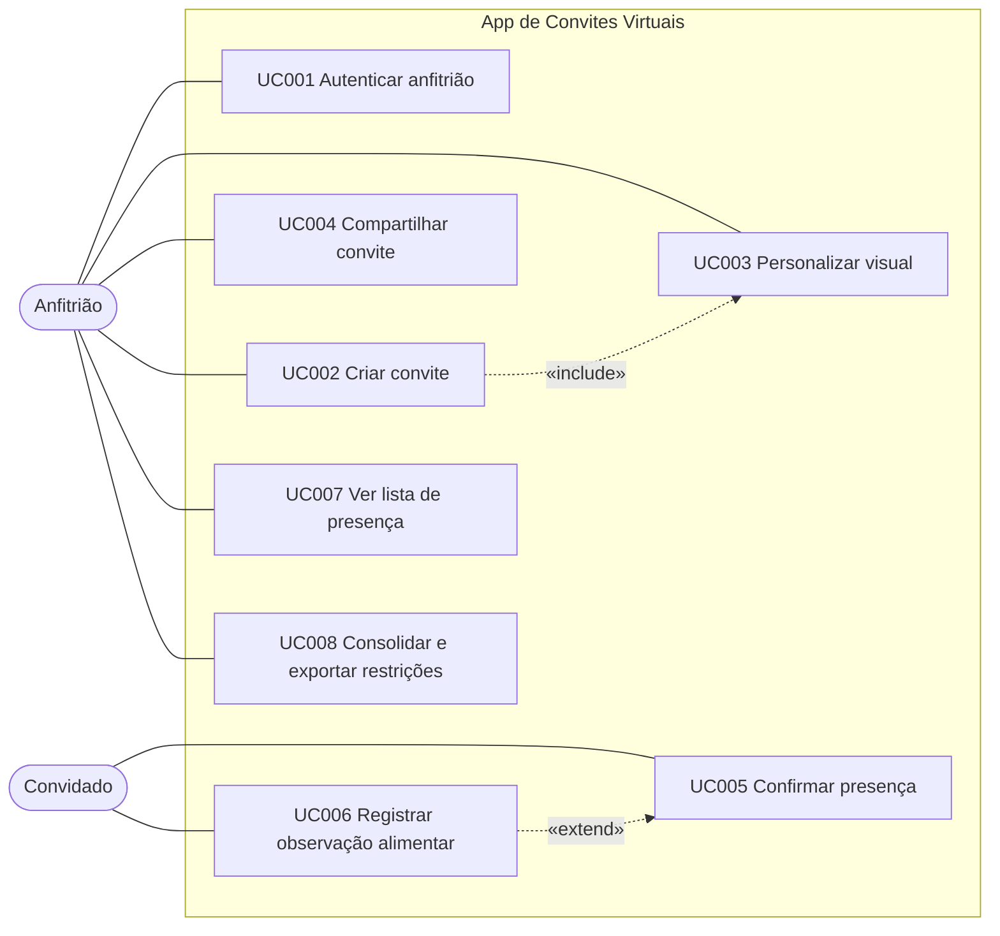

# Diagrama de Casos de Uso

Notação UML: fronteira do sistema, atores (Anfitrião, Convidado), casos de uso (mesmos nomes da [Especificação](Especificação-de-Casos-de-Uso.md)) e relações `<<include>>` e `<<extend>>`.

Relações representadas:
- UC002 `<<include>>` UC003: ao criar o convite, o fluxo abre a personalização.
- UC005 `<<extend>>` UC006: registrar a observação alimentar é uma extensão opcional da confirmação de presença.

