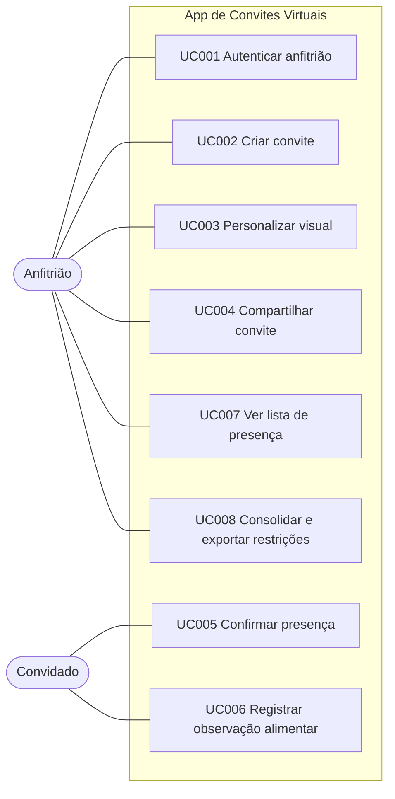

# Diagrama de Casos de Uso

> **A detalhar nesta Sprint 1.** Notação UML: fronteira do sistema, atores (Anfitrião, Convidado), casos de uso (mesmos nomes da [Especificação](Especificação-de-Casos-de-Uso.md)) e relações `<<include>>`/`<<extend>>`.
> Diagrama final desenhado em draw.io, Astah ou PlantUML e anexado como imagem em `/.attachments`. Abaixo, um rascunho aproximado em Mermaid. No GitHub a cerca é ` ```mermaid `; no Azure Wiki use `::: mermaid`.


