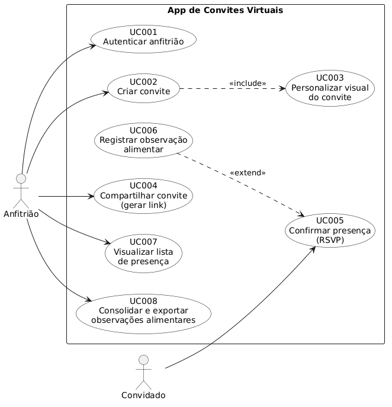

# Diagrama de Casos de Uso

O diagrama usa a fronteira do sistema, os atores Anfitrião e Convidado, os casos de uso da [especificação](Especificação-de-Casos-de-Uso.md) e as relações `<<include>>` e `<<extend>>`.

## Relações representadas
- **UC002 `<<include>>` UC003:** ao criar o convite, o fluxo sempre abre a personalização, então UC003 é parte obrigatória de UC002.
- **UC006 `<<extend>>` UC005:** registrar a observação alimentar é uma extensão opcional da confirmação de presença. A seta parte da extensão para o caso base, que é a direção correta em UML.

## Sobre as associações de ator
O Anfitrião se associa a UC001, UC002, UC004, UC007 e UC008. O Convidado se associa a UC005.

UC003 e UC006 não têm associação direta com os atores. Como UC003 é incluído por UC002 e UC006 estende UC005, a relação já é feita pelo caso de uso base. Uma ligação adicional ficaria duplicada.

## Fonte do diagrama
O diagrama é gerado a partir de [`diagrama-casos-de-uso.puml`](../../.attachments/diagrama-casos-de-uso.puml), versionado junto com a imagem. Para regerar depois de editar o fonte, com Docker:

    docker run --rm -v "<caminho de docs/.attachments>:/data" plantuml/plantuml -tpng /data/diagrama-casos-de-uso.puml
