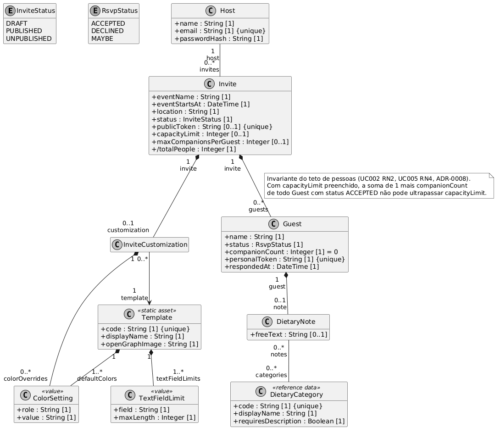

# Diagrama de Classes

O diagrama apresenta as classes do domínio, seus atributos e suas relações.

Cada atributo parte de uma Estrutura de Dados, de uma Regra de Negócio da [Especificação de Casos de Uso](../Sprint-1/Especificação-de-Casos-de-Uso.md) ou de uma [Decisão Arquitetural](../../Diretrizes-do-Projeto/Decisões-Arquiteturais.md). Os identificadores estão em inglês, conforme o [Guia de Estilo](../../Diretrizes-do-Projeto/Guia-de-Estilo.md).

## Descrição das classes

### Classe Host

**Descrição:** o anfitrião autenticado, dono dos convites que cria.

**Responsabilidades:** guardar a credencial de acesso ao painel e ser o proprietário dos convites.

**Relações:** um Host possui de zero a muitos Invite.

**Origem:** UC001 ED1.

### Classe Invite

**Descrição:** o convite de um evento e a raiz do modelo.

**Responsabilidades:** guardar os dados do evento, controlar a situação de publicação, carregar o identificador público do link, e definir os dois limites opcionais do evento.

**Relações:** pertence a um Host, tem no máximo uma InviteCustomization e agrega de zero a muitos Guest.

**Sobre os atributos:**

- `publicToken` é opcional porque nasce apenas na transição para publicado (UC004 passo 3). Enquanto o convite é rascunho, ele não existe. É o token de 128 bits do [ADR-0005](../../Diretrizes-do-Projeto/Decisões-Arquiteturais/0005-Identificador-público-do-convite.md), em coluna separada da chave primária.
- A situação ativo ou inativo do link, citada na ED1 do UC004, é derivada de `status` e não vira uma segunda coluna.
- `capacityLimit` e `maxCompanionsPerGuest` são limites independentes (UC002 RN2). O primeiro vale para o evento inteiro e o segundo para cada resposta. A camada de Dados verifica `capacityLimit` dentro de uma transação. A seção 3.4 do [Guia da Arquitetura](../../Diretrizes-do-Projeto/Guia-da-Arquitetura.md) explica o problema de fazer essa verificação em outra camada.
- `/totalPeople` é derivado, indicado pela barra, e não é coluna. Quem o calcula em execução é `AttendanceService`, somando os acompanhantes sobre as linhas que `findAttendanceByStatus` já devolveu. É a RN1 do UC007.
- As três consultas do painel não são operações de `Invite`. A lista do UC007 é uma projeção de `Guest`, a consolidação do UC008 agrega por categoria e a exportação monta uma junção sob demanda. Elas também não geram tabelas próprias. No Domínio, `AttendanceService` oferece `listAttendance` e `DietaryService` atende as outras duas consultas, conforme a tabela 4.2 do [Guia da Arquitetura](../../Diretrizes-do-Projeto/Guia-da-Arquitetura.md). As três operações recebem `inviteId` e `hostId`, em vez de operar sobre uma instância já carregada de `Invite`.

**Origem:** UC002 ED1 e RN2, UC004 ED1, ADR-0005 e ADR-0008.

### Classe InviteCustomization

**Descrição:** as escolhas visuais aplicadas a um convite.

**Responsabilidades:** apontar o template escolhido e guardar os ajustes de cor que sobrescrevem o padrão.

**Relações:** pertence a um Invite, referencia um Template e possui de zero a muitas ColorSetting.

**Multiplicidade 0..1:** o UC002 salva o rascunho no passo 5, mas o UC003 só grava as escolhas no passo 6. Nesse intervalo, o convite existe sem personalização e usa o template inicial com as cores padrão (UC003 passo 1).

A classe não tem atributos próprios porque os únicos textos nomeados na especificação são o nome do evento e o local, que já são atributos de Invite e ficam em colunas próprias, conforme o [ADR-0004](../../Diretrizes-do-Projeto/Decisões-Arquiteturais/0004-Stack-de-implementação.md). As cores são o único conteúdo semiestruturado do modelo. Não há mídia, por decisão do [ADR-0009](../../Diretrizes-do-Projeto/Decisões-Arquiteturais/0009-Personalização-por-template.md).

**Origem:** UC003 ED1.

### Classe Template

**Descrição:** um layout de convite em HTML e CSS. Marcada com o estereótipo `<<static asset>>` porque **não é tabela**: é catálogo versionado junto com o código.

**Responsabilidades:** definir o layout, as cores padrão, os limites de tamanho dos campos de texto e a imagem de prévia do link.

**Relações:** referenciado por muitas InviteCustomization, possui suas ColorSetting padrão e suas TextFieldLimit.

O [ADR-0009](../../Diretrizes-do-Projeto/Decisões-Arquiteturais/0009-Personalização-por-template.md) coloca os templates no tier Front, mas o fluxo A1 do UC003 exige validar o tamanho dos textos no Domínio. Por isso, o tier API também precisa ter acesso ao catálogo de limites. O contrato de tipos compartilhado do ADR-0004 permite essa divisão.

**Origem:** UC003 passo 2 e RN1, ADR-0009.

### Classes ColorSetting e TextFieldLimit

**Descrição:** objetos de valor. ColorSetting associa um papel de cor a um valor, e TextFieldLimit associa um campo de texto ao seu tamanho máximo.

**Responsabilidades:** ColorSetting carrega tanto a paleta padrão do template quanto as sobrescritas do convite. TextFieldLimit sustenta a regra RN2 do UC003.

**Relações:** ambas compõem Template. ColorSetting também compõe InviteCustomization.

**Origem:** UC003 ED1 e RN2.

### Classe Guest

**Descrição:** um convidado que respondeu ao convite. O registro é criado no momento da resposta, sem cadastro prévio pelo anfitrião, conforme o [ADR-0006](../../Diretrizes-do-Projeto/Decisões-Arquiteturais/0006-Identidade-do-convidado.md).

**Responsabilidades:** registrar quem respondeu, o que respondeu, quantas pessoas leva, e carregar a credencial que permite editar a resposta depois.

**Relações:** pertence a um Invite e possui no máximo uma DietaryNote.

**Sobre os atributos:**

- `respondedAt` é obrigatório justamente porque o registro nasce na resposta. Se o time voltar a ter lista prévia de convidados, este atributo passa a ser opcional, e o ADR-0006 já registra que a entidade é a mesma nos dois modelos.
- `personalToken` é a credencial de edição da resposta (UC005 ED2 e RN3), e é o **segundo identificador público do sistema**. O [ADR-0011](../../Diretrizes-do-Projeto/Decisões-Arquiteturais/0011-Identificador-pessoal-do-convidado.md) dá a ele a mesma geração do token do convite e registra que não há revogação nesta fase.
- `companionCount` respeita `maxCompanionsPerGuest` do convite, quando definido (UC005 RN2).
- Não há chave única por nome. Dois convidados com o mesmo nome geram registros diferentes, conforme o ADR-0006.

**Origem:** UC005 ED1 e ED2, ADR-0006.

### Classe DietaryNote

**Descrição:** a observação alimentar de um convidado, que é o diferencial declarado do produto.

**Responsabilidades:** ligar um convidado às categorias de restrição que ele marcou e ao texto livre que escreveu.

**Relações:** pertence a um Guest e associa-se a muitas DietaryCategory.

A nota só existe quando o status é ACCEPTED ou MAYBE, pela pré-condição do UC006. Nota sem categoria marcada significa sem restrição (UC006 A1), e ausência de nota significa que o convidado não passou pelo UC006.

**Origem:** UC006 ED1.

### Classe DietaryCategory

**Descrição:** a categoria de restrição alimentar. Marcada como `<<reference data>>` porque é dado de referência com carga inicial.

**Responsabilidades:** nomear a categoria e declarar se ela exige descrição adicional.

**As cinco entradas da carga inicial**, pela RN3 do UC006: `VEGETARIAN`, `VEGAN`, `GLUTEN_FREE`, `LACTOSE_FREE` e `ALLERGY`. O `code` é o que a agregação do UC008 agrupa, e o `displayName` é o que a tela mostra.

**Relações:** associa-se a muitas DietaryNote.

**Uso de classe:** `requiresDescription` é um dado da categoria, e a RN2 do UC006 depende dele para exigir a descrição quando a categoria é alergia. Por esse motivo, `DietaryCategory` não foi modelada como enumeração.

Um convidado com mais de uma categoria conta em cada uma na consolidação do UC008, que é o comportamento natural do agrupamento.

**Origem:** UC006 passo 1, RN2 e RN3, H10.

## Fora do diagrama

- **Chave primária e chave estrangeira** são modelo físico. O ADR-0005 trata da separação entre chave primária e identificador público.
- **A tabela de ligação** entre DietaryNote e DietaryCategory é implementação da associação muitos para muitos.
- **Sessão do anfitrião** e o **contador de limite de taxa** do ADR-0008 são infraestrutura e aparecem no diagrama de componentes.
- **O painel não tem entidade de assinatura**, porque o [ADR-0007](../../Diretrizes-do-Projeto/Decisões-Arquiteturais/0007-Atualização-da-lista-de-presença.md) escolheu consulta periódica.

## Pendências que este diagrama expôs

A modelagem encontrou pontos que dependem de decisão do time. Cada item traz o estado de hoje:

1. **Textos da personalização.** Se o UC003 prevê campos além do nome e do local do evento, é preciso definir seus nomes, passos e colunas. Até lá, `InviteCustomization` fica sem atributos de texto.
2. **Validade do `personalToken`.** O [ADR-0011](../../Diretrizes-do-Projeto/Decisões-Arquiteturais/0011-Identificador-pessoal-do-convidado.md) define a geração com 128 bits em base32 Crockford, sem revogação nesta fase, e mantém o link pessoal válido quando o convite é despublicado. Ainda falta definir até quando a RN3 do UC005 permite alterações, o que depende do item 4.
3. **Lista de categorias alimentares.** Fechada pela RN3 do UC006. São cinco entradas com carga inicial, e só `ALLERGY` exige descrição.
4. **Fuso horário e fim do evento.** Três regras dependem de tempo, mas `Invite` tem data e hora separadas, sem duração nem fuso. O comportamento no dia do evento ainda não está definido.

## Fonte do diagrama

Gerado a partir de [`diagrama-de-classes.puml`](../../.attachments/diagrama-de-classes.puml), versionado junto com a imagem. Para regerar depois de editar o fonte, com Docker:

    docker run --rm -v "<caminho de docs/.attachments>:/data" plantuml/plantuml -tpng /data/diagrama-de-classes.puml
