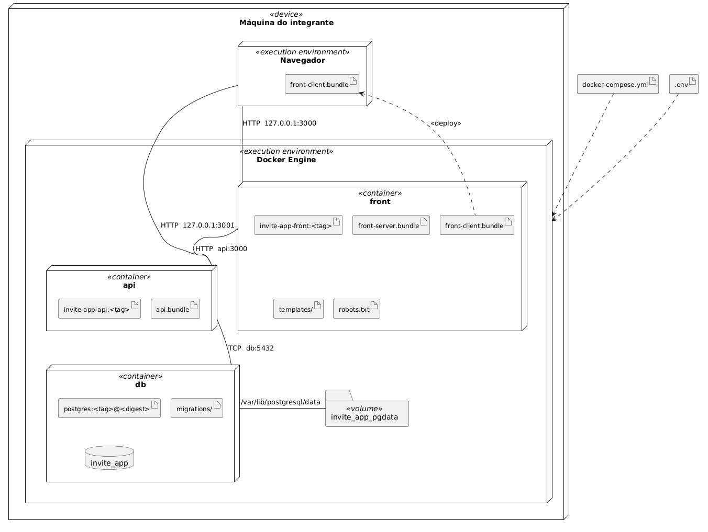

# Diagrama de Implantação

Visão de execução. Mostra em que máquina e em que ambiente cada artefato do sistema roda, e por onde esses ambientes conversam.

A organização segue os sete passos sugeridos pelo professor e usados nas tasks do item #60 no Azure Boards.

| Passo | Task | Resultado | Seção |
|---|---|---|---|
| 1. Identificar os nós de implantação | #71 | Lista de nós | 1 |
| 2. Mapear componentes para os nós | #72 | Componentes alocados | 2 |
| 3. Definir os dispositivos e artefatos | #73 | Dispositivos e artefatos por nó | 3 |
| 4. Desenhar o diagrama | #74 | Diagrama preliminar | 4 |
| 5. Definir os links de comunicação | #75 | Links com protocolo e endereço | 5 |
| 6. Refinar | #76 | Diagrama finalizado | 6 |
| 7. Revisão por pares | #77 | Feedback incorporado | 7 |

A seção 10 do [Guia da Arquitetura](../../Diretrizes-do-Projeto/Guia-da-Arquitetura.md) fornece os dados de entrada: artefatos por container na 10.3, comunicação entre serviços na 10.4 e pendências na 10.7. Onze itens daquela lista dependiam deste diagrama. A seção 8 registra as decisões tomadas.

O diagrama descreve a estrutura prevista para a Sprint 3. O `docker-compose.yml` já está na raiz do repositório, mas os serviços `front` e `api` dependem do código que será implementado na próxima sprint.

---

## 1. Passo 1, os nós de implantação

### 1.1 Critério para os nós

Em UML, nó é lugar onde alguma coisa executa, e ele vem em dois tipos. **Dispositivo** é hardware. **Ambiente de execução** é software que hospeda outro software. Um nó pode conter outro, e é assim que o desenho fica.

O [ADR-0003](Decisões-Arquiteturais/0003-Ambiente-de-execução.md) limita a execução ao computador de desenvolvimento, usando `docker compose up`, sem ambiente publicado. Por isso, o diagrama tem um único dispositivo. Não há máquinas separadas para aplicação e banco, balanceador ou infraestrutura em nuvem.

| Nó | Tipo | O que é |
|---|---|---|
| Máquina do integrante | Dispositivo | O computador de quem sobe o ambiente |
| Navegador | Ambiente de execução | Onde o convidado abre o convite e o anfitrião abre o painel |
| Docker Engine | Ambiente de execução | O que roda os containers, dentro da mesma máquina |
| `front` | Container | O processo Node do tier Front |
| `api` | Container | O processo NestJS com as três camadas |
| `db` | Container | O PostgreSQL |

São seis nós, dos quais um é um dispositivo. O volume nomeado aparece ao lado do `db` como local de persistência, não como nó.

### 1.2 Navegador como nó

Neste diagrama, o navegador aparece como local de execução do `front-client.bundle`.

O navegador é um nó de execução, mas não um tier. Ele não é iniciado pelo `docker compose` nem faz parte das unidades de implantação definidas no [ADR-0002](Decisões-Arquiteturais/0002-Empacotamento-em-tiers.md).

O sistema produz o `front-client.bundle` e o entrega ao navegador, onde ele executa e faz o POST do UC005. Por isso, o navegador precisa aparecer como nó.

> Tier indica a unidade que entrega o artefato. Nó indica onde o artefato executa. O navegador é apenas um nó.

O `db`, por outro lado, é tanto tier quanto nó. A distinção importa porque tier representa uma unidade de implantação, enquanto nó indica onde um artefato executa.

### 1.3 Nós fora do escopo

Não há nó de rede ou balanceador. O ADR-0003 limita o ambiente ao host local, e a seção 10.6 do guia registra que não existe um ambiente compartilhado.

Também não há um segundo dispositivo para o convidado. Neste ambiente, o convite é aberto no mesmo computador que executa o Compose, por isso os endereços do passo 5 usam `127.0.0.1`. Se houver publicação, o navegador passará para outro dispositivo e o diagrama deverá ser atualizado.

---

## 2. Passo 2, componentes para os nós

O mapeamento combina a seção 4.2 do [Diagrama de Componentes](Diagrama-de-Componentes.md), que associa componentes a artefatos, com a seção 10.3 do guia, que associa artefatos a containers.

| Componentes | Artefato que os carrega | Nó onde executa |
|---|---|---|
| `PublicInvitePage`, metade de leitura | `front-server.bundle` | `front` |
| `PublicInvitePage`, metade de escrita, e `HostPanelPage` | `front-client.bundle` | Navegador |
| `ApiClient` | `front-server.bundle` e `front-client.bundle` | `front` e Navegador |
| `TemplateSet` | `templates/` | `front` |
| Os quatro controllers, as duas guardas e o filtro | `api.bundle` | `api` |
| Os seis serviços de Domínio | `api.bundle` | `api` |
| Os três repositórios | `api.bundle` | `api` |
| `invite_app` | `postgres:<tag>@<digest>` | `db` |

`PublicInvitePage` e `ApiClient` aparecem em dois nós. O mesmo build gera código executado no servidor, dentro do container, e no navegador, fora dele, conforme a seção 10.2 do guia.

Os 21 componentes estão distribuídos em quatro nós, dos quais três são containers. O Docker Engine apenas hospeda os containers e não executa um componente do sistema.

---

## 3. Passo 3, os dispositivos e os artefatos

### 3.1 O dispositivo

O projeto não define requisitos de processador, memória ou disco para as máquinas de desenvolvimento. O ADR-0002 apenas registra que três containers consomem mais memória do que um processo único. Por falta de medidas, o diagrama não inclui uma especificação de hardware.

Os requisitos de hardware só devem ser incluídos depois de medir o consumo dos três containers nas máquinas da equipe.

### 3.2 Os artefatos por nó

| Nó | Artefato | Tipo | Como nasce |
|---|---|---|---|
| `front` | `invite-app-front:<tag>` | Imagem | Build do `Dockerfile` do front |
| `front` | `front-server.bundle` | Executável | Saída de servidor do build do Next.js |
| `front` | `front-client.bundle` | Executável | Saída de cliente do mesmo build, servida ao navegador |
| `front` | `templates/` | Ativo estático | Versionado, copiado no build, pelo [ADR-0009](Decisões-Arquiteturais/0009-Personalização-por-template.md) |
| `front` | `robots.txt` | Ativo estático | Versionado, copiado no build, pela seção 9.5 do guia |
| Navegador | `front-client.bundle` | Executável | O mesmo arquivo, entregue pela resposta HTTP |
| `api` | `invite-app-api:<tag>` | Imagem | Build do `Dockerfile` da API |
| `api` | `api.bundle` | Executável | Compilação do TypeScript, com as três camadas |
| `db` | `postgres:<tag>@<digest>` | Imagem | Obtida do registry, não construída pelo time |
| `db` | `migrations/` | Script | Versionado, montado no container |
| Docker Engine | `docker-compose.yml` | Especificação de implantação | Versionado |
| Docker Engine | `.env` | Configuração | Preenchido por quem sobe o ambiente |

O `robots.txt` é um ativo estático do tier Front, conforme a seção 9.5 do guia. Ele também foi adicionado ao inventário da seção 4.1 do Diagrama de Componentes.

### 3.3 Elementos que não são implantados separadamente

O módulo `contract/` não aparece no diagrama porque seus tipos são removidos na compilação. Valores de execução, como o enum `RsvpStatus`, são compilados dentro dos dois bundles. A seção 10.3 do guia detalha essa decisão.

Os arquivos `Dockerfile` também ficam fora. Eles produzem as imagens do Front e da API. O Banco usa uma imagem pronta.

---

## 4. Passo 4, o diagrama

### Como ler

**Nó:** caixa tridimensional. `<<device>>` representa hardware, `<<execution environment>>` representa um software que hospeda outro software e `<<container>>` representa o ambiente criado pelo Docker.

**Artefato:** retângulo com o canto dobrado. Pode representar imagem, executável, script ou arquivo de configuração.

**Caminho de comunicação:** linha cheia entre nós, identificada pelo protocolo e pelo endereço. Os cinco caminhos estão detalhados no passo 5.

**Implantação:** linha tracejada com `<<deploy>>`. No diagrama, indica que o `front-client.bundle` sai do container `front` e executa no navegador.

As explicações dos símbolos ficam nesta seção, seguindo o padrão dos demais diagramas da Sprint 2.

### Decisões mostradas na figura

Todos os nós ficam dentro de um único dispositivo, conforme o ambiente local definido no ADR-0003.

O `front-client.bundle` aparece no container e no navegador porque é entregue de um nó para executar no outro. A relação `<<deploy>>` representa esse movimento.

Não há caminho entre o navegador e o `db`, conforme a seção 6.3 do guia. O banco não publica uma porta para fora da rede do Compose, mas continua acessível aos demais containers da rede, como registra a seção 10.5.

O volume fica fora do `db` para persistir mesmo quando o container é removido. Front e API não têm volumes porque não armazenam estado. O Compose declara o volume como `pgdata` e cria o objeto `invite-app_pgdata`, que é o nome na figura. Os dois diferem porque o Compose prefixa tudo com o nome do projeto.

---

## 5. Passo 5, os links de comunicação

### 5.1 Os cinco caminhos

| # | De | Para | Protocolo | Endereço usado por quem chama | Publicado no host |
|---|---|---|---|---|---|
| 1 | Navegador | `front` | HTTP | `127.0.0.1:3000` | Sim, `3000:3000` |
| 2 | Navegador | `api` | HTTP | `127.0.0.1:3001` | Sim, `3001:3000` |
| 3 | `front` | `api` | HTTP | `api:3000` | Não se aplica, nasce dentro da rede |
| 4 | `api` | `db` | TCP | `db:5432` | Não |
| 5 | `db` | volume | Montagem | `/var/lib/postgresql/data` | Não se aplica |

Os links 1 e 3 formam o caminho de dois saltos do convite público descrito no ADR-0002. O link 2 atende ao POST do UC005 e às cinco rotas do painel.

### 5.2 Endereços da API

A API usa endereços diferentes dentro e fora da rede do Compose.

O `front`, dentro da rede do Compose, chama `api:3000` pelo nome do serviço. O navegador está fora dessa rede e usa a porta publicada em `127.0.0.1:3001`.

> **O endereço da API que vai compilado no `front-client.bundle` nunca é o nome de serviço do compose.** Se `api:3000` aparecer em código entregue ao navegador, o convite quebra na máquina do convidado sem quebrar build nem teste. É o terceiro item da quarta busca da seção 10.5 do guia.

O build do Front usa duas configurações: `API_URL_INTERNAL` no servidor e `NEXT_PUBLIC_API_URL` no código enviado ao navegador. Elas já estão declaradas no `docker-compose.yml`.

### 5.3 Por que a `api` publica porta e o `db` não

O Front e a API publicam portas porque ambos recebem chamadas do navegador. O POST do UC005 chega diretamente à API, sem passar pelo Front. O banco permanece apenas na rede interna.

O `db` não publica porta porque ninguém fora da rede precisa alcançá-lo. Quem precisa inspecionar o banco durante o desenvolvimento entra pelo `docker compose exec`, que não passa pela rede publicada.

### 5.4 Ordem de subida

O ADR-0002 exige `HEALTHCHECK` com `condition: service_healthy` para evitar que a API inicie antes de o banco estar pronto. A ordem é `db`, `api` e `front`.

O `front` só chama a API quando recebe uma requisição de convite público. Se a API ainda não estiver disponível, ele exibe a página de indisponibilidade definida na seção 9.4 do guia.

---

## 6. Passo 6, ajustes feitos no diagrama

1. **Inclusão do navegador como nó.** O primeiro rascunho não mostrava onde o `front-client.bundle` executava. A seção 1.2 diferencia nó de tier.

2. **Remoção do serviço `migrate`.** O primeiro rascunho usava um quarto container para aplicar as migrações. A versão atual mantém os três serviços definidos no ADR-0002. A forma de aplicar as migrações e sua limitação estão na seção 8.1.

3. **Definição das portas.** O material do T1 usava a porta 3000 apenas como exemplo. Os números adotados neste diagrama passam a ser decisões do projeto e ainda precisam de aprovação.

4. **Nome do serviço de banco.** `db` é o nome usado na rede do Compose. `invite_app` continua sendo o nome do banco dentro do container, como já diferencia a seção 1.6 do Diagrama de Componentes.

5. **Inclusão do `robots.txt`.** O arquivo é um ativo estático servido pelo tier Front, conforme a seção 9.5 do guia.

6. **Remoção das especificações de hardware.** O projeto ainda não definiu requisitos mínimos de memória ou processador, como explicado na seção 3.1.

---

## 7. Passo 7, revisão por pares

| # | O que verificar | Onde olhar |
|---|---|---|
| 1 | Todo componente do Diagrama de Componentes tem nó | Seção 2 |
| 2 | Todo artefato da seção 4.1 do Diagrama de Componentes ou está no diagrama ou tem ausência justificada | Seções 3.2 e 3.3 |
| 3 | Nenhum nó de infraestrutura que o ADR-0003 não sustenta | Seção 1.3 |
| 4 | Nenhum caminho de comunicação entre o Navegador e o `db` | Figura |
| 5 | O `db` não publica porta | Seção 5.1 |
| 6 | O endereço da API no código de cliente não é nome de serviço do compose | Seção 5.2 |
| 7 | Nada dentro da figura é frase, nota ou legenda | Figura |
| 8 | Nenhum número inventado que algum artefato já tenha decidido de outro jeito | Seção 8 |

O time ainda precisa aprovar as sete decisões da seção 8.

Registro da revisão, a preencher na cerimônia:

| Data | Revisores | Resultado |
|---|---|---|
| a preencher | a preencher | a preencher |

---

## 8. Decisões tomadas durante a modelagem

Estas decisões seguem a seção 11 do Guia da Arquitetura. Elas registram a proposta atual, mas ainda não têm o peso de um ADR.

| # | Decisão | Fecha qual linha da seção 10.7 do guia |
|---|---|---|
| 1 | O `front` publica `3000:3000` e a `api` publica `3001:3000`. O `db` não publica porta | Número de porta e mapeamento para o host |
| 2 | Os serviços do compose se chamam `front`, `api` e `db` | Nome de cada serviço |
| 3 | O volume do tier Banco é declarado como `pgdata`, montado em `/var/lib/postgresql/data`, e o objeto no Docker fica `invite-app_pgdata` | Nome do volume |
| 4 | Ordem de subida `db`, `api`, `front`, com `HEALTHCHECK` no `db` e `condition: service_healthy` na `api` | A declaração de `HEALTHCHECK` e a ordem de subida |
| 5 | As `migrations/` são montadas no diretório de inicialização do container `db` e aplicadas por ele | Quem aplica as `migrations/` e em que momento |
| 6 | O `robots.txt` é artefato do container `front` | Nenhuma. A correção já foi aplicada na seção 4.1 do Diagrama de Componentes |
| 7 | O dispositivo não recebe especificação de hardware enquanto não houver medida | Nenhuma, é limite desta página |

### 8.1 Limitação da decisão 5

A imagem do PostgreSQL executa os scripts do diretório de inicialização apenas quando o volume está vazio. Portanto, uma mudança de esquema feita depois da primeira inicialização não é aplicada automaticamente. Nesse caso, é preciso remover o volume com `docker compose down -v` e iniciar o ambiente novamente, o que apaga os dados locais.

Essa limitação foi aceita porque o ADR-0003 restringe o ambiente ao desenvolvimento local, sem dados que precisem ser preservados. Uma ferramenta dedicada exigiria um quarto serviço no Compose ou transferiria para a API a responsabilidade pelo esquema.

> Esta decisão deve ser revista antes de usar o sistema com dados que precisem ser preservados ou em um ambiente publicado.

---

## 9. Pendências

Depois da criação do `docker-compose.yml`, permanecem três pontos em aberto:

1. **Valores de tag e de digest das imagens construídas pelo time.** O compose usa `${IMAGE_TAG:-dev}`, que serve enquanto o ADR-0003 valer e não é etiqueta de versão. A imagem do banco já está escolhida e fixada em `postgres:17-alpine`, e o digest continua sem fixar.
2. **O contador do `RateLimitGuard` supõe uma instância só.** O [ADR-0010](Decisões-Arquiteturais/0010-Autenticação-do-anfitrião.md) decidiu contador em memória do processo e sessão em cookie assinado, então nenhuma das duas guardas acrescenta nó e este diagrama não muda por causa delas. O que muda o diagrama é o item seguinte.
3. **Se a API ganha réplicas.** Se ganhar, este diagrama muda de verdade, porque passa a ter mais de uma instância do mesmo container e a decisão do contador em memória do `RateLimitGuard` deixa de valer junto.

---

## 10. Rastreabilidade

| Artefato | Relação |
|---|---|
| Seção 10 do [Guia da Arquitetura](../../Diretrizes-do-Projeto/Guia-da-Arquitetura.md) | Entrada direta. A 10.3 deu os artefatos por container, a 10.4 deu os caminhos e a 10.7 deu a lista do que decidir aqui |
| [Diagrama de Componentes](Diagrama-de-Componentes.md) | A seção 4.2 daquela página ligou componente a artefato, e esta liga artefato a nó. Nenhum componente novo foi criado |
| [ADR-0002](Decisões-Arquiteturais/0002-Empacotamento-em-tiers.md) | Os três containers e a exigência de `HEALTHCHECK` e de volume |
| [ADR-0003](Decisões-Arquiteturais/0003-Ambiente-de-execução.md) | O dispositivo único e a ausência de ambiente publicado |
| `docker-compose.yml` | **Escrito**, na raiz do repositório. O ADR-0002 registra que ele é a forma executável deste diagrama, e as sete decisões da seção 8 estão todas dentro dele. O `db` sobe e fica saudável hoje. O `api` e o `front` esperam o código da Sprint 3 |

## Fonte do diagrama

Gerado a partir de [`diagrama-de-implantacao.puml`](../../.attachments/diagrama-de-implantacao.puml), versionado junto com a imagem. Para regerar depois de editar o fonte, com Docker:

    docker run --rm -v "<caminho de docs/.attachments>:/data" plantuml/plantuml -tpng /data/diagrama-de-implantacao.puml
