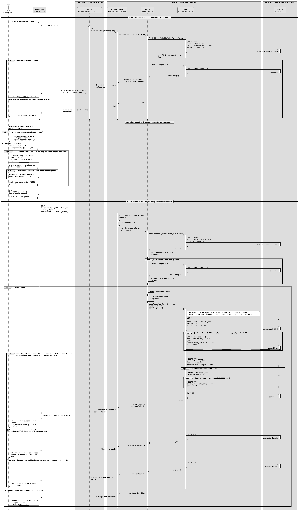
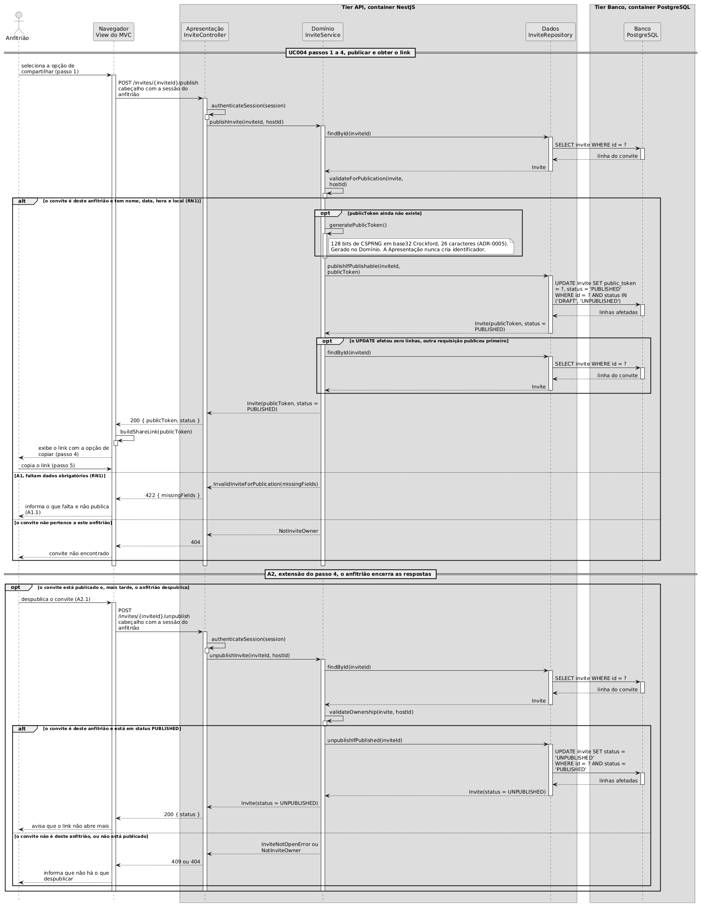
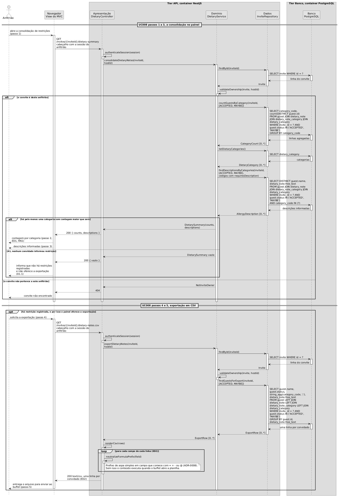

# Diagramas de Sequência

Os diagramas mostram a ordem das interações nos principais fluxos do sistema e a camada responsável por cada etapa.

As linhas de vida representam os papéis de camada definidos no [ADR-0001](../../Diretrizes-do-Projeto/Decisões-Arquiteturais/0001-Estilo-arquitetural.md) e os tiers do [ADR-0002](../../Diretrizes-do-Projeto/Decisões-Arquiteturais/0002-Empacotamento-em-tiers.md), não as classes do [Diagrama de Classes](Diagrama-de-Classes.md). `Invite`, `Guest`, `DietaryNote` e `DietaryCategory` aparecem como dados trocados entre essas linhas.

Nos três diagramas, as chamadas seguem da Apresentação para o Domínio e do Domínio para os Dados. As linhas tracejadas mostram os retornos. O Domínio e os Dados não dependem da Apresentação.

## Diagrama 1, Confirmar presença

O diagrama cobre o UC005 e a extensão do UC006 no passo 4. Esse fluxo atravessa a fronteira pública e é o único que permite escrita sem autenticação.

### Decisões representadas

Na leitura, o navegador chama o tier Front. O Front renderiza a página no servidor e consulta a API pela rede do Compose. Esse é o caminho de dois saltos descrito no ADR-0002.

Na escrita, o POST vai do navegador direto para a API. O tier Front não repassa o comando, conforme a divisão definida no [ADR-0004](../../Diretrizes-do-Projeto/Decisões-Arquiteturais/0004-Stack-de-implementação.md).

O teto de capacidade é verificado dentro da transação. A sequência usa `BEGIN`, `SELECT ... FOR UPDATE`, contagem das vagas ocupadas, `INSERT` e `COMMIT`. No ramo de evento lotado, usa `ROLLBACK`.

Se essa verificação fosse feita na Apresentação, duas respostas simultâneas quando houvesse 49 de 50 vagas poderiam ser aceitas, levando o total a 51. Por isso, a regra fica na camada de Dados.

### Responsabilidades por camada

| Passo | Camada | Por quê |
|---|---|---|
| Limite de taxa | Apresentação | Controle de tráfego, não regra do caso de uso (ADR-0008) |
| Desserialização e tipos | Apresentação | Só forma. O conjunto de valores válidos é o `RsvpStatus` do Domínio |
| Limite de acompanhantes por resposta (RN2) | Domínio | Regra de negócio |
| Validação da observação alimentar (UC006 RN2) | Domínio | Depende de `requiresDescription` da categoria |
| Geração do `personalToken` | Domínio | A Apresentação nunca cria identificador |
| Teto de capacidade (RN4) | Dados | Invariante que depende do estado do banco e exige transação |

Também aparecem os fluxos A1 (recusa), A2 (dados inválidos), A3 (observação alimentar opcional) e A4 (evento lotado, com `ROLLBACK`). No A1, o fluxo segue para o passo 5 porque a recusa também precisa ser identificada por nome.

## Diagrama 2, Publicar convite e gerar link

O diagrama cobre o UC004 e a extensão A2, usada para despublicar o convite.

### Decisões representadas

O Domínio gera o `publicToken` com 128 bits de CSPRNG em base32 Crockford, totalizando 26 caracteres, conforme o [ADR-0005](../../Diretrizes-do-Projeto/Decisões-Arquiteturais/0005-Identificador-público-do-convite.md).

A geração fica dentro de um bloco `opt`, pois o token só é criado quando ainda não existe. Ao republicar um convite, o sistema reaproveita o link anterior. Despublicar apenas desativa o acesso, sem apagar o token.

A transição de situação é atômica sem uma transação explícita. O `UPDATE` verifica a situação no `WHERE` e faz a alteração no mesmo comando. Isso evita que dois cliques em compartilhar gerem tokens diferentes.

Esse fluxo explica a multiplicidade `[0..1]` do `publicToken` no Diagrama de Classes: o campo não existe antes da primeira publicação.

Quando o convite pertence a outro anfitrião, a API responde 404 em vez de 403 para não confirmar a existência do recurso, conforme o ADR-0008.

## Diagrama 3, Consolidar e exportar observações alimentares

O diagrama cobre o UC008, com a contagem por categoria e a exportação em CSV.

### Decisões representadas

A camada de Dados faz a agregação com `GROUP BY`. As linhas não são carregadas no Domínio apenas para serem contadas em memória.

A consolidação e a lista são consultas sobre `Invite` e `Guest`, não entidades. Nenhuma etapa grava uma tabela de consolidação.

A Apresentação trata a injeção de fórmula na exportação. Campos iniciados por `=`, `+`, `-` ou `@` recebem uma aspa simples como prefixo (ADR-0008). O banco mantém o valor original, e a alteração vale apenas para o CSV.

O texto vem de um formulário anônimo, passa pela API, é armazenado e depois chega a uma planilha usada pelo buffet. Como esse caminho não exige autenticação do convidado, o tratamento na saída é necessário.

## Pontos em aberto

Os diagramas encontraram quatro pontos ainda não resolvidos na especificação:

1. **Exportação sem restrições.** A pré-condição do UC008 bloqueia a exportação quando ninguém informa uma restrição. Nesse caso, o anfitrião também fica sem a lista de presença pedida na H12.
2. **Número de acompanhantes no CSV.** A ED2 do UC008 define quatro colunas, mas não inclui a quantidade de acompanhantes, necessária para o planejamento do buffet.
3. **Alteração da resposta.** A H09 aparece apenas como RN3 do UC005 e ainda não tem um fluxo próprio.
4. **Autenticação do anfitrião.** Nos três diagramas, `authenticateSession` valida a assinatura de um cookie e devolve o `hostId` sem consultar o banco. A decisão está no [ADR-0010](../../Diretrizes-do-Projeto/Decisões-Arquiteturais/0010-Autenticação-do-anfitrião.md).

## Fontes dos diagramas

Gerados a partir dos arquivos `.puml` versionados em `/.attachments`, ao lado dos PNG. Para regerar:

    docker run --rm -e PLANTUML_LIMIT_SIZE=16384 -v "<caminho de docs/.attachments>:/data" plantuml/plantuml -tpng /data/diagrama-sequencia-uc005.puml

A variável `PLANTUML_LIMIT_SIZE` é necessária porque os diagramas passam do teto padrão de 4096 pixels. Sem ela o PNG sai cortado no rodapé.
