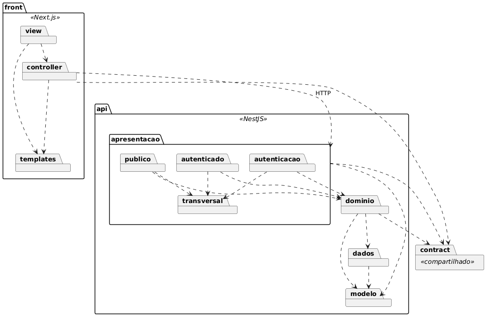
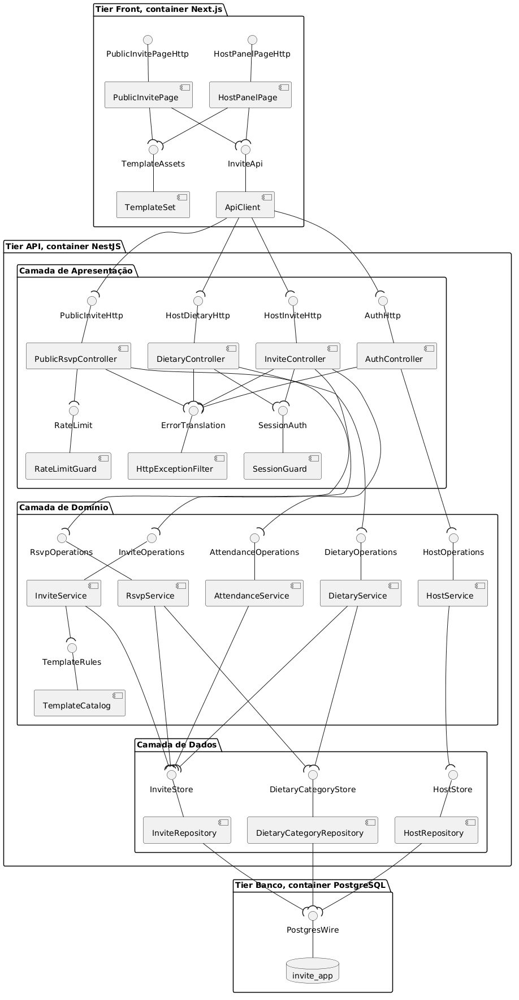
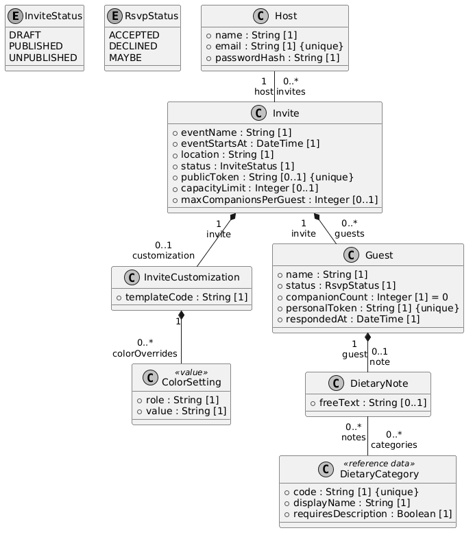

# Documento de Arquitetura de Software

**Projeto:** invite-app
**Versão:** 0.1
**Autores:** Tiago Passos, Guilherme Toebe dos Santos, Andreas Grings, Gabriel Tomasi de Melo

## Histórico de Revisões

| Data | Versão | Descrição | Autor |
|---|---|---|---|
| 19/09/2026 | 0.1 | Estrutura do documento a partir do template da Aula 07 | Tiago Passos |

---

## Como preencher este documento

> **Este bloco sai antes da entrega.** Ele existe só enquanto o documento está sendo escrito, e a task **#108** o remove junto com a revisão final.

A estrutura segue o template do RUP que o professor disponibilizou na Aula 07. Duas escolhas de formato vieram dos dois exemplos preenchidos que ele publicou junto.

A subseção 1.5 Visão Geral foi retirada, porque nenhum dos dois exemplos a tem. A subseção 5.1 se chama Divisão em Pacotes, que é o nome que os dois exemplos usam no lugar de Pacotes de Design Significativos do template.

Seis das oito seções têm conteúdo já escrito em outro artefato. O trabalho nelas é recortar e adaptar, não redigir do zero.

| Seção | Task | De onde vem o conteúdo |
|---|---|---|
| 1. Introdução | #98 | Nada pronto. Texto curto, escrito aqui |
| 2. Representação Arquitetural | #98 | [Guia da Arquitetura](../../Diretrizes-do-Projeto/Guia-da-Arquitetura.md), seções 1 e 2 |
| 3. Metas e Restrições | #98 | Os 12 [ADRs](../../Diretrizes-do-Projeto/Decisões-Arquiteturais.md), em forma de restrições curtas |
| 4. Visão de Casos de Uso | #99 | [Especificação de Casos de Uso](../Sprint-1/Especificação-de-Casos-de-Uso.md) e [Diagrama de Casos de Uso](../Sprint-1/Diagrama-de-Casos-de-Uso.md) |
| 5. Visão Lógica | #100, #101, #102 | [Diagrama de Classes](../Sprint-2/Diagrama-de-Classes.md). Falta o diagrama de pacotes, que é a task #100 |
| 6. Visão de Implantação | #103 | [Diagrama de Implantação](../Sprint-2/Diagrama-de-Implantação.md), pronto |
| 7. Visão da Implementação | #104 | [Diagrama de Componentes](../Sprint-2/Diagrama-de-Componentes.md) e seção 10 do Guia da Arquitetura |
| 8. Visão de Dados | #105, #106, #107 | Nada pronto. É o único conteúdo inteiramente novo |

O formato da tabela de descrição de classe da seção 5 é decidido na task **#97** e vale para todas as classes, sem variação entre quem escreve.

---

## 1. Introdução

### 1.1 Finalidade

Este documento reúne as decisões arquiteturais do invite-app e as apresenta em visões, para que quem for implementar o sistema encontre num lugar só o que precisa saber antes de escrever a primeira linha de código.

O público é o time de desenvolvimento e o Product Owner. O time o usa como referência de onde cada responsabilidade mora e de qual regra de fronteira não pode ser quebrada. O Product Owner o usa para conferir se a solução projetada atende o que a [Visão do Produto](../../Visão-do-Produto.md) pede.

São oito seções. As de 1 a 3 situam o leitor e listam o que restringe a arquitetura. As de 4 a 8 são as visões, cada uma olhando o mesmo sistema por um ângulo diferente.

**O documento se sustenta sozinho.** Nenhuma seção depende de o leitor abrir outro artefato para fazer sentido. Os links existem para quem quiser o texto longo de alguma decisão, e são opcionais.

### 1.2 Escopo

Cobre a arquitetura do invite-app, a aplicação web de convites com confirmação de presença e observação alimentar. Abrange os três containers do sistema, as camadas lógicas dentro da API, os componentes de cada camada e o modelo de dados que sustenta os oito casos de uso.

Fica de fora o que a Visão do Produto já colocou fora do MVP, e ficam de fora os detalhes de implementação que não mudam a estrutura, como a escolha de biblioteca de componentes visuais.

Quando este documento e um ADR discordarem, **o ADR é a decisão de registro**. Decisão nova nasce em ADR e chega aqui depois, nunca o contrário.

### 1.3 Definições, Acrônimos e Abreviações

| Termo | O que significa |
|---|---|
| Anfitrião | Quem cria o convite e acompanha o painel. É o único ator com conta no sistema |
| Convidado | Quem abre o link e responde. Não tem cadastro, e a identidade nasce junto com a resposta |
| RSVP | A confirmação de presença, e o nome do UC005 |
| Tier | Unidade de implantação, na prática um container. São três |
| Camada | Divisão lógica dentro da API. São três: Apresentação, Domínio e Dados |
| `publicToken` | Identificador público do convite, o que vai dentro do link compartilhado |
| `personalToken` | Identificador pessoal do convidado, o que permite voltar e alterar a resposta |
| ADR | Architecture Decision Record, um registro por decisão |
| DAS | Documento de Arquitetura de Software, este documento |
| MVC | Model, View e Controller, o padrão adotado no front |
| BCE | Boundary, Control e Entity, a notação usada no Documento de Realização |
| CSPRNG | Gerador de números aleatórios adequado a uso criptográfico |

### 1.4 Referências

Todos versionados em `docs/` no repositório GitHub do projeto e publicados na wiki do Azure DevOps.

| Documento | Sprint |
|---|---|
| [Visão do Produto](../../Visão-do-Produto.md) | 1 |
| [Diagrama de Casos de Uso](../Sprint-1/Diagrama-de-Casos-de-Uso.md) | 1 |
| [Especificação de Casos de Uso](../Sprint-1/Especificação-de-Casos-de-Uso.md) | 1 |
| [Diagrama de Classes](../Sprint-2/Diagrama-de-Classes.md) | 2 |
| [Diagrama de Componentes](../Sprint-2/Diagrama-de-Componentes.md) | 2 |
| [Diagrama de Implantação](../Sprint-2/Diagrama-de-Implantação.md) | 2 |
| [Decisões Arquiteturais](../../Diretrizes-do-Projeto/Decisões-Arquiteturais.md), treze ADRs | 2 e 3 |
| [Documento de Realização de Casos de Uso](Documento-de-Realização-de-Casos-de-Uso.md) | 3 |
| [Guia da Arquitetura](../../Diretrizes-do-Projeto/Guia-da-Arquitetura.md), documento de trabalho do time | 2 |

---

## 2. Representação Arquitetural

A arquitetura é apresentada em cinco visões. O template do RUP oferece seis, e a **Visão de Processos fica de fora**, porque o sistema não tem concorrência que renda diagrama próprio. Cada requisição é tratada de forma independente, e o único ponto de disputa, o teto de capacidade, se resolve numa transação de banco descrita na seção 7.1.

| Visão | Seção | Que tipo de elemento ela contém |
|---|---|---|
| Casos de Uso | 4 | Casos de uso e atores, com os arquiteturalmente significativos em destaque |
| Lógica | 5 | Pacotes e classes, com atributos, operações e relações |
| Implantação | 6 | Nós, artefatos e caminhos de comunicação |
| Implementação | 7 | Componentes, interfaces e camadas |
| Dados | 8 | Classes persistentes, estratégias de mapeamento e tabelas |

As realizações de caso de uso ficam num artefato independente, conforme a seção 4.1 indica.

Cada visão descreve o mesmo sistema, e o que muda é o tipo de elemento. O mesmo `InviteRepository` aparece como classe na 5, como componente na 7 e como origem de tabela na 8. Quando duas visões parecerem discordar, a divergência é erro e não perspectiva.

---

## 3. Metas e Restrições da Arquitetura

### 3.1 Metas de qualidade

| Meta | Como a arquitetura a atende | ADR |
|---|---|---|
| Segurança na fronteira pública | O convite abre sem login, então o link carrega um token de 128 bits de CSPRNG separado da chave primária, a escrita passa por limite de taxa, e o teto de capacidade é verificado dentro de uma transação na camada de Dados | 0005, 0006, 0008, 0011 |
| Segurança da conta do anfitrião | Senha guardada com Argon2id, sessão em cookie assinado com `HttpOnly` e `SameSite=Lax`, e recusa de credencial que não revela se o errado foi o email ou a senha | 0010 |
| Privacidade | Os dois tokens e o texto livre da observação alimentar nunca entram em log, e a rota registrada é o molde e não o caminho concreto | 0012 |
| Manutenibilidade | Três camadas com uma regra de dependência única, separação estrutural por módulos do framework em vez de convenção, e um contrato de tipos compartilhado que o build verifica | 0001, 0004 |
| Exibição do convite | Renderização no servidor, para que o link mostre prévia ao ser compartilhado e a página chegue pronta ao convidado | 0004 |
| Simplicidade deliberada | Consulta periódica em vez de Server-Sent Events no painel, e personalização por template em HTML e CSS em vez de upload de mídia | 0007, 0009 |

### 3.2 Restrições

| Restrição | De onde vem |
|---|---|
| **A execução é local.** `docker compose up` no computador de quem desenvolve, sem alvo de publicação, sem ambiente compartilhado e sem TLS | ADR-0003 |
| **São três containers**, um por serviço, o que parte a camada de Apresentação entre dois processos e faz um erro passar a ter dois lados | ADR-0002 |
| **A pilha está fechada** em Next.js no front, NestJS na API e PostgreSQL no banco | ADR-0004 |
| **O convidado não tem cadastro.** A identidade nasce na resposta, e por isso o sistema não sabe quem ainda não respondeu | ADR-0006 |
| **Não há envio de e-mail.** Nenhum caso de uso o pede, então não existe recuperação de senha nem lembrete automático | Especificação de Casos de Uso |
| **Não há observabilidade além do log em saída padrão.** Sem coletor de métricas, sem painel e sem rastreamento distribuído | ADR-0012 |
| **O fuso é um só para o projeto inteiro**, `America/Sao_Paulo`, então evento fora dele exibe hora local errada | ADR-0013 |
| **A equipe tem quatro pessoas e o prazo é o semestre letivo**, o que pesou contra toda decisão que exigisse container ou serviço novo | [Team Charter](../../Team-Charter.md) e [Proposta de Trabalho](../../Proposta-de-Trabalho.md) |

---

## 4. Visão de Casos de Uso

Os oito casos de uso do sistema, com os arquiteturalmente significativos em destaque. A especificação completa está na [Especificação de Casos de Uso](../Sprint-1/Especificação-de-Casos-de-Uso.md) e a figura no [Diagrama de Casos de Uso](../Sprint-1/Diagrama-de-Casos-de-Uso.md).

**O critério.** Um caso de uso é arquiteturalmente significativo quando é o único que exercita alguma decisão de arquitetura. Se ele sair deste documento, aquela decisão fica sem prova em diagrama. Cinco dos oito passam pelo critério, e eles rendem quatro realizações, porque o UC006 é extensão do UC005 e é realizado dentro dele.

| ID | Caso de uso | Ator | Significativo |
|---|---|---|---|
| UC001 | Autenticar anfitrião | Anfitrião | **Sim** |
| UC002 | Criar convite | Anfitrião | Não |
| UC003 | Personalizar visual do convite | Anfitrião | Não |
| UC004 | Compartilhar convite (gerar link) | Anfitrião | **Sim** |
| UC005 | Confirmar presença (RSVP) | Convidado | **Sim** |
| UC006 | Registrar observação alimentar | Convidado | **Sim**, dentro do UC005 |
| UC007 | Visualizar lista de presença | Anfitrião | Não |
| UC008 | Consolidar e exportar observações alimentares | Anfitrião | **Sim** |

**O que cada um sustenta.**

| Realização | A decisão que só ela exercita |
|---|---|
| UC001 | O [ADR-0010](../../Diretrizes-do-Projeto/Decisões-Arquiteturais/0010-Autenticação-do-anfitrião.md) inteiro. Argon2id, cookie assinado com `hostId` e instante de expiração, e a recusa que não diz se o errado foi o email ou a senha |
| UC004 | A única transição de estado do modelo, de rascunho para publicado, e o único lugar onde nasce o `publicToken` do [ADR-0005](../../Diretrizes-do-Projeto/Decisões-Arquiteturais/0005-Identificador-público-do-convite.md) |
| UC005, com a extensão do UC006 | A única escrita sem sessão do sistema. Carrega o [ADR-0006](../../Diretrizes-do-Projeto/Decisões-Arquiteturais/0006-Identidade-do-convidado.md), o [ADR-0008](../../Diretrizes-do-Projeto/Decisões-Arquiteturais/0008-Confiança-na-fronteira-pública.md) inteiro, o [ADR-0011](../../Diretrizes-do-Projeto/Decisões-Arquiteturais/0011-Identificador-pessoal-do-convidado.md) e a fronteira temporal do [ADR-0013](../../Diretrizes-do-Projeto/Decisões-Arquiteturais/0013-Tempo-do-evento.md). O teto de capacidade verificado dentro da transação é a demonstração concreta da regra de dependência do [ADR-0001](../../Diretrizes-do-Projeto/Decisões-Arquiteturais/0001-Estilo-arquitetural.md) |
| UC008 | A única agregação com projeções nomeadas, a única exportação em CSV e o único serviço que consome dois repositórios, que é o que justifica separar `InviteRepository` de `DietaryCategoryRepository` |

**Por que os outros três ficam de fora.** UC002 e UC003 são cadastro atrás de sessão e não têm rota em artefato nenhum, então não há o que desenhar sem inventar. UC007 é leitura de projeção com a mesma guarda e o mesmo repositório do UC008, e não prova nada que o UC008 já não prove.

### 4.1 Realizações de Casos de Uso

As realizações ficam em artefato independente, conforme o template determina. Ver [Documento de Realização de Casos de Uso](Documento-de-Realização-de-Casos-de-Uso.md).

---

## 5. Visão Lógica

A decomposição do sistema em pacotes, com as classes significativas de cada um.

A divisão parte das três camadas do [ADR-0001](../../Diretrizes-do-Projeto/Decisões-Arquiteturais/0001-Estilo-arquitetural.md), e a camada de Apresentação é subdividida por quem alcança cada rota, conforme a tabela abaixo. Pacote aqui é unidade de organização de código, e não componente nem tier, que são assunto das seções 7 e 6.

### 5.1 Divisão em Pacotes

**Como ler.** Retângulo com aba é pacote. Seta tracejada é dependência, ou seja, o pacote de origem importa alguma coisa do destino. A única seta rotulada é a do `controller` para a `apresentacao`, porque aquela dependência cruza a rede e não é importação de código.

| Pacote | Camada | O que contém |
|---|---|---|
| `front.view` | Apresentação no sentido amplo, no navegador | Telas do convite público e do painel |
| `front.controller` | Apresentação no sentido amplo, partida entre o tier Front e o navegador | Resolução de rota, chamada à API e a consulta periódica do [ADR-0007](../../Diretrizes-do-Projeto/Decisões-Arquiteturais/0007-Atualização-da-lista-de-presença.md) |
| `front.templates` | Nenhuma, é ativo estático | Os templates em HTML e CSS do [ADR-0009](../../Diretrizes-do-Projeto/Decisões-Arquiteturais/0009-Personalização-por-template.md) |
| `contract` | Nenhuma, é módulo compartilhado | Os tipos que as duas pontas usam, compilados para dentro dos dois builds |
| `api.apresentacao.publico` | Apresentação | `PublicRsvpController`, a única escrita sem autenticação do sistema |
| `api.apresentacao.autenticado` | Apresentação | `InviteController` e `DietaryController` |
| `api.apresentacao.autenticacao` | Apresentação | `AuthController`, ver a ressalva abaixo |
| `api.apresentacao.transversal` | Apresentação | `SessionGuard`, `RateLimitGuard` e `HttpExceptionFilter` |
| `api.dominio` | Domínio | Os seis serviços, de `RsvpService` a `TemplateCatalog` |
| `api.dados` | Dados | `InviteRepository`, `DietaryCategoryRepository` e `HostRepository` |
| `api.modelo` | Atravessa Domínio e Dados | As classes do [Diagrama de Classes](../Sprint-2/Diagrama-de-Classes.md) e os dois enums |

### Por que `modelo` é pacote irmão e não filho do Domínio

Este ponto só aparece quando se desenha o diagrama de pacotes, e decidi-lo errado produz um ciclo de importação que o compilador aceita e que ninguém percebe até a base crescer.

A seção 7.1 registra que o **Domínio depende da camada de Dados**. E a camada de Dados **devolve as classes do modelo**, ou seja, depende delas.

Se `Invite`, `Guest` e as outras morarem dentro do pacote de Domínio, o resultado é `dominio` importando `dados` e `dados` importando `dominio`.

> **As classes de modelo ficam em pacote próprio, no mesmo nível de `dominio` e de `dados`.** Nenhum dos dois importa o outro por causa delas, e os dois importam `modelo`.

Isso não contraria o ADR-0001. A regra de lá é que Domínio e Dados não dependem da Apresentação, e ela continua valendo. `modelo` não é uma quarta camada, é onde vivem os classificadores que duas camadas trocam entre si.

### Uma ressalva sobre `autenticacao`

O pacote existe porque `AuthController` precisa morar em algum lugar, e **ele não cabe em nenhum dos dois pacotes que o guia define**. Não é do público, porque aquele pacote atende só as rotas que o convidado alcança. Não é do autenticado, porque a rota de entrada é anterior à sessão.

A pendência 2 da seção 10.2 do [Diagrama de Componentes](../Sprint-2/Diagrama-de-Componentes.md) registra essa lacuna e diz que falta decidir se entra um terceiro pacote. **Este diagrama adota o terceiro pacote de forma provisória**, porque um diagrama precisa colocar a classe em algum lugar. A decisão continua com o time, e se ela for outra, a figura muda.

### Formato da descrição de classe

São dois formatos, usados em toda a seção 5 sem variação entre quem escreve. O critério é estrutural: **classe com atributo próprio leva a descrição completa, classe sem atributo leva a curta.** As nove classes do modelo ficam no primeiro caso, e as vinte comportamentais no segundo.

**Descrição completa:**

| Campo | O que escrever |
|---|---|
| Descrição | Uma frase dizendo o que a classe representa no domínio |
| Responsabilidades | O que ela sabe fazer, em lista curta |
| Relações | Com quais outras classes se associa, com a multiplicidade |
| Atributos | Nome, tipo e multiplicidade, na grafia do Diagrama de Classes |
| Métodos | Assinatura completa, com tipo de parâmetro e de retorno |

**Descrição curta**, para controllers, guardas, filtro, serviços e repositórios: Descrição e Operações, e nada mais. Nenhum deles tem atributo próprio, e a linha Relações repetiria o que a figura de componentes da seção 7 já mostra.

Nos dois formatos, **o nome dos identificadores fica em inglês** e o texto de descrição fica em português.

### 5.2 Classes por pacote

São 29 classes e dois enums, na ordem dos pacotes da seção 5.1.

#### `front.view`

**Nenhuma classe nomeada.** As telas do convite público e do painel existem como responsabilidade, e nenhum artefato do projeto as enumera individualmente. Os componentes que resolvem rota e montam essas telas estão em `front.controller`, e a parte que executa no navegador recebe deles o conteúdo já pronto.

#### `front.controller`

| Classe | Descrição | Operações |
|---|---|---|
| `PublicInvitePage` | Serve a superfície pública do convite. Resolve a rota, monta a página e entrega o formulário do UC005 com a extensão do UC006 | `GET /i/{publicToken}` |
| `HostPanelPage` | Serve as telas do painel do anfitrião, incluindo a consulta periódica do [ADR-0007](../../Diretrizes-do-Projeto/Decisões-Arquiteturais/0007-Atualização-da-lista-de-presença.md) | As rotas de tela do painel |
| `ApiClient` | Fala com a API por um ponto só, com chamada tipada pelo contrato compartilhado, e lê o corpo de erro | Uma operação por rota da API, tipada pelo contrato do [ADR-0004](../../Diretrizes-do-Projeto/Decisões-Arquiteturais/0004-Stack-de-implementação.md) |

`PublicInvitePage` é partida entre o processo do tier Front, que faz a leitura, e o navegador, que faz a escrita. É a mesma classe em dois lugares de execução, e a seção 6 mostra a divisão em dois artefatos.

#### `front.templates`

| Classe | Descrição | Operações |
|---|---|---|
| `TemplateSet` | Guarda o HTML, o CSS e a imagem de Open Graph de cada template do [ADR-0009](../../Diretrizes-do-Projeto/Decisões-Arquiteturais/0009-Personalização-por-template.md) | `templateAssets(templateCode)` |

#### `contract`

**Nenhuma classe.** O pacote carrega os tipos que as duas pontas compartilham, e tipo não é classe. Ele é compilado para dentro do build do Front e do build da API, e some na compilação. Os valores de execução que moram nele, como o enum `RsvpStatus`, acabam duplicados dentro dos dois bundles.

#### `api.apresentacao.publico`

| Classe | Descrição | Operações |
|---|---|---|
| `PublicRsvpController` | Expõe a superfície pública do convite. É a única escrita sem sessão do sistema | `GET /public/invites/{publicToken}`, `POST /public/invites/{publicToken}/rsvp`, `parseRequest(dto)` |

#### `api.apresentacao.autenticado`

| Classe | Descrição | Operações |
|---|---|---|
| `InviteController` | Expõe o recurso convite ao anfitrião. Publicação, despublicação e lista de presença | `POST /invites/{inviteId}/publish`, `POST /invites/{inviteId}/unpublish`, `GET /invites/{inviteId}/attendance` |
| `DietaryController` | Expõe a consolidação alimentar ao anfitrião, incluindo a exportação | `GET /invites/{inviteId}/dietary-summary`, `GET /invites/{inviteId}/dietary-notes.csv`, `renderCsv(rows)`, `neutralizeFormulaPrefix(field)` |

#### `api.apresentacao.autenticacao`

| Classe | Descrição | Operações |
|---|---|---|
| `AuthController` | Expõe a entrada e o cadastro do anfitrião, fluxo básico e A1 do UC001 | `signIn(email, password)` e `signUp(name, email, password)`. A rota de cada uma ainda não está fechada |

#### `api.apresentacao.transversal`

| Classe | Descrição | Operações |
|---|---|---|
| `SessionGuard` | Autentica a sessão do anfitrião validando a assinatura do cookie do [ADR-0010](../../Diretrizes-do-Projeto/Decisões-Arquiteturais/0010-Autenticação-do-anfitrião.md) | `authenticateSession(session)`, que devolve `hostId` |
| `RateLimitGuard` | Controla tráfego na fronteira pública, pela medida 2 do [ADR-0008](../../Diretrizes-do-Projeto/Decisões-Arquiteturais/0008-Confiança-na-fronteira-pública.md) | `enforceReadLimit(publicToken)`, `enforceWriteLimit(publicToken, clientIp)` |
| `HttpExceptionFilter` | Traduz erro do Domínio em protocolo, num ponto só, e monta o corpo único de erro | `toErrorResponse(error)` |

A leitura e a escrita têm assinaturas diferentes de propósito. Na leitura pública quem chama a API é o container do tier Front, então o endereço de origem visível é sempre o mesmo e contá-lo bloquearia a página para todos os convidados de uma vez.

#### `api.dominio`

| Classe | Descrição | Operações |
|---|---|---|
| `RsvpService` | Atende o convite público. Devolve o convite publicado e registra a resposta, validando o limite de acompanhantes e derivando as vagas pedidas | `getPublishedInvite(publicToken)`, `registerRsvp(publicToken, rsvpCommand)` |
| `InviteService` | Conduz a transição de estado do convite, gerando o token público quando ele ainda não existe | `publishInvite(inviteId, hostId)`, `unpublishInvite(inviteId, hostId)` |
| `AttendanceService` | Monta a lista de presença do painel e o total de pessoas da RN1 do UC007 | `listAttendance(inviteId, hostId)` |
| `DietaryService` | Monta a contagem por categoria e as descrições do UC008, e devolve as linhas da exportação sem formatá-las | `consolidateDietaryNotes(inviteId, hostId)`, `exportDietaryNotes(inviteId, hostId)` |
| `HostService` | Cadastro e autenticação do anfitrião | Sem assinatura fechada. A realização do UC001 nomeia `hashPassword`, `verifyPassword` e `issueSession` dentro de um objeto de controle, sem separar o que é deste serviço do que é do controller |
| `TemplateCatalog` | Carrega o catálogo de templates e sustenta a RN2 do UC003 dentro do Domínio | `listTemplateCodes()`, `textFieldLimits(templateCode)` |

#### `api.dados`

| Classe | Descrição | Operações |
|---|---|---|
| `InviteRepository` | Guarda o agregado do convite. Concentra as leituras, as duas transições atômicas e a escrita transacional do teto de capacidade | `findById(inviteId)`, `findPublishedByPublicToken(publicToken)`, `publishIfPublishable(inviteId, publicToken)`, `unpublishIfPublished(inviteId)`, `saveRsvpWithinCapacity(invite, guest, dietaryNote, seatsRequested)`, `countGuestsByCategory(inviteId, statuses)`, `findDescriptionsByCategories(inviteId, statuses, categoryCodes)`, `findGuestsForExport(inviteId, statuses)`, `findAttendanceByStatus(inviteId, statuses)` |
| `DietaryCategoryRepository` | Serve o dado de referência das cinco categorias alimentares. Fica separado do repositório do convite porque a operação dele não recebe `inviteId` | `listDietaryCategories()` |
| `HostRepository` | Guarda a conta do anfitrião | `findByEmail(email)`, mais a gravação da conta, sem assinatura fechada |

#### `api.modelo`

As nove classes abaixo vêm do Diagrama de Classes. **Nenhuma tem método próprio**, porque o comportamento mora nos serviços do Domínio, e por isso a linha Métodos repete Nenhum nas nove.

##### `Host`

| | |
|---|---|
| **Descrição** | O anfitrião autenticado, dono dos convites que cria |
| **Responsabilidades** | Guardar a credencial de acesso ao painel e ser proprietário dos convites |
| **Relações** | Possui de zero a muitos `Invite` |
| **Atributos** | `name : String [1]`, `email : String [1] {unique}`, `passwordHash : String [1]` |
| **Métodos** | Nenhum |

##### `Invite`

| | |
|---|---|
| **Descrição** | O convite de um evento, e a raiz do modelo |
| **Responsabilidades** | Guardar os dados do evento, controlar a situação de publicação, carregar o identificador público do link e definir os dois limites opcionais |
| **Relações** | Pertence a um `Host`, compõe no máximo uma `InviteCustomization` e agrega de zero a muitos `Guest` |
| **Atributos** | `eventName : String [1]`, `eventStartsAt : DateTime [1]`, `location : String [1]`, `status : InviteStatus [1]`, `publicToken : String [0..1] {unique}`, `capacityLimit : Integer [0..1]`, `maxCompanionsPerGuest : Integer [0..1]`, `/totalPeople : Integer [1]` |
| **Métodos** | Nenhum |

`publicToken` é opcional porque nasce só na transição para publicado. `/totalPeople` é derivado, indicado pela barra, e não vira coluna. Com `capacityLimit` preenchido, a soma de um mais `companionCount` de todo `Guest` com status `ACCEPTED` não pode ultrapassar o limite, e essa invariante é verificada dentro da transação da camada de Dados.

##### `InviteCustomization`

| | |
|---|---|
| **Descrição** | As escolhas visuais aplicadas a um convite |
| **Responsabilidades** | Apontar o template escolhido e guardar os ajustes de cor que sobrescrevem o padrão |
| **Relações** | Pertence a um `Invite`, referencia um `Template` e compõe de zero a muitas `ColorSetting` |
| **Atributos** | Nenhum. Os únicos textos nomeados na especificação, nome do evento e local, já são atributos de `Invite` |
| **Métodos** | Nenhum |

A multiplicidade é `0..1` porque o UC002 salva o rascunho antes de o UC003 gravar as escolhas. Nesse intervalo o convite existe sem personalização e usa o template inicial.

##### `Template`

| | |
|---|---|
| **Descrição** | Um layout de convite em HTML e CSS. Marcada com `<<static asset>>` porque não é tabela, e sim catálogo versionado junto com o código |
| **Responsabilidades** | Definir o layout, as cores padrão, os limites de tamanho dos campos de texto e a imagem de prévia do link |
| **Relações** | Referenciado por muitas `InviteCustomization`, compõe uma ou mais `ColorSetting` padrão e uma ou mais `TextFieldLimit` |
| **Atributos** | `code : String [1] {unique}`, `displayName : String [1]`, `openGraphImage : String [1]` |
| **Métodos** | Nenhum |

##### `ColorSetting`

| | |
|---|---|
| **Descrição** | Objeto de valor que associa um papel de cor a um valor |
| **Responsabilidades** | Carregar tanto a paleta padrão do template quanto as sobrescritas do convite |
| **Relações** | Compõe `Template`, como cor padrão, e compõe `InviteCustomization`, como sobrescrita |
| **Atributos** | `role : String [1]`, `value : String [1]` |
| **Métodos** | Nenhum |

##### `TextFieldLimit`

| | |
|---|---|
| **Descrição** | Objeto de valor que associa um campo de texto ao seu tamanho máximo |
| **Responsabilidades** | Sustentar a RN2 do UC003, que recusa texto acima do limite do campo |
| **Relações** | Compõe `Template` |
| **Atributos** | `field : String [1]`, `maxLength : Integer [1]` |
| **Métodos** | Nenhum |

##### `Guest`

| | |
|---|---|
| **Descrição** | Um convidado que respondeu ao convite. O registro nasce no momento da resposta, sem cadastro prévio pelo anfitrião |
| **Responsabilidades** | Registrar quem respondeu, o que respondeu, quantas pessoas leva, e carregar a credencial que permite editar a resposta depois |
| **Relações** | Pertence a um `Invite` e compõe no máximo uma `DietaryNote` |
| **Atributos** | `name : String [1]`, `status : RsvpStatus [1]`, `companionCount : Integer [1] = 0`, `personalToken : String [1] {unique}`, `respondedAt : DateTime [1]` |
| **Métodos** | Nenhum |

`personalToken` é o segundo identificador público do sistema, em coluna separada da chave primária. Ele vale até o fim do dia do evento, pela RN3 do UC005.

##### `DietaryNote`

| | |
|---|---|
| **Descrição** | A observação alimentar de um convidado, que é o diferencial declarado do produto |
| **Responsabilidades** | Ligar um convidado às categorias de restrição que ele marcou e ao texto livre que escreveu |
| **Relações** | Pertence a um `Guest` e associa-se a muitas `DietaryCategory` |
| **Atributos** | `freeText : String [0..1]` |
| **Métodos** | Nenhum |

A nota só existe quando o status é `ACCEPTED` ou `MAYBE`. Nota sem categoria marcada significa sem restrição, e ausência de nota significa que o convidado não passou pelo UC006.

##### `DietaryCategory`

| | |
|---|---|
| **Descrição** | A categoria de restrição alimentar. Marcada como `<<reference data>>` porque é dado de referência com carga inicial |
| **Responsabilidades** | Nomear a categoria e declarar se ela exige descrição adicional |
| **Relações** | Associa-se a muitas `DietaryNote` |
| **Atributos** | `code : String [1] {unique}`, `displayName : String [1]`, `requiresDescription : Boolean [1]` |
| **Métodos** | Nenhum |

A lista é fechada em cinco entradas, pela RN3 do UC006: `VEGETARIAN`, `VEGAN`, `GLUTEN_FREE`, `LACTOSE_FREE` e `ALLERGY`. Só `ALLERGY` tem `requiresDescription` verdadeiro. `requiresDescription` é o motivo de a categoria não ser enumeração, porque é dado dela e a RN2 do UC006 depende dele.

##### Enumerações

| Enum | Valores |
|---|---|
| `InviteStatus` | `DRAFT`, `PUBLISHED`, `UNPUBLISHED` |
| `RsvpStatus` | `ACCEPTED`, `DECLINED`, `MAYBE` |

### 5.3 O que esta seção deixa em aberto

Três assinaturas ficam sem fechar, e as três são do mesmo fluxo. `AuthController`, `HostService` e `HostRepository` têm operação nomeada mas não têm assinatura com tipo de parâmetro e de retorno, porque a realização do UC001 usa notação de análise, que reúne controller e serviço num objeto só. Elas fecham quando o UC001 ganhar rota especificada.

E `front.view` não tem classe nomeada, conforme registrado acima.

---

## 6. Visão de Implantação

O sistema roda inteiro num dispositivo só, o computador de quem levanta o ambiente com `docker compose up`. O [ADR-0003](../../Diretrizes-do-Projeto/Decisões-Arquiteturais/0003-Ambiente-de-execução.md) fecha a execução no host de desenvolvimento, sem ambiente publicado, então não existe máquina separada para aplicação e banco, nem balanceador, nem nó de nuvem.

São seis nós, um dispositivo e cinco ambientes de execução aninhados dentro dele.

| Nó | Tipo | O que executa |
|---|---|---|
| Máquina do integrante | Dispositivo | Tudo que segue |
| Navegador | Ambiente de execução | `front-client.bundle` |
| Docker Engine | Ambiente de execução | Os três containers |
| `front` | Container | `front-server.bundle`, os templates e o `robots.txt` |
| `api` | Container | `api.bundle`, com as três camadas |
| `db` | Container | PostgreSQL, com o volume `pgdata` montado |

**O navegador é nó e não é tier.** Ele não sobe pelo compose e não é unidade de implantação do [ADR-0002](../../Diretrizes-do-Projeto/Decisões-Arquiteturais/0002-Empacotamento-em-tiers.md), mas o `front-client.bundle` sai do container `front` e executa dentro dele, o que a figura mostra com a relação `<<deploy>>`. O `db` é as duas coisas ao mesmo tempo.

Cinco caminhos de comunicação ligam os nós:

| # | De | Para | Protocolo | Endereço de quem chama | Porta no host |
|---|---|---|---|---|---|
| 1 | Navegador | `front` | HTTP | `127.0.0.1:3000` | `3000:3000` |
| 2 | Navegador | `api` | HTTP | `127.0.0.1:3001` | `3001:3000` |
| 3 | `front` | `api` | HTTP | `api:3000` | Nenhuma, nasce dentro da rede do compose |
| 4 | `api` | `db` | TCP | `db:5432` | Nenhuma |
| 5 | `db` | volume `pgdata` | Montagem | `/var/lib/postgresql/data` | Nenhuma |

Os caminhos 1 e 3 formam o convite público em dois saltos. O caminho 2 atende o POST do UC005 e as rotas do painel, que chegam do navegador direto à API.

**A API tem dois endereços, e trocá-los quebra o convite sem quebrar o build.** Dentro da rede do compose, o `front` chama `api:3000` pelo nome do serviço. O navegador está fora dessa rede e usa `127.0.0.1:3001`. O endereço que vai compilado no `front-client.bundle` é sempre o segundo, e por isso ele entra como argumento de build e não como variável de execução.

**O `db` não publica porta.** Ninguém fora da rede do compose precisa alcançá-lo, e quem precisa inspecionar o banco entra por `docker compose exec`. A ordem de subida é `db`, `api` e `front`, garantida por `HEALTHCHECK` com `condition: service_healthy`.

---

## 7. Visão da Implementação

São 20 componentes significativos, distribuídos em três containers e organizados pelas camadas lógicas do [ADR-0001](../../Diretrizes-do-Projeto/Decisões-Arquiteturais/0001-Estilo-arquitetural.md). A figura mostra cada componente, as interfaces que ele publica e as 31 dependências entre eles.

| Onde | Componentes |
|---|---|
| Tier Front | `PublicInvitePage`, `HostPanelPage`, `ApiClient` e `TemplateSet` |
| Apresentação, na API | `PublicRsvpController`, `InviteController`, `DietaryController`, `AuthController`, `SessionGuard`, `RateLimitGuard` e `HttpExceptionFilter` |
| Domínio, na API | `RsvpService`, `InviteService`, `AttendanceService`, `DietaryService`, `HostService` e `TemplateCatalog` |
| Dados, na API | `InviteRepository`, `DietaryCategoryRepository` e `HostRepository` |

O módulo `contract/` não é componente. Ele é fonte compartilhada, compilada para dentro do build do Front e do build da API, e é o que faz o contrato de tipos do [ADR-0004](../../Diretrizes-do-Projeto/Decisões-Arquiteturais/0004-Stack-de-implementação.md) ser um tipo verificado no build, e não uma convenção documentada.

### 7.1 Camadas

São três camadas lógicas dentro da API, mais o MVC no front.

| Camada | O que contém | O que ela não faz |
|---|---|---|
| Apresentação | Rota, método, cabeçalho e código de status. Autenticação da sessão, limite de tráfego na fronteira pública, conferência da forma do corpo, tradução de erro do Domínio em protocolo e serialização da saída | Não cria identificador, não decide regra de negócio, não verifica o teto de capacidade, não decide autorização e não fala com o banco |
| Domínio | As regras, as validações e os cálculos. Gera os dois tokens públicos, compara o dono do convite, valida a nota alimentar e decide o que é resposta aceitável | Não conhece rota nem código de status |
| Dados | O acesso ao PostgreSQL. As consultas, as projeções do painel e a escrita transacional do teto de capacidade | Não decide quem pode o quê, não gera token, não formata saída e não conduz o caso de uso |

**A regra que determina a inclusão numa camada é uma só, e é a única obrigatória:**

> O Domínio e a camada de Dados nunca dependem da Apresentação. As dependências apontam sempre para dentro.

Dela saem as duas fronteiras que o projeto de fato cobra em revisão de código. **A Apresentação nunca chama a camada de Dados**, porque se ela pudesse ler o convite por conta própria alguém acabaria verificando o teto de capacidade ali. E **a verificação do teto é transacional, dentro da camada de Dados**, porque com duas respostas simultâneas num evento que está em 49 de 50 uma validação na Apresentação deixa as duas passarem e o evento fecha em 51. Essa é a demonstração concreta da regra, e está no [ADR-0008](../../Diretrizes-do-Projeto/Decisões-Arquiteturais/0008-Confiança-na-fronteira-pública.md).

O projeto não adota inversão de dependência entre Domínio e Dados. O Domínio depende da interface da camada de Dados, que é dependência para baixo e é o que a arquitetura em três camadas prevê. A regra registrada é uma só, e é a de cima.

---

## 8. Visão de Dados

Esta seção existe porque a conversão do modelo de objetos para o modelo de dados **não é trivial** neste projeto. Três pontos não saem de lugar nenhum por dedução: as cores viram documento, a associação alimentar vira tabela sem classe, e dois campos de formulário viram uma coluna só.

### 8.1 Modelo de objetos persistentes

É a seção 5 recortada, guardando só o que vai para o banco. **Sete classes persistem** e duas ficam de fora.

| Fora do modelo persistente | Por quê |
|---|---|
| `Template` | O [ADR-0009](../../Diretrizes-do-Projeto/Decisões-Arquiteturais/0009-Personalização-por-template.md) o define como ativo estático, versionado junto com o código. Catálogo, não tabela |
| `TextFieldLimit` | Compõe `Template`, então segue o mesmo caminho |
| `/totalPeople` | Atributo derivado, calculado em execução por `AttendanceService`. Derivado não vira coluna |

`InviteCustomization` ganha aqui um atributo que não tem na seção 5: **`templateCode`**. A associação com `Template` precisa sobreviver, e como o destino dela não persiste, o que fica gravado é o código do template.

### 8.2 Estratégias

Sete decisões de mapeamento. As três primeiras são as que justificam esta seção existir.

**1. As cores viram um documento, e `ColorSetting` não ganha tabela.** As sobrescritas de cor de um convite são o único conteúdo semiestruturado do modelo, e o [ADR-0004](../../Diretrizes-do-Projeto/Decisões-Arquiteturais/0004-Stack-de-implementação.md) escolheu PostgreSQL com JSONB por causa delas. `colorOverrides` vira uma coluna `jsonb` em `invite_customization`. A classe continua existindo no modelo de objetos e desaparece do modelo relacional.

**2. A associação alimentar vira uma tabela que não é classe.** `DietaryNote` e `DietaryCategory` se associam muitos para muitos, e isso não tem representação direta em tabela. Entra `dietary_note_category`, com chave primária composta pelas duas chaves estrangeiras. É o único caso em que o modelo relacional tem uma tabela sem origem em classe, e a seção 8.3 a marca como tal.

**3. Dois campos de formulário viram uma coluna.** O passo 3 do UC002 pede data e hora separadas, e o [ADR-0013](../../Diretrizes-do-Projeto/Decisões-Arquiteturais/0013-Tempo-do-evento.md) guarda um instante único. A coluna é `event_starts_at timestamptz`, em UTC, e a junção dos dois campos acontece na camada de Apresentação, no fuso do projeto. Quem lê o banco vê um valor, quem preenche a tela vê dois campos.

**4. O template é referência sem chave estrangeira.** `template_code` aponta para um catálogo que mora no código, não em tabela, então não existe `REFERENCES` para ele. A consequência é que o banco não impede um código inválido, e quem impede é `TemplateCatalog`, no Domínio, com `listTemplateCodes()`.

**5. Os enums viram texto com restrição, e não tipo do banco.** `InviteStatus` e `RsvpStatus` viram `text` com `CHECK`. Tipo enumerado nativo do PostgreSQL obriga a `ALTER TYPE` para acrescentar valor e praticamente não permite remover, o que transforma uma mudança de vocabulário em migração delicada. Com `CHECK`, a lista de valores fica declarada em dois lugares que o build já mantém juntos, o módulo `contract` e a migração.

**6. A chave primária nunca é o token.** Cada tabela tem `id bigint` gerado pelo banco, e os dois tokens públicos moram em colunas próprias com índice único, conforme o [ADR-0005](../../Diretrizes-do-Projeto/Decisões-Arquiteturais/0005-Identificador-público-do-convite.md) e o [ADR-0011](../../Diretrizes-do-Projeto/Decisões-Arquiteturais/0011-Identificador-pessoal-do-convidado.md). Chave primária sequencial exposta em link permitiria adivinhar o convite seguinte.

**7. O teto de capacidade não é restrição de tabela.** A invariante soma linhas de `guest` e compara com uma coluna de `invite`, então ela atravessa registros e não cabe num `CHECK`. Ela é garantida por transação, com `SELECT ... FOR UPDATE` na linha do convite antes da contagem, conforme o [ADR-0008](../../Diretrizes-do-Projeto/Decisões-Arquiteturais/0008-Confiança-na-fronteira-pública.md). **Isso é decisão de arquitetura e não detalhe de implementação**, porque é o que impede duas respostas simultâneas de estourarem o limite.

Sobre a grafia: tabela e coluna em `snake_case`, classe e atributo em `camelCase`. A tradução é do mapeamento, e nome de coluna nunca aparece em corpo de resposta da API.

### 8.3 Modelo Relacional

Sete tabelas, seis vindas de classe e uma de associação.

#### `host`

| Coluna | Tipo | Restrição |
|---|---|---|
| `id` | `bigint` | Chave primária, gerada pelo banco |
| `name` | `text` | Obrigatória |
| `email` | `text` | Obrigatória, índice único sobre `lower(email)` |
| `password_hash` | `text` | Obrigatória |

O índice único é sobre `lower(email)` e não sobre a coluna crua, porque a RN3 do UC001 proíbe dois cadastros com o mesmo email e ninguém entende maiúscula como email diferente.

#### `invite`

| Coluna | Tipo | Restrição |
|---|---|---|
| `id` | `bigint` | Chave primária |
| `host_id` | `bigint` | Obrigatória, estrangeira para `host(id)` |
| `event_name` | `text` | Obrigatória |
| `event_starts_at` | `timestamptz` | Obrigatória |
| `location` | `text` | Obrigatória |
| `status` | `text` | Obrigatória, `CHECK` em `DRAFT`, `PUBLISHED` e `UNPUBLISHED` |
| `public_token` | `text` | Opcional, índice único |
| `capacity_limit` | `integer` | Opcional, `CHECK` maior que zero |
| `max_companions_per_guest` | `integer` | Opcional, `CHECK` maior ou igual a zero |

#### `invite_customization`

| Coluna | Tipo | Restrição |
|---|---|---|
| `id` | `bigint` | Chave primária |
| `invite_id` | `bigint` | Obrigatória, **única**, estrangeira para `invite(id)` em cascata |
| `template_code` | `text` | Obrigatória, sem chave estrangeira, ver estratégia 4 |
| `color_overrides` | `jsonb` | Obrigatória, padrão documento vazio |

A restrição de unicidade em `invite_id` é o que faz valer a multiplicidade `0..1` da seção 8.1. Sem ela, o banco aceitaria duas personalizações para o mesmo convite.

#### `guest`

| Coluna | Tipo | Restrição |
|---|---|---|
| `id` | `bigint` | Chave primária |
| `invite_id` | `bigint` | Obrigatória, estrangeira para `invite(id)` em cascata |
| `name` | `text` | Obrigatória |
| `status` | `text` | Obrigatória, `CHECK` em `ACCEPTED`, `DECLINED` e `MAYBE` |
| `companion_count` | `integer` | Obrigatória, padrão zero, `CHECK` maior ou igual a zero |
| `personal_token` | `text` | Obrigatória, índice único |
| `responded_at` | `timestamptz` | Obrigatória |

#### `dietary_note`

| Coluna | Tipo | Restrição |
|---|---|---|
| `id` | `bigint` | Chave primária |
| `guest_id` | `bigint` | Obrigatória, **única**, estrangeira para `guest(id)` em cascata |
| `free_text` | `text` | Opcional |

#### `dietary_category`

| Coluna | Tipo | Restrição |
|---|---|---|
| `code` | `text` | Chave primária |
| `display_name` | `text` | Obrigatória |
| `requires_description` | `boolean` | Obrigatória |

A chave primária aqui é o próprio `code`, e não um `id` gerado, porque é dado de referência com carga inicial fechada e porque a agregação do UC008 agrupa por ele. Cinco linhas entram na inicialização do banco, pela RN3 do UC006.

#### `dietary_note_category`

**Tabela de associação. Não tem classe correspondente na seção 8.1**, e isso é esperado, conforme a estratégia 2.

| Coluna | Tipo | Restrição |
|---|---|---|
| `dietary_note_id` | `bigint` | Obrigatória, estrangeira para `dietary_note(id)` em cascata |
| `category_code` | `text` | Obrigatória, estrangeira para `dietary_category(code)` |

A chave primária é composta pelas duas colunas, o que impede a mesma categoria marcada duas vezes na mesma nota.

#### Índices além das chaves

| Índice | Para quê |
|---|---|
| `invite(public_token)`, único | A leitura do convite público, que é a rota mais chamada do sistema |
| `guest(personal_token)`, único | A abertura do link pessoal do convidado |
| `guest(invite_id, status)` | A verificação do teto na transação e as três projeções do painel, que sempre filtram por convite e por status |
| `host(lower(email))`, único | A entrada do UC001 e a RN3 dele |

#### Correspondência entre 8.1 e 8.3

| Classe da 8.1 | Tabela da 8.3 |
|---|---|
| `Host` | `host` |
| `Invite` | `invite` |
| `InviteCustomization` | `invite_customization` |
| `ColorSetting` | **Nenhuma.** Vira a coluna `color_overrides`, pela estratégia 1 |
| `Guest` | `guest` |
| `DietaryNote` | `dietary_note` |
| `DietaryCategory` | `dietary_category` |
| Associação entre `DietaryNote` e `DietaryCategory` | `dietary_note_category`, tabela sem classe, pela estratégia 2 |

As duas divergências são as duas que a seção 8.2 justifica, e não existe terceira. Toda outra classe persistente tem tabela, e toda outra tabela tem classe.

Esta subseção é a entrada direta do diretório `migrations/`, que hoje só tem README.
