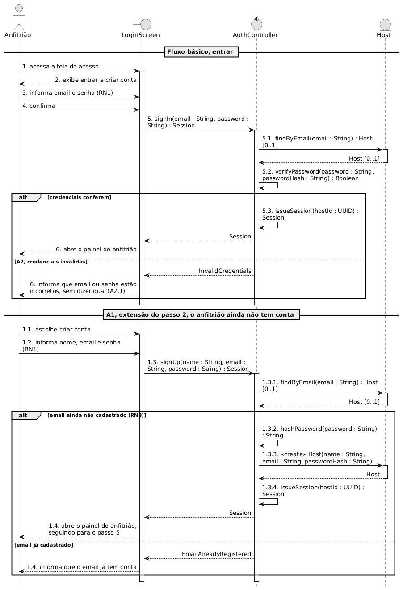
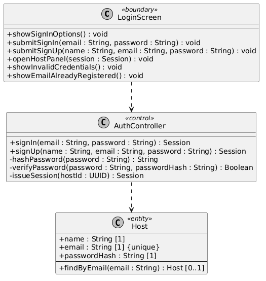
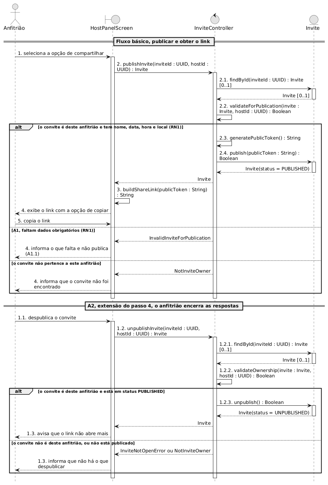
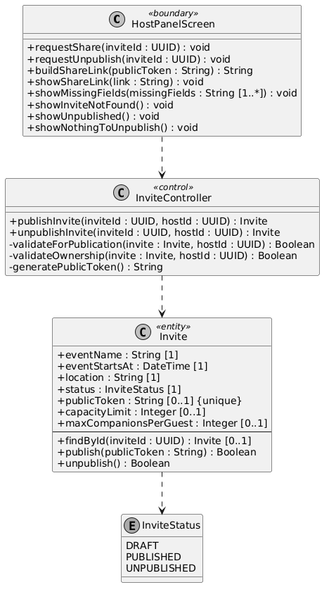
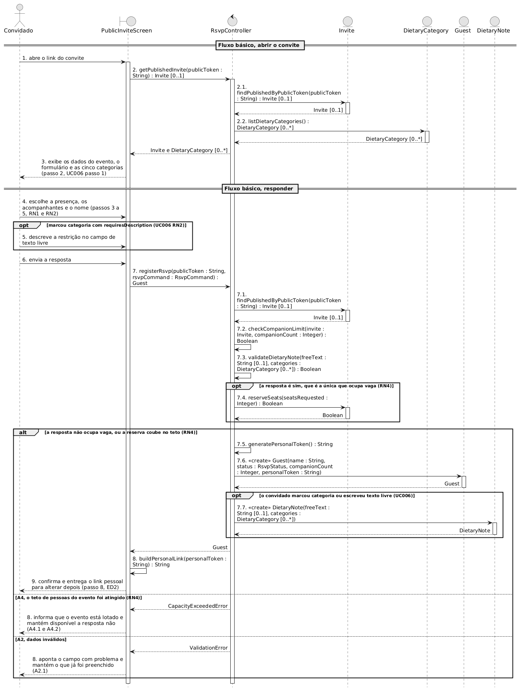
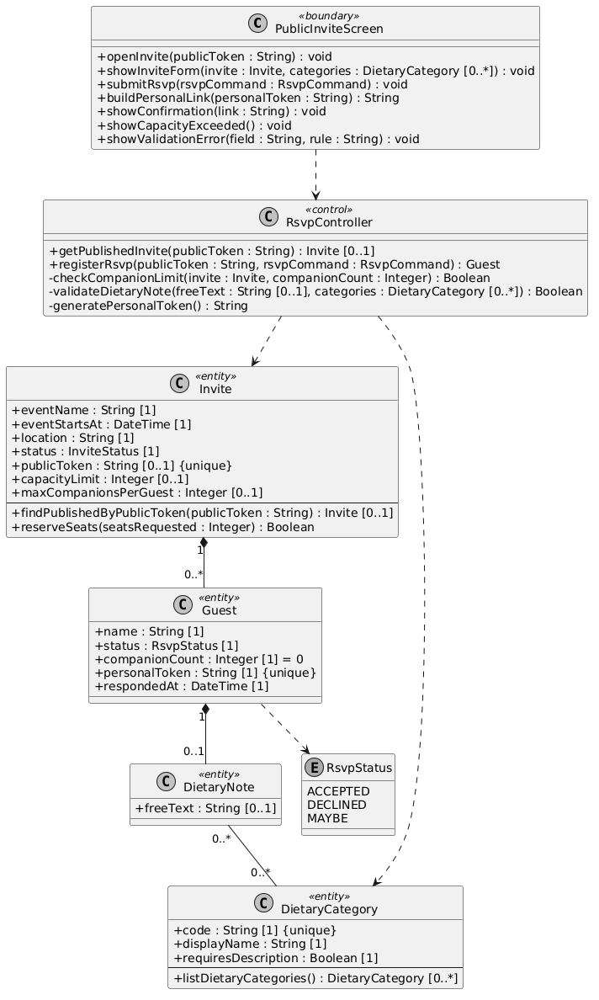
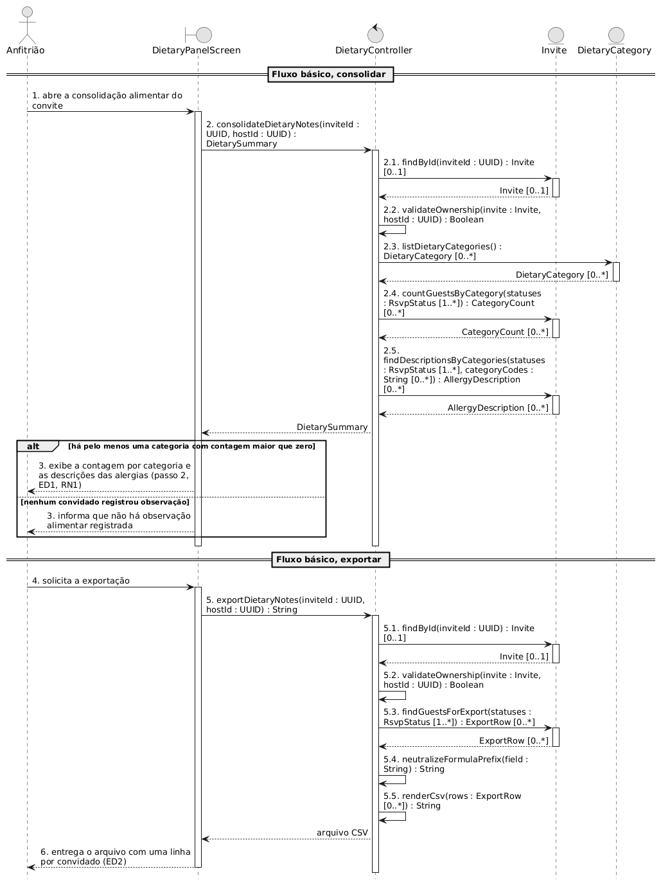
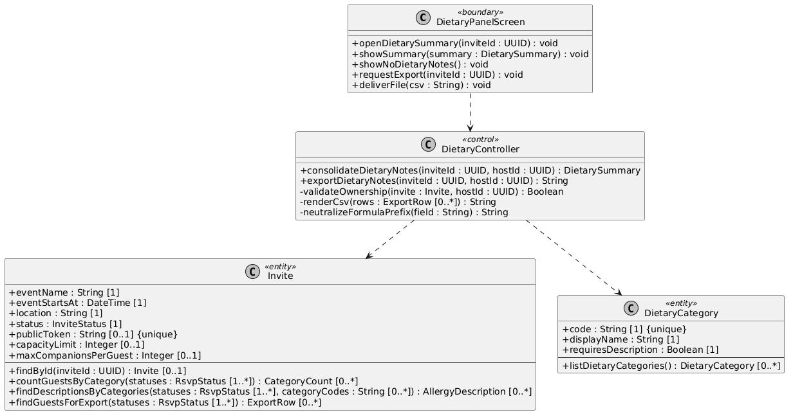
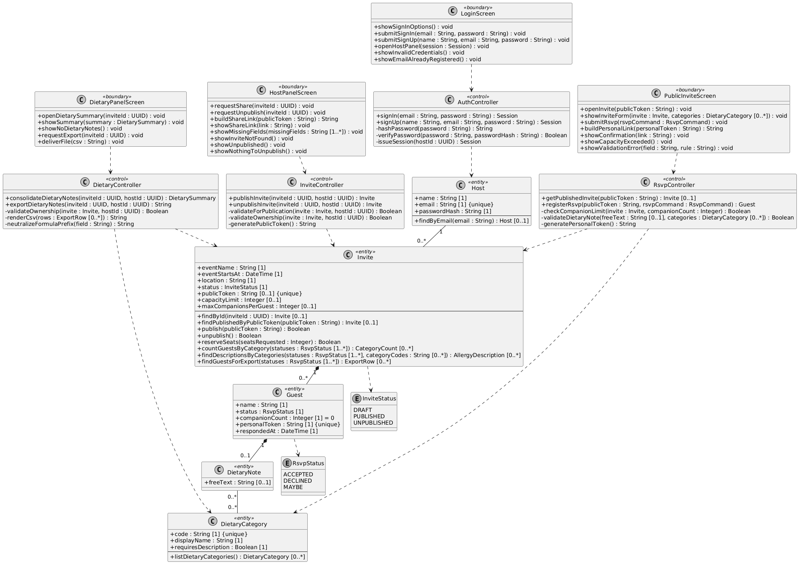

# Documento de Realização de Casos de Uso

**Projeto:** invite-app, aplicação web de convites com confirmação de presença
**Versão:** 1.0
**Data:** 20 de setembro de 2026
**Autores:** Tiago Passos, Guilherme Toebe dos Santos, Andreas Grings, Gabriel Tomasi de Melo
**Product Owner:** Kleinner Farias

## Histórico de Revisões

| Data | Versão | Descrição | Autor |
|---|---|---|---|
| 20/09/2026 | 0.1 | Escolha dos quatro casos a realizar e conversão dos diagramas de sequência para BCE | Tiago Passos |
| 20/09/2026 | 0.2 | Diagramas de classes participantes, um por caso de uso | Tiago Passos |
| 20/09/2026 | 1.0 | Capa, introdução, descrição das realizações e anexo consolidado | Tiago Passos |

---

## Sumário

- [1. Introdução](#1-introdução)
  - [1.1 Finalidade](#11-finalidade)
  - [1.2 Escopo](#12-escopo)
  - [1.3 Notação](#13-notação)
  - [1.4 Visão geral da arquitetura](#14-visão-geral-da-arquitetura)
- [2. UC001, Autenticar anfitrião](#2-uc001-autenticar-anfitrião)
- [3. UC004, Compartilhar convite](#3-uc004-compartilhar-convite)
- [4. UC005, Confirmar presença, com a extensão do UC006](#4-uc005-confirmar-presença-com-a-extensão-do-uc006)
- [5. UC008, Consolidar e exportar observações alimentares](#5-uc008-consolidar-e-exportar-observações-alimentares)
- [6. Anexo, classes participantes consolidadas](#6-anexo-classes-participantes-consolidadas)

---

## 1. Introdução

### 1.1 Finalidade

O [Documento de Arquitetura de Software](Documento-de-Arquitetura-do-Sistema-%28DAS%29.md) descreve a estrutura do sistema. Este descreve o comportamento: como os objetos colaboram entre si para que cada caso de uso significativo aconteça.

Ele serve a quem vai implementar. A pergunta que responde é qual objeto faz o quê, em que ordem, e o que cada um pode e não pode decidir sozinho.

### 1.2 Escopo

Quatro casos de uso, os mesmos marcados como arquiteturalmente significativos na seção 4 do DAS. O critério foi que cada um é o único a exercitar alguma decisão de arquitetura, então tirá-lo daqui deixaria aquela decisão sem prova em diagrama.

| Realização | O que ela demonstra |
|---|---|
| UC001, Autenticar anfitrião | Como a senha é verificada e como a sessão nasce, sem a fronteira julgar credencial |
| UC004, Compartilhar convite | A única transição de estado do modelo e o nascimento do identificador público |
| UC005 com a extensão do UC006 | A única escrita sem sessão, o teto de capacidade e a criação da identidade do convidado |
| UC008, Consolidar e exportar | A agregação por categoria e a exportação, com a neutralização de fórmula |

Ficam de fora UC002, UC003 e UC007. Os dois primeiros são cadastro atrás de sessão e ainda não têm rota especificada. O UC007 é leitura de projeção com a mesma guarda e a mesma entidade do UC008, então não demonstra nada que o UC008 já não demonstre.

### 1.3 Notação

As figuras usam **BCE**, que é a notação de análise com três tipos de objeto:

| Estereótipo | O que é | Como aparece aqui |
|---|---|---|
| `<<boundary>>` | O que fica entre o ator e o sistema | A tela que o anfitrião ou o convidado usa |
| `<<control>>` | Quem coordena o caso de uso | Reúne o controller da API e o serviço de domínio num objeto só |
| `<<entity>>` | O que o sistema guarda | Reúne a classe de domínio e o acesso a dados dela |

Essa reunião é deliberada e é o que diferencia esta notação da usada nos diagramas da Sprint 2. Ali a divisão em camadas é o assunto. Aqui o assunto é a colaboração, e repositório e transação não aparecem. Onde uma garantia dependia da transação, ela virou uma mensagem com valor de retorno, e o texto de cada seção aponta onde isso acontece.

Nos diagramas de sequência, **só as chamadas são numeradas**, com numeração hierárquica. Retorno não leva número. A criação de entidade leva `«create»`.

### 1.4 Visão geral da arquitetura

---

## 2. UC001, Autenticar anfitrião

A `LoginScreen` recebe as credenciais e não as julga. Ela entrega o par ao `AuthController`, que é quem sabe o que torna uma credencial válida. O controle pede ao `Host` a conta daquele email, compara a senha com o hash guardado e, quando confere, emite a sessão. A fronteira só exibe o resultado.

A recusa é o ponto interessante da colaboração. O controle devolve `InvalidCredentials` sem dizer se o errado foi o email ou a senha, e a fronteira mostra a mesma mensagem nos dois casos. A decisão só funciona se os dois objetos concordarem, porque bastaria a tela distinguir os casos para o segredo vazar por outro caminho.

No cadastro, a ordem importa. O controle consulta o `Host` por email antes de criar qualquer coisa, e só então gera o hash e cria a entidade. Inverter isso gravaria uma conta que a regra de email único recusaria logo depois, e deixaria um hash calculado à toa.

---

## 3. UC004, Compartilhar convite

O `HostPanelScreen` pede a publicação e recebe de volta o convite publicado. É ele quem monta o link a partir do token, e é só isso que ele faz com o token. O `InviteController` faz o trabalho de decidir: carrega o `Invite`, confere se ele pertence àquele anfitrião e se tem os quatro campos obrigatórios, gera o identificador público e manda a entidade publicar.

**O identificador nasce no controle e nunca na fronteira.** É a mesma separação do UC001, vista por outro ângulo: quem exibe não cria identificador.

A operação `publish` da entidade devolve booleano em vez de nada, e isso não é detalhe. A transição de rascunho para publicado só vale se o convite ainda não estiver publicado, e se duas requisições chegarem juntas uma delas precisa receber falso. Na notação de camadas essa garantia aparecia como um `UPDATE` com predicado. Aqui ela aparece no valor de retorno, porque BCE não mostra transação.

Despublicar é o mesmo desenho ao contrário, com a mesma conferência de dono e a mesma guarda no retorno. O que muda é que o token não é apagado, então o link pessoal de quem já respondeu continua abrindo.

---

## 4. UC005, Confirmar presença, com a extensão do UC006

É a realização com mais objetos, e a única em que a fronteira fala com o sistema sem sessão nenhuma.

Na abertura do convite, o `RsvpController` junta duas coisas de origens diferentes: o convite, pedido ao `Invite` pelo token público, e as cinco categorias alimentares, pedidas ao `DietaryCategory`. A tela recebe os dois de uma vez e monta o formulário. **A tela não guarda cópia da lista de categorias**, e é isso que mantém a contagem do UC008 comparável entre convites diferentes.

Na resposta, o controle valida primeiro o que dá para decidir com o que já tem em mãos, que é o limite de acompanhantes e a coerência da nota alimentar. Só depois ele pede a vaga ao `Invite`.

**`reserveSeats` é a mensagem que carrega o teto de capacidade.** Ela devolve booleano, e o ramo do diagrama guarda nesse retorno. Na notação de camadas o teto aparecia como uma verificação dentro de uma transação, com trava na linha do convite. BCE não tem onde mostrar isso, então a garantia foi para o retorno da mensagem. O `opt` acima dela registra que só a resposta sim ocupa vaga, porque não e talvez passam sem reservar nada.

O `Guest` nasce com o token pessoal já gerado pelo controle, e a `DietaryNote` só nasce se o convidado tiver marcado categoria ou escrito texto livre. As duas levam `«create»` porque a identidade do convidado não existe antes da resposta: não há cadastro prévio, e é a resposta que cria o registro.

---

## 5. UC008, Consolidar e exportar observações alimentares

O `DietaryController` coordena duas operações que parecem uma só e não são. A consolidação monta um resumo para a tela. A exportação monta um arquivo. As duas começam igual, carregando o `Invite` e conferindo o dono, e terminam diferente.

Na consolidação, o controle faz três perguntas em sequência e nenhuma delas sabe da outra. Pede as categorias ao `DietaryCategory`, pede a contagem por categoria ao `Invite` e pede as descrições de quem marcou categoria que exige texto. **É o controle que conduz a ordem**, e não uma operação de entidade que já sabe o roteiro. Por isso cada pergunta pode mudar sozinha quando o painel mudar.

Um convidado com duas categorias marcadas conta nas duas, que é o comportamento natural do agrupamento e é o que a regra do caso de uso pede.

Na exportação, o controle pede as linhas ao `Invite` e depois faz duas coisas que são da apresentação e não do domínio: neutraliza o prefixo de fórmula de cada campo e monta o CSV. **A neutralização acontece na saída, não na gravação.** Se o convidado escreveu uma fórmula no texto livre, é isso que fica gravado, e a aspa simples entra só na hora de montar o arquivo. Assim a linha no banco continua sendo o que a pessoa escreveu.

---

## 6. Anexo, classes participantes consolidadas

As classes das quatro realizações, juntas numa figura. Não há classe nova aqui: é a união das quatro anteriores, e serve para mostrar onde elas se encostam.

Quatro fronteiras, quatro controles e cinco entidades. **Cada fronteira fala com um controle só**, e nenhum controle fala com outro controle. As entidades são o único ponto em que dois casos de uso se cruzam: `Invite` aparece em três realizações e `DietaryCategory` em duas.

